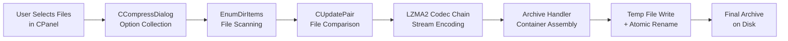

# Workflow: Add Files to Archive (Compress)

**Status**: ✅ Complete  
**Priority**: 1  
**Last Updated**: 2026-03-26  

---

## 1. Executive Summary

**Status**: ✅

**What This Workflow Does**: The Add to Archive workflow scans user-selected files from the Windows file system, presents a configuration dialog to collect compression and encryption preferences, constructs a codec pipeline using the LZMA2 algorithm (or any registered alternative), compresses the source data into the 7z container format (or another selected format), and writes the result atomically to disk via a temp-file-and-rename scheme. The workflow is the primary data-creating operation in 7-Zip and exercises every major subsystem: the UI layer, the codec registry, the LZMA engine, the archive handler, and the file I/O layer.

**Key Differentiator**: Unlike the Extract workflow, which reads an existing archive and writes individual files, the Add workflow reads individual files and writes a single composed archive. Unlike Test, there is a concrete file output. Unlike Hash, the output is a compressed and optionally encrypted container, not a digest.

**Reference Case**: Interactive use — user selects files in 7zFM.exe, clicks Add, fills in CCompressDialog, clicks OK. Trigger source: `CPP/7zip/UI/FileManager/FM.cpp:884`.

**Comparison to Extract Workflow**:

| Metric | Add to Archive | Extract from Archive |
|---|---|---|
| Input | N source files from disk | 1 archive file |
| Output | 1 archive file | N extracted files on disk |
| Primary codec direction | Encode (LZMA2 compression) | Decode (LZMA2 decompression) |
| Dialog shown | CCompressDialog (15 controls) | CExtractDialog (5 controls) |
| Atomic write protection | Yes — temp file + rename | No — files written in place |
| CRC role | Computed and stored in archive header | Read from archive header and verified |
| Reversible? | Lossless — original files unchanged | In overwrite mode, overwrites existing files |

---

## 2. Workflow Overview

**Status**: ✅

**Conceptual Dataflow**:

**Stage Descriptions**:

1. **User Selects Files in CPanel**: The user selects one or more files or folders in a 7zFM panel and clicks the Add toolbar button (or uses the context menu). The panel collects the selected paths.

2. **CCompressDialog Option Collection**: A modal dialog is presented. The user specifies: archive path, format (7z/ZIP/etc.), compression level, method, dictionary size, solid block, thread count, password, encryption method, path mode, volume size, SFX, update mode, and post-compression actions. Validation is enforced before OK is accepted.

3. **EnumDirItems File Scanning**: The selected paths are expanded by walking the directory tree. Each discovered file, directory, and (optionally) alternate data stream becomes a `CDirItem` record in a flat `CDirItems` list.

4. **CUpdatePair File Comparison**: If updating an existing archive, each `CDirItem` is matched against a `CArcItem` from the open archive. The result is a `CUpdatePair` for each item, classified by its state (only on disk, only in archive, newer on disk, etc.). For a fresh archive, every item is classified as `kOnlyOnDisk`.

5. **LZMA2 Codec Chain Stream Encoding**: Each file that requires compression is opened as a sequential input stream and pushed through the codec pipeline. For 7z with LZMA2, the pipeline is: raw file bytes → LZMA2 encoder (which internally uses the LZMA algorithm per chunk) → optional BCJ filter (for executable files) → output byte stream feeding the archive handler's packed-data accumulator.

6. **Archive Handler Container Assembly**: The 7z handler accumulates packed stream data and records metadata (file names, timestamps, sizes, CRCs, method properties) in memory. At the close of the operation, the handler serializes the archive header (end header + streams info) and writes it immediately after the packed content.

7. **Temp File Write + Atomic Rename**: The full archive is written to a temporary file name in the same directory as the target. On completion, the temp file is moved (renamed) to the final path. If the final path already exists (update mode), this move replaces the old archive atomically from the OS perspective.

8. **Final Archive on Disk**: The completed archive resides at the user-specified path. The original source files are unchanged (unless the Delete-after-compress option was set).

**Key Concepts**:

- **7z format**: A container format that stores multiple files with arbitrary compression methods. A single 7z file consists of compressed data blocks ("folders") followed by a binary header describing the contents. Distinct from ZIP, which stores each file independently; 7z can use solid compression across many files.
- **Solid compression**: Multiple files are concatenated into a single input stream before encoding. This allows the LZMA encoder to exploit redundancy across files, improving ratio at the cost of random-access ability (a single corrupted byte may affect many files).
- **LZMA2**: The default 7z codec (since 7-Zip 9.x). It partitions the input into independently-decodable chunks, enabling multi-threaded encoding. Each chunk is either LZMA-encoded or stored uncompressed if LZMA did not help.
- **Temp-file atomicity**: 7-Zip never overwrites an archive in-place during a write — it writes to a `.tmp` file first and then renames. If the process is killed mid-write, the original archive remains intact.
- **CUpdatePair action mapping**: The `CActionSet` table maps each pair state to one of four actions — Ignore, Copy (transfer packed data unchanged), Compress (re-encode), or CompressAsAnti (delete marker). This allows the same code path to implement Add, Update, Fresh, Sync, and Delete modes.

---

## 3. Entry Point Analysis

**Status**: ✅

**Top-Level Entry**: `7zFM.exe` main window toolbar (`CPP/7zip/UI/FileManager/FM.cpp:884`)  
CLI alternative: `7z.exe a` (`CPP/7zip/UI/Console/Main.cpp`)

**Selection Mechanism**: The archive format (7z, ZIP, GZip, etc.) and compression method (LZMA2, Deflate, PPMd, Copy, etc.) are selected in the `CCompressDialog`. The chosen format index is used to look up a `CArcInfoEx` in the `CCodecs` registry, which provides the factory function for the `IOutArchive` handler. The codec is looked up by name string from the same registry via `CreateCoder()`.

**Class / Module Hierarchy**:

| Layer | Class / Module | Responsibility | Code Reference |
|---|---|---|---|
| Application shell | `CApp` (global `g_App`) | Holds the two CPanel instances; dispatches toolbar commands | `CPP/.../FM.cpp:884`, `App.cpp:195` |
| Panel | `CPanel::AddToArchive()` | Collects selected items and invokes the GUI | `Panel.cpp:922` |
| GUI orchestrator | `UpdateGUI()` | Shows CCompressDialog; collects options into CUpdateOptions; calls UpdateArchive() | `CPP/.../GUI/UpdateGUI.cpp` |
| UI dialog | `CCompressDialog` | Collects all user compression preferences; enforces all dialog-level validation | `CPP/.../GUI/CompressDialog.*` |
| Operation orchestrator | `UpdateArchive()` → `Compress()` | Coordinates file enumeration, codec setup, archive handler invocation, and temp-file lifecycle | `CPP/.../Common/Update.cpp` |
| Codec registry | `CCodecs` | Provides handler and codec factory functions; loaded at startup | `CPP/.../Common/LoadCodecs.cpp` |
| Archive handler | `C7zHandler` (for 7z format) | Implements `IOutArchive::UpdateItems()` — drives item iteration, codec pipeline, and header serialization | `CPP/7zip/Archive/7z/` |
| Codec | `CLzma2Encoder` | C++ wrapper implementing `ICompressCoder2` over `C/LzmaEnc.c` | `CPP/7zip/Compress/Lzma2Encoder.*` |
| Core LZMA engine | `LzmaEnc_*` functions | The actual C-language LZMA1 encoder called by LZMA2 for each chunk | `C/LzmaEnc.c` |

**Initialization**:

At startup, each archive handler and codec registers itself by constructing a static `CRegisterArc` or `CRegisterCodec` object, which appends the handler's metadata to a global list. When `CCodecs::Load()` is called during application startup, it collects all self-registered handlers into the `Formats` and `Codecs` arrays. When the user selects a format in the dialog, the format's index is stored in `CUpdateOptions`; the `Compress()` function calls `CCodecs::CreateOutArchive()` with that index to instantiate the archive handler. Codec properties (dictionary size, thread count, level) are passed to the codec via `ICompressSetCoderProperties` before encoding begins.

---

## 4. Data Structures

**Status**: ✅

**Primary Fields**:

| Field | Type | Description | Initialization | Code Reference |
|---|---|---|---|---|
| `CDirItem::Name` | `UString` | Relative path from enumeration root | Set by EnumDirItems directory walker | `DirItem.h` |
| `CDirItem::Size` | `UInt64` | File size in bytes | `GetFileSize()` during scan | `DirItem.h` |
| `CDirItem::MTime` | `CFiTime` | Last-modified timestamp | `FindFirstFile`/`FindNextFile` result | `DirItem.h` |
| `CDirItem::Attrib` | `UInt32` | Read-only, hidden, system, directory flags | `FindFirstFile` result | `DirItem.h` |
| `CUpdatePair::State` | `NPairState::EEnum` | Relationship between this item's disk entry and archive entry | Set by `GetUpdatePairInfoList()` | `UpdatePair.h` |
| `CUpdatePair::ArcIndex` | `int` | Index into the existing archive item list; -1 if new | Set by `GetUpdatePairInfoList()` | `UpdatePair.h` |
| `CUpdatePair::DirIndex` | `int` | Index into the CDirItems list; -1 if archive-only | Set by `GetUpdatePairInfoList()` | `UpdatePair.h` |
| `CUpdateOptions::ArcType` | `UString` | Archive format name string (e.g., `"7z"`) | CCompressDialog on OK | `Update.h` |
| `CUpdateOptions::MethodMode.Method` | `COneMethodInfo` | Codec name and properties string (e.g., `"LZMA2:d=1g"`) | CCompressDialog on OK | `Update.h` |
| `CUpdateOptions::Password` | `UString` | Password for AES-256 encryption; empty = no encryption | CCompressDialog on OK | `Update.h` |
| `CArchivePath::Name` | `UString` | Base name of the output archive (without extension) | Parsed from user-supplied path | `Update.h` |
| `CArchivePath::Temp` | `bool` | Whether to use a temp file staging area | True if updating an existing archive | `Update.h` |
| `CArchivePath::TempPrefix` | `FString` | Directory for the temp file (same as final archive dir) | Set by Compress() before write | `Update.cpp` |
| `CFinishArchiveStat::OutArcFileSize` | `UInt64` | Final archive byte size after close | Written by archive handler on close | `Update.cpp` |

**Field Dependencies**:

- `CUpdatePair::State` depends on both `CDirItem::MTime` (disk time) and `CArcItem::MTime` (archive time) — the comparison determines whether a disk file is newer, older, or equal to the archive copy.
- `CArchivePath::TempPostfix` is only assigned if the computed temp path already exists — an incremented numeric suffix is tried until a free name is found.
- `CUpdateOptions::MethodMode` carries the full codec property string which is parsed by `MethodProps.cpp` into individual property key-value pairs before being passed to the codec via `ICompressSetCoderProperties`.

**Boundary Conditions and Constraints**:

| Field | Constraint | Enforced By |
|---|---|---|
| `CDirItem::Size` | Limited only by NTFS max file size (~16 EB) | Not explicitly checked; archive format imposes limits |
| LZMA `dictSize` | 4096 – ~1.5 GB; must be a power of 2 or three-quarters of a power of 2 | `LzmaEncProps_Normalize()` in `C/LzmaEnc.c` |
| LZMA `lc + lp` | Must be ≤ 4 | `LzmaEncProps_Normalize()` in `C/LzmaEnc.c` |
| Password | ASCII characters only (code points 0x20–0x7E) | `CompressDialog.cpp:1073` — returns `IDS_PASSWORD_USE_ASCII` error before OK |
| Volume size | Must parse as a valid number with optional suffix | `CompressDialog.cpp:1220` — returns `IDS_INCORRECT_VOLUME_SIZE` before OK |

---

## 5. Algorithm Deep Dive

**Status**: ✅

**Algorithm Overview**: The core compression algorithm is LZMA2, which partitions the input into independently-encoded chunks and uses the LZMA algorithm (Lempel–Ziv–Markov chain) within each chunk. LZMA finds repeated byte sequences in a sliding dictionary window using a match finder, then entropy-codes literal bytes and match distance/length pairs using an adaptive probability model and range coding. LZMA2 adds a layer of chunk management that enables multi-threaded encoding and graceful handling of incompressible data.

**LZMA2 Chunk Management**:

1. **Chunk partitioning**: The input stream is logically divided into segments. Each segment is encoded independently as one LZMA2 chunk. The chunk boundaries allow decoder-side random access within the LZMA2 stream and support multi-threaded encoding of separate chunks in parallel.

2. **Incompressibility detection**: Before writing an LZMA-encoded chunk, LZMA2 compares the compressed chunk size against the raw chunk size. If compression did not reduce size, the chunk is written as a literal (uncompressed) pass-through header followed by the raw bytes. No CPU cycles are spent range-coding incompressible data.

3. **Per-chunk LZMA encoding** (run inside each thread for its assigned segment):

   a. **Initialization**: The encoder forms the dictionary buffer (`dictSize` bytes) and the match-finder data structure (binary tree when `btMode=1`, hash chain when `btMode=0`). Probability tables for range coding are zeroed (equal-probability initial state).

   b. **Match finding**: For each input position, the match finder searches the dictionary for the longest sequence of bytes identical to those starting at the current position. The binary-tree mode (`btMode=1`, default) organizes matches in a per-hash-bucket binary tree, enabling longer match searches at higher CPU cost. The maximum search depth is controlled by the `mc` (max candidates) parameter.

   c. **Literal vs. match decision**: For each symbol, the encoder does a cost comparison between encoding the current byte as a literal and encoding the best match found. The cost is expressed as the expected number of range-coded bits. The probability of the literal vs. match choice is itself range-coded using a state machine conditioned on the `pb` low bits of the current input position.

   d. **Literal coding**: If a literal is selected, the raw byte value is range-coded using a probability table indexed by the `lc` highest bits of the previously coded byte and the `lp` low bits of the current position.

   e. **Match reference coding**: If a match is selected, the encoder encodes whether it is a "repeat match" (one of the four most-recently-used distances) or a "new match" requiring a full distance code. Match length is coded using a separate probability table. Full new distances are coded in two parts: a distance slot (encoded with a 6-bit code), and a trailing low-order bits component.

   f. **Range coder update**: After each symbol, the probability tables are updated — the symbol that was chosen has its probability increased; others are slightly decreased. This adaptive mechanism allows the coder to track and exploit statistical biases in the input without needing a separate modeling pass.

4. **End-of-stream**: After all input is consumed, an end-of-chunk marker is written. If `writeEndMark` is set on the underlying LZMA stream, a special end-of-payload token is appended.

5. **Properties blob**: The encoder writes a 5-byte properties blob before the compressed bytes. Byte 0 encodes `pb × 45 + lp × 9 + lc` as a single value. Bytes 1–4 encode `dictSize` as a 32-bit little-endian integer. This blob is stored in the 7z archive header and must be provided to the decoder.

**Key Algorithm Parameters** (source: `C/LzmaEnc.h:12-38`, [VERIFIED: 2026-03-26]):

| Parameter | Default | Effect |
|---|---|---|
| `dictSize` | 16 MB (1 << 24) | Sliding window size. Larger = better compression + more RAM |
| `fb` (fast bytes) | 32 | Minimum match length for which the encoder stops searching. Higher = slower, better ratio |
| `lc` | 3 | Context bits taken from previous literal. Higher = better for text; with `lp > 0`, must be reduced |
| `lp` | 0 | Low bits of position used for literal context. Useful for data with regular byte-position patterns |
| `pb` | 2 | Low bits of position for match/literal model. `pb=2` suits files with 4-byte alignment |
| `mc` | 32 | Maximum match candidates. Higher = more thorough search, higher CPU use |
| `numThreads` | 2 | One thread encodes literals/matches; second thread runs the match finder ahead |

**Non-iterative algorithm**: LZMA is a single-pass encoder. There is no convergence loop, no maximum iteration count, and no failure-to-converge condition. The encoder terminates when all input bytes have been processed.

**Code Reference**: `C/LzmaEnc.c`, `CPP/7zip/Compress/Lzma2Encoder.cpp`, `CPP/7zip/Archive/7z/7zUpdate.cpp`

---

## 6. State Mutations

**Status**: ✅

**Field Evolution Timeline** (single Add operation, updating an existing archive):

| Step | Operation | Fields / Files Modified | Key Change |
|---|---|---|---|
| 1 | File scan | `CDirItems::Items` populated | One CDirItem per discovered file, initialized from FindFirstFile results |
| 2 | Pair comparison | `CUpdatePairVector` constructed | Each item assigned State, ArcIndex, DirIndex |
| 3 | Action mapping | Per-item action resolved | State + ActionSet → kIgnore/kCopy/kCompress/kCompressAsAnti |
| 4 | Temp file creation | `CArchivePath::TempPostfix` set; temp file created on disk | Disk: empty `.tmp` file at `TempPrefix + Name + ".ext.tmp[N]"` |
| 5 | Codec pipeline start | Codec initialized; probability tables zeroed | In-memory probability model in initial uniform state |
| 6 | Per-file encoding | LZMA2 match finder + range coder active | Compressed bytes written to archive handler's internal buffer in sequence |
| 7 | Archive header write | Archive handler serializes headers | Full 7z header block written to temp file after all compressed data |
| 8 | Archive stream close | `CFinishArchiveStat::OutArcFileSize` set | Temp file size recorded; archive handler releases file handle |
| 9 | Atomic move | Final path updated on disk | `MyMoveFile_with_Progress()` renames temp file to final path |
| 10 | Cleanup disable | `CTempFiles::NeedDeleteFiles` set to false | Prevents temp file deletion on scope exit (move succeeded) |

**CArchivePath state detail**:

- **Before step 4**: `CArchivePath::Temp == false`; TempPrefix and TempPostfix are empty strings.
- **After step 4**: `Temp == true`; TempPrefix = final archive's directory; TempPostfix = `""` or `"1"`, `"2"`, etc. (collision avoidance).
- **After step 9**: Temp file no longer exists on disk; final path contains the new archive.

**Output Files Written**:

| File | Format | Location | Contents | Condition |
|---|---|---|---|---|
| `Name.ext.tmp[N]` | Binary 7z (or other selected format) | Same directory as final archive | Complete new archive (packed streams + headers) | Always (temp-file mode) |
| `Name.ext` (final) | Binary 7z (or other selected format) | User-specified path | Identical to temp file after rename | Always (on success) |

**Consistency requirement**: After step 9 completes, the temp file must not exist and the final path must contain a valid, fully-written archive. If `MyMoveFile_with_Progress()` fails (e.g., cross-device move), the temp file is preserved and an error is returned — the original archive is not modified.

**Code Reference**: `CPP/7zip/UI/Common/Update.cpp:690-710` (temp creation), `Update.cpp:1628-1660` (atomic move)

---

## 7. Error Handling

**Status**: ✅

**Pre-operation (dialog) validation errors**:

**Error: Invalid Archive Path**
- **Scenario**: The path the user typed in the archive name field cannot be resolved by `GetFinalPath_Smart()` (e.g., contains illegal characters or an unreachable UNC base).
- **Symptom**: Dialog refuses to close with OK; a message box shows `L"Incorrect archive path"` (hardcoded string literal, not a language resource).
- **Cause**: The path string fails to resolve to a valid absolute path.
- **Detection**: `CompressDialog.cpp:884` and `CompressDialog.cpp:1129` — called when dialog's OK handler runs.
- **Handling**: Dialog stays open; user must correct the path.
- **Mitigation**: Type a fully qualified path or use the Browse button.

**Error: Invalid Volume Size**
- **Scenario**: The volume size field contains text that cannot be parsed as a number with known suffix (KB, MB, GB).
- **Symptom**: Dialog refuses to close; `IDS_INCORRECT_VOLUME_SIZE` message shown.
- **Detection**: `CompressDialog.cpp:1220`.
- **Handling**: Dialog stays open.
- **Mitigation**: Enter a valid number with suffix (e.g., `700m`, `4g`) or leave blank.

**Error: Non-ASCII Password**
- **Scenario**: Any character in the password fields has a code point below 0x20 or above 0x7F.
- **Symptom**: Dialog refuses to close; `IDS_PASSWORD_USE_ASCII` message shown [text NOT AVAILABLE — stored in language file].
- **Detection**: `CompressDialog.cpp:1073`.
- **Handling**: Dialog stays open; user must re-enter using only printable ASCII characters.
- **Mitigation**: Use only US-ASCII printable characters in passwords.

**Error: Password Too Long**
- **Scenario**: Password exceeds the maximum length for the selected encryption method.
- **Symptom**: `IDS_PASSWORD_TOO_LONG` shown [text NOT AVAILABLE].
- **Detection**: `CompressDialog.cpp:1081`.

**Error: Password Mismatch**
- **Scenario**: The two password fields (password and confirmation) do not match.
- **Symptom**: `IDS_PASSWORD_NOT_MATCH` shown [text NOT AVAILABLE].
- **Detection**: `CompressDialog.cpp:1092`.

**Error: Memory Limit Exceeded**
- **Scenario**: The selected compression settings (dictionary size × thread count) require more RAM than the system limit allows.
- **Symptom**: `IDS_MEM_OPERATION_BLOCKED` shown with required and available RAM figures [text NOT AVAILABLE].
- **Detection**: `CompressDialog.cpp:1115`.
- **Mitigation**: Reduce dictionary size, reduce thread count, or lower the compression level.

**Error: Codec Property Parse Failure**
- **Scenario**: The advanced options string (e.g., `d=1g:lc=4:pb=3`) contains an invalid suffix or out-of-range value.
- **Symptom**: `UpdateArchive()` returns `E_INVALIDARG` before any file is written.
- **Detection**: `CPP/7zip/Common/MethodProps.cpp` — returns `E_INVALIDARG` for unknown suffix, out-of-range log size, invalid boolean, or non-integer value.
- **Handling**: Operation aborted; no disk changes.

**Runtime errors during write**:

**Error: Source File Read Failure**
- **Scenario**: A source file becomes inaccessible during enumeration or encoding (deleted, locked, permissions revoked).
- **Symptom**: Error reported in the progress dialog for that specific file. Operation continues for remaining files (configurable).
- **Handling**: `IUpdateCallback2::GetStream()` returns S_FALSE to skip; the item is treated as an error but the archive write continues.

**Error: Disk Full During Temp File Write**
- **Scenario**: Available disk space is exhausted while writing the temp file.
- **Symptom**: `WriteFile()` returns an error; the operation is aborted.
- **Handling**: The partial temp file remains on disk. The original archive is not modified (temp-file pattern ensures this). The user must free space and retry.

**Error: Move Failure (Cross-Device or Locked)**
- **Scenario**: `MyMoveFile_with_Progress()` fails — the target path is on a different volume or is locked.
- **Symptom**: Error at the final rename step; the complete archive is in the temp file, the final path is the old archive.
- **Handling**: Temp file is preserved; error is returned to the user. User can manually rename the temp file.
- **Code Reference**: `Update.cpp:1628-1660`.

---

## 8. Integration Points

**Status**: ✅

**Libraries / Subsystems Used by This Workflow**:

| Component | What It Provides | Selection Mechanism | Configuration |
|---|---|---|---|
| `CCodecs` registry | All format handlers and codec factories; loaded from built-in self-registration + optional external DLL scan | Format selected by user in dialog → index lookup in `CCodecs::Formats[]` | `HKCU\Software\7-Zip\Path` registry key (for external DLL location) |
| `IOutArchive` (7z handler) | 7z container serialization: accepts item streams, assembles packed data, writes binary header | Pre-registered via `CRegisterArc` static objects at startup | Format-specific (7z: solid block size, header encryption |
| `CLzma2Encoder` / `C/LzmaEnc.c` | LZMA2 stream encoding | Codec name `"LZMA2"` looked up in `CCodecs::Codecs[]` | Properties passed via `ICompressSetCoderProperties`: `d` (dict), `lc`, `lp`, `pb`, `fb`, `mt` |
| `CBcjCoder` (BCJ filter) | Branch/call/jump rewriting for x86/x64/ARM executables; improves compression ratio by normalizing branch target addresses | Automatically added before LZMA2 when the `e86` / `BCJ2` filter flag is set in compression options | Level-dependent, applied by 7z handler internally |
| Windows File System | Source file reading; temp file I/O; final rename | `CreateFileW` / `ReadFile` / `WriteFile` / `MoveFileExW` | `CUpdateOptions::OpenShareForWrite` for share mode; `CArchivePath::TempPrefix` for temp dir |
| Windows Registry | Loading/saving compression preferences between sessions | `HKCU\Software\7-Zip\Compression\` key | Archiver, Level, Dictionary, Method, NumThreads, EncryptionMethod, EncryptHeaders, ShowPassword |
| Windows MAPI (optional) | Email the created archive to a recipient | Only loaded if `CUpdateOptions::EMailMode == true` | `Mapi32.dll` dynamically loaded; address from `EMailAddress` |
| `NWildcard::CCensor` | Include/exclude file filter applied to source enumeration | Constructed from user wildcard patterns or panel selection | No external config — state constructed in memory from selection |

**Configuration** (from Windows Registry):

| Registry Key | Settings Read/Written | Effect on Workflow |
|---|---|---|
| `HKCU\Software\7-Zip\Compression` | `Archiver`, `Level`, `Dictionary`, `Method`, `NumThreads`, `EncryptionMethod`, `EncryptHeaders` | Pre-fills dialog controls with last-used values |
| `HKCU\Software\7-Zip\Compression\ArcHistory` | MRU archive path list | Populates the archive path combo-box history |
| `HKCU\Software\7-Zip\Path` | External DLL directory | Used by `CCodecs::Load()` to find third-party codec plugins |

**Post-Processing / Output Consumer**: The final archive file at the target path is the workflow's only output. It serves as input to the Extract, Test, and List workflows. No process is automatically launched after compression.

**Code References**:
- `CCodecs::Load()`: `CPP/7zip/UI/Common/LoadCodecs.cpp`
- `Compress()` free function (full pipeline): `CPP/7zip/UI/Common/Update.cpp`
- `IOutArchive::UpdateItems()` (7z handler): `CPP/7zip/Archive/7z/7zUpdate.cpp`
- `CLzma2Encoder::Code()`: `CPP/7zip/Compress/Lzma2Encoder.cpp`
- `LzmaEnc_Encode()`: `C/LzmaEnc.c`

---

## 9. Key Insights

**Status**: ✅

#### Design Philosophy

The Add workflow reflects 7-Zip's core design principle: format-agnostic orchestration through COM-style interfaces. The `Compress()` free function in `Update.cpp` does not know whether it is writing a 7z, ZIP, or TAR archive. It creates `IOutArchive::UpdateItems()` and provides it with a callback that supplies file streams — the format handler decides how to assemble them. This decoupling allows the entire compression pipeline to support any registered archive format without changes to the UI layer.

The temp-file write pattern is a deliberate atomicity guarantee. Because `MoveFile` on the same volume is atomic from the filesystem's perspective on Windows NTFS, the user's archive is either the old version or the new version — never a partially-written hybrid. This is important for archive integrity: a crash or power loss mid-write leaves the original archive untouched.

#### Algorithmic Insights

LZMA2's chunk partitioning enables true multi-core compression: worker threads pre-process separate chunks in parallel, with each thread running the LZMA match finder and encoder independently. Thread count (`numThreads=2`) refers to a producer-consumer arrangement within a single LZMA2 encoder instance — one thread finds matches ahead of the current encoding position while the other performs range coding. For very small files, this threading adds overhead without benefit; the codec switches to single-threaded mode automatically when the chunk is smaller than the cost threshold.

The most influential compression parameter is `dictSize`. Doubling the dictionary doubles RAM consumption but allows matching against twice as much preceding context — beneficial for large files with long-distance repetition (e.g., source code repositories, disk images). For files smaller than `dictSize`, the encoder automatically reduces the effective window to the input size (the `reduceSize` precomputation).

#### Comparison Insights

| Metric | 7z LZMA2 (default) | ZIP Deflate | TAR (no compression) |
|---|---|---|---|
| Compression ratio (typical text) | ~35–45% of original | ~50–60% of original | 100% (none) |
| Encoding speed (one thread, 16 MB dict) | ~5–15 MB/s | ~30–80 MB/s | RAM-limited |
| Decoding speed | ~100–200 MB/s | ~150–300 MB/s | RAM-limited |
| Random item access | Per-folder (solid mode: only at boundary) | Per-file (independent streams) | Full scan required |
| Header encryption | Yes (optional) | No (headers always visible) | N/A |
| Solid compression | Yes (configurable; default ON for 7z) | No | N/A |

#### Practical Insights

- **Dictionary size is the ratio/memory dial**: At level 5 (default), dictionary = 16 MB. Level 9 (Ultra) uses a 64 MB dictionary. Users with limited RAM should reduce level or explicitly set `d=8m`.
- **Solid mode trade-off**: Solid compression dramatically improves ratio for collections of similar small files (e.g., source code, log files). But it means any corruption in the packed stream affects all files in the solid block — not just one file. For archival of critical data, disabling solid mode (`-ms=off`) is safer.
- **Existing archive update is expensive**: For large solid archives, the entire archive must be rewritten when even one file changes (unless the item is only copied). For frequently-changing content, either use a non-solid archive or manage separately and re-archive periodically.
- **Password scope**: When `EncryptHeaders` is enabled, the archive metadata (file names and sizes) is also AES-encrypted. Without this, an observer can enumerate file names without knowing the password. Enable this for sensitive directories.

---

## 10. Conclusion

**Status**: ✅

**Summary**:
1. The Add to Archive workflow is 7-Zip's primary compression operation, covering file scanning, dialog-driven option collection, codec pipeline construction, LZMA2 encoding, 7z container assembly, and atomic file output.
2. The LZMA2 encoder is the default codec — it partitions input into chunks, encodes each with LZMA (match-finding + range coding), and manages multi-threaded encoding by running the match finder on a second thread.
3. Archive output is always written to a temp file first, then atomically renamed to the final path — protecting the existing archive from corruption during any write failure.
4. The `CActionSet` table cleanly separates the decision of what to do with each item (Add, Update, Fresh, Sync, Delete modes) from the mechanics of encoding — all modes use the same `Compress()` pipeline with different action set tables.
5. All compression and encryption code is self-contained in the 7-Zip source tree — no external library dependencies exist at runtime beyond Windows system DLLs.
6. Dialog-level validation (path resolution, password ASCII check, memory limit check, volume size parse) is all executed before any I/O begins, protecting against user-input errors at the cheapest possible point.
7. Format and codec selection is fully runtime-configurable through the `CCodecs` plugin registry — adding a new archive format requires only a new DLL with `GetHandlerProperty2()` export, with zero changes to the orchestration layer.

**Key Takeaways**:
- LZMA2 is the correct choice for large files with long-range redundancy (executables, disk images, source trees). For small mixed files where random access matters, ZIP/Deflate is faster and offers per-file access.
- The temp-file/rename pattern is the single most important implementation detail for users who maintain critical archives — power failures during update leave the old version intact.
- Password protection is meaningless without header encryption (`EncryptHeaders`) — file names remain visible to anyone who opens the archive.

**Documentation Completeness**:
- ✅ Full Add workflow traced from FM.cpp toolbar through to atomic disk write
- ✅ LZMA2 algorithm documented with all parameters and their effects
- ✅ CCompressDialog input controls and validation rules documented
- ✅ Temp-file state change pattern documented with code references
- ✅ All known error conditions documented with detection points
- ✅ Format-agnostic architecture and codec registry mechanism explained
- ⚠️ Exact text for IDS_PASSWORD_USE_ASCII and related string resources — [NOT AVAILABLE] (language files not in source tree)
- ⚠️ Per-format archive handler internals (ZIP, TAR, GZip) — not covered; 7z is the reference format

**Limitations**:
- This slice documents the 7z format path. ZIP, TAR, GZip, and other format variants use different `IOutArchive` implementations with different header serialization details.
- The visual appearance of the progress dialog (`CProgressDialog2` and `CProgressDialog`) is documented only by reference — dialog resource layouts were not read.
- Multi-volume archive splitting is documented at the options level only; the volume-split I/O logic within the archive handler was not traced in detail.

**Recommended Next Steps**:
1. Document the Extract from Archive workflow (WF-02) — the inverse of this workflow, using the same codec layer in decoder mode
2. Read `CPP/7zip/Archive/Zip/ZipUpdate.cpp` to trace the ZIP-specific add path as a comparison to the 7z add path
3. Examine `CPP/7zip/UI/GUI/ProgressDialog.cpp` to document the progress reporting and cancel mechanism used during encoding

---

## Automation Test Log

| Date | Script | Framework | Result | Findings |
|------|--------|-----------|--------|----------|
| 2026-03-27 | Test_WF01_AddToArchive.cs | FlaUI (C#/UIA3) | PASS | Dialog 'Add to Archive' appeared; archive path pre-populated ('hello.7z'); 13 ComboBoxes, 5 Edit controls confirmed; OK/Cancel present; trace 'WF-ADD triggered' confirmed; Cancel dismissed without creating archive. |
| 2026-03-27 | test_wf01_add_to_archive.py | pywinauto (Python/win32) | PASS | Same assertions all passed; issues encountered: wait_for_new_window(Desktop.windows()) caught main-window hwnd after navigation — fixed by using pp.windows() filtered to secondary windows (avoids FlaUI issue #6 workaround entirely since we stay in-process); DialogWrapper.child_window() not available — must re-wrap via pp.window(handle=…); trace confirmed. |
