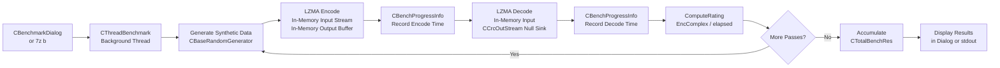

# Workflow: Benchmark (LZMA Performance Test)

**Status**: ✅ Complete  
**Priority**: 3 (Secondary)  
**Last Updated**: 2026-03-26  

---

## 1. Executive Summary

**Status**: ✅

**What This Workflow Does**: The Benchmark workflow measures the LZMA encode and decode throughput of the current system in KB/s and produces a normalized performance rating in MIPS (millions of LZMA-equivalent operations per second). It runs entirely in memory — no files are read or written. Synthetic pseudo-random data is generated, compressed with the LZMA encoder, then decompressed, and CRC-verified. The timer measures wall time; CPU time is separately measured for a CPU-usage percentage. Multiple passes are run; the results from each pass are accumulated into rolling averages.

**Key Differentiator**: No real files, no archive handler, no extraction callback, no disk I/O. The benchmark exercises the raw codec path (`ICompressCoder` encode + `ICompressDec oder` decode) in isolation. The rating formula normalizes by a model assumed LZMA complexity (`EncComplex = 1200`, `DecComplexUnc = 4`, `DecComplexCompr = 190`) so results across different dictionary sizes are comparable.

**Reference Cases**:
- FM: Tools → Benchmark (opens `CBenchmarkDialog`)
- CLI: `7z.exe b` or `7z.exe b -mmt4 -md=256m -mpass=5`

**Outputs**:
- Compression speed (KB/s): uncompressed bytes / wall time
- Decompression speed (KB/s): uncompressed bytes / wall time  
- Compression rating (MIPS): normalized commands / wall time
- Decompression rating (MIPS): normalized commands / wall time
- CPU usage (%): user+kernel time / wall time
- Total rating (MIPS): average of compress + decompress ratings

---

## 2. Workflow Overview

**Status**: ✅

**Conceptual Dataflow**:

**Stage Descriptions**:

1. **CBenchmarkDialog or `7z b`**: User opens the dialog (FM) or invokes `7z b`. Parameters are read: dictionary size (default 32 MB), number of threads (default: all logical CPUs), number of passes (default: continuous until stopped), CPU frequency (auto-detected via `QueryPerformanceFrequency`).

2. **CThreadBenchmark Background Thread**: A `NWindows::CThread` is created. The dialog remains responsive through a 1-second timer that reads updated results from a shared `CSyncData` structure protected by a critical section.

3. **Generate Synthetic Data**: `CBaseRandomGenerator` produces a pseudo-random byte sequence. The generator uses a linear congruential algorithm with fixed seed — results are deterministic and reproducible. The buffer size equals the dictionary size (with some added overhead: `kAdditionalSize = 1 << 16`).

4. **LZMA Encode**: The synthetic data is fed through a `CBenchmarkInStream` (in-memory sequential read stream) into the LZMA encoder (`CLzmaEncProps`, `CLzmaEnc_*`). The encoded output goes to a `CBenchmarkOutStream` (in-memory write buffer, sized at `dictSize + kCompressedAdditionalSize`). Timer starts before encode, stops via `CBenchProgressInfo::SetRatioInfo()` callback.

5. **Record Encode Time**: `CBenchInfo::GlobalTime` = elapsed ticks; `CBenchInfo::UserTime` = elapsed CPU time; `CBenchInfo::UnpackSize` = uncompressed size; `CBenchInfo::PackSize` = compressed size.

6. **LZMA Decode**: The compressed bytes from step 4 are fed through the LZMA decoder. Output goes to a `CCrcOutStream` (null-sink with CRC-32 accumulation). Timer runs independently from the encode timer. Decode verifies the CRC against the original synthetic data.

7. **ComputeRating**: Uses `CBenchProps::GetRating_Enc()` / `GetRating_Dec()`:
   - `numCommands_enc = unpackSize × encComplex`
   - `rating_enc = numCommands_enc × freq / elapsed`
   - Where `encComplex` adjusts with dictionary size: `EncComplex = 870 + t² × 5 / 256` where `t` is the log₂(dictSize) sub-bits index above `kBenchMinDicLogSize`.

8. **Accumulate CTotalBenchRes**: Encode and decode results are accumulated across passes using `CTotalBenchRes::Update_With_Res()`. The displayed values are running averages.

---

## 3. Entry Point Analysis

**Status**: ✅

| Interface | Entry | Code Reference |
|---|---|---|
| FM | Tools → Benchmark menu → `CBenchmarkDialog::StartBenchmark()` | `BenchmarkDialog.cpp:310` |
| CLI | `7z b [options]` → `Main.cpp` → `BenchCon()` | `Main.cpp:1258`, `BenchCon.cpp` |

**Class / Module Hierarchy**:

| Layer | Class / Module | Responsibility |
|---|---|---|
| UI (GUI) | `CBenchmarkDialog` | Dialog lifecycle; 1-second timer; result display |
| Worker thread | `CThreadBenchmark` | Runs `Process()` in background thread |
| Core benchmark | `Bench.cpp` (free functions) | Data generation, encode, decode, timing, rating |
| Data generator | `CBaseRandomGenerator` | Pseudo-random data stream |
| Encode input | `CBenchmarkInStream` | In-memory sequential read stream |
| Encode output | `CBenchmarkOutStream` | In-memory write buffer (up to dictSize + overhead) |
| Decode output | `CCrcOutStream` | Null-sink with CRC-32 accumulation |
| Timer | `CBenchInfoCalc` | Wall time via `QueryPerformanceCounter`; CPU time via `GetProcessTimes` |
| Codec | LZMA encoder/decoder | Same codec used in WF-01/WF-02; accessed via `ICompressCoder` interface |

---

## 4. Data Structures

**Status**: ✅

| Field / Object | Description |
|---|---|
| `CBenchmarkDialog::m_Dictionary` | ComboBox: dictionary size (256 KB to ~max); default 32 MB for 1 thread |
| `CBenchmarkDialog::m_NumThreads` | ComboBox: 1 to system logical CPU count |
| `CBenchmarkDialog::m_NumPasses` | ComboBox: 1, 2, 3, 5, 10, or continuous |
| `CBenchProps::EncComplex` | Per-byte command count for encode (function of dictSize); base = 1200 |
| `CBenchProps::DecComplexUnc` | 4 commands per decompressed byte |
| `CBenchProps::DecComplexCompr` | 190 commands per compressed byte |
| `CBenchInfo::GlobalTime` | Elapsed ticks (from `QueryPerformanceCounter`) |
| `CBenchInfo::GlobalFreq` | Tick frequency |
| `CBenchInfo::UserTime` | CPU user+kernel time ticks |
| `CBenchInfo::UserFreq` | CPU time tick frequency (10,000,000 on Windows) |
| `CBenchInfo::UnpackSize` | Uncompressed bytes processed in this pass |
| `CBenchInfo::PackSize` | Compressed bytes produced |
| `CTotalBenchRes` | Accumulated multi-pass averages for encode and decode |
| `CSyncData` | Shared memory between benchmark thread and dialog; protected by critical section |

---

## 5. Algorithm Deep Dive

**Status**: ✅

**Algorithm Overview**: Per-pass encode + decode with rating normalization.

**LZMA Rating Formula** (from `Bench.cpp:804` and `Bench.cpp:843`):

For **encoding**:
$$\text{rating}_{\text{enc}} = \frac{\text{unpackSize} \times \text{encComplex}(\text{dictSize})}{\text{elapsedTime} / \text{freq}}$$

Where `encComplex(dictSize)` follows the LZMA rating mode formula:
- Let $t = \text{GetLogSize\_Sub}(\text{dictSize}) - (\text{kBenchMinDicLogSize} \times 256)$
- `encComplex` $= 870 + \lfloor t^2 \times 5 / 65536 \rfloor$
- This gives `encComplex ≈ 1200` for 32 MB dictionary (the reference size)

For **decoding**:
$$\text{rating}_{\text{dec}} = \frac{\text{inSize} \times \text{DecComplexCompr} + \text{outSize} \times \text{DecComplexUnc}}{\text{elapsedTime} / \text{freq}} \times \text{numIterations}$$

Where `DecComplexCompr = 190`, `DecComplexUnc = 4`.

**MIPS conversion**: Rating / 1,000,000 = MIPS value shown in dialog.

**CPU Usage**:
$$\text{usage} = \frac{\text{userTime} / \text{userFreq}}{\text{globalTime} / \text{globalFreq}} \times 100\%$$

**Thread model**: One encode worker thread per physical CPU core (controlled by `m_NumThreads`). The LZMA encoder itself is multi-threaded (match finder + encoder), so setting `m_NumThreads` affects how many LZMA instances run in parallel — effectively simulating multi-file compression. The decode is single-threaded per stream but multiple streams can run in parallel.

**Precision**: `QueryPerformanceCounter` provides sub-microsecond resolution. `GetProcessTimes` provides 100-ns CPU time resolution. The benchmark target duration is calibrated by `SetComplexCommandsMs()` — it estimates the number of input bytes needed to run for approximately `kComplexInMs = 4000` ms at the detected CPU frequency. This normalization means fast CPUs test larger data sets.

---

## 6. State Mutations

**Status**: ✅

**No disk state is modified.**

| Step | In-Memory Change |
|---|---|
| Thread launch | `CThreadBenchmark` object created; Windows thread started |
| Data generation | Heap buffer allocated: `dictSize + kAdditionalSize` bytes |
| Encode | `CBenchmarkOutStream` buffer allocated: `dictSize + kCompressedAdditionalSize` |
| Timing | `CBenchInfo` populated with elapsed/CPU times |
| Per-pass result | `CTotalBenchRes2` accumulated |
| Dialog update | `CSyncData` written by thread; read by 1-second timer callback in UI thread |

The encode output buffer is reused across passes. No files are created, modified, or deleted.

---

## 7. Error Handling

**Status**: ✅

**Error: Decode CRC Mismatch**
- If the LZMA decoder produces output that does not match the CRC of the original synthetic data, `BenchCon()` returns `S_FALSE` and the CLI prints `"\nDecoding ERROR\n"`.
- This would indicate a codec bug (deterministic data → deterministic encode → deterministic decode should always match).
- In practice this should never occur unless there is a memory hardware fault or a codec regression.

**Error: E_OUTOFMEMORY**
- All buffers are heap-allocated. If the dictionary size is too large for available RAM, `ALLOC_WITH_HRESULT` returns `E_OUTOFMEMORY`.
- The dialog disables the Start button for dictionary sizes that exceed available RAM before starting.

**Error: Thread Creation Failure**
- `NWindows::CThread::Create()` fails (rare; out of system resources).
- Dialog shows an error message; benchmark does not start.

No partial result is shown if a pass fails — the failed pass result is discarded.

---

## 8. Integration Points

**Status**: ✅

| Component | Role |
|---|---|
| LZMA encoder (`CLzmaEnc`) | Core encode path — same instance as WF-01 |
| LZMA decoder (`CLzmaDec`) | Core decode path — same instance as WF-02/WF-03 |
| `QueryPerformanceCounter` / `QueryPerformanceFrequency` | High-resolution wall-time measurement |
| `GetProcessTimes` | CPU time measurement for usage percentage |
| `NWindows::CThread` | Background thread for non-blocking GUI |
| `NSynchronization::CCriticalSection` | Protects `CSyncData` shared between thread and timer |

No `CCodecs`, no `IInArchive`, no `IOutArchive`, no file system, no network. The benchmark is self-contained within `Bench.cpp` + `BenchmarkDialog.cpp`.

---

## 9. Key Insights

**Status**: ✅

**Design Philosophy**: The benchmark reuses the production codec path without modification. `CBenchmarkInStream` satisfies `ISequentialInStream`; `CBenchmarkOutStream` satisfies `ISequentialOutStream`. The LZMA encoder and decoder code paths are exercised identically to real compression — only the stream sources/sinks differ. This means benchmark results directly predict real-world compression performance.

**Rating Normalization**: The MIPS rating is normalized so that doubling the dictionary size does not automatically double the rating — `encComplex` grows quadratically with dictionary log-size. This reflects the real observation that LZMA's match finder does more work per byte as the dictionary grows (more candidates to search). Two benchmarks with different dictionary sizes can be fairly compared.

**CPU Usage < 100%**: Even on a system where all cores are busy, CPU usage may be less than 100% if wall time includes DRAM latency stalls, cache misses, or HyperThread/SMT competition. A CPU usage near 100% with high MIPS indicates the bottleneck is compute; lower usage with lower MIPS suggests memory bandwidth or cache pressure.

**Dict Size Recommendations**: The dialog's default (32 MB for 1 thread) is the reference point for the MIPS formula. For multi-threaded benchmarks, the dictionary per thread is halved at each doubling of thread count to prevent RAM exhaustion.

---

## 10. Conclusion

**Status**: ✅

**Summary**:
1. Benchmark exercises the production LZMA encode/decode path with synthetic in-memory data — no archive handler, no disk I/O.
2. Timing uses `QueryPerformanceCounter` (wall) + `GetProcessTimes` (CPU); rating is `numCommands × freq / elapsed`.
3. `encComplex` adjusts quadratically with dictionary log-size so cross-dict-size comparisons are normalized.
4. The background thread + critical section design keeps the dialog responsive during long benchmark runs.
5. A CRC-32 verify after each decode pass confirms codec correctness; mismatch signals hardware or codec regression.
6. No disk state is modified at any point.

**Documentation Completeness**:
- ✅ Rating formula  extracted from `Bench.cpp:804` with `EncComplex`, `DecComplexUnc`, `DecComplexCompr`
- ✅ Dict-size-dependent `encComplex` formula documented
- ✅ Thread model documented (LZMA encoder multi-threaded internally)
- ✅ `CSyncData` critical-section pattern documented
