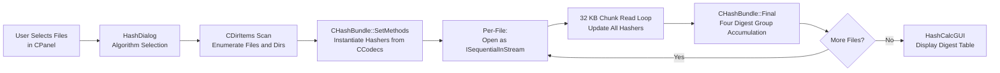

# Workflow: Compute File Hash

**Status**: ✅ Complete  
**Priority**: 1  
**Last Updated**: 2026-03-26  

---

## 1. Executive Summary

**Status**: ✅

**What This Workflow Does**: The Compute File Hash workflow enumerates user-selected files (including files inside selected directories), opens each file as a raw byte stream, reads it in 32 KB chunks, and feeds each chunk through one or more hash algorithm instances simultaneously. After all bytes are consumed, the workflow produces per-file digests and four categories of aggregate digests (per-file, data sum, names sum, streams sum). No archive is opened, no compression or decompression is performed, and no files are written. The results are displayed in a dialog (GUI) or printed to stdout (CLI).

**Key Differentiator**: The Hash workflow is the only workflow in 7-Zip that operates directly on filesystem files rather than on archive items. It never invokes an `IInArchive` or `IOutArchive` handler. The codec registry (`CCodecs`) is used exclusively to instantiate hash algorithm objects. There is no archive format logic, no codec chain, and no extraction callback. The architecture is a pure read-and-digest loop.

**Reference Case**: Interactive use — user selects one or more files or directories in 7zFM.exe, clicks the Hash toolbar button, selects an algorithm (or `*` for all), and clicks OK. Trigger source: `CPP/7zip/UI/FileManager/GUI.cpp:379`.

**Comparison to Sibling Workflows**:

| Metric | Compute File Hash | Test Archive Integrity | Extract from Archive |
|---|---|---|---|
| Opens archive | No — raw files only | Yes | Yes |
| Decompresses data | No | Yes | Yes |
| Computes hash / CRC | Yes — full file | Yes — per archive item | No (by default) |
| Algorithm selection | User-selectable | CRC-32 (fixed by format) | None |
| Writes files to disk | No | No | Yes |
| Output | Hash digest table | Pass/fail per item | Files on disk |
| Input scope | Filesystem files and folders | Archive contents | Archive contents |

---

## 2. Workflow Overview

**Status**: ✅

**Conceptual Dataflow**:



**Stage Descriptions**:

1. **User Selects Files in CPanel**: The user selects files or directories and clicks the "CRC SHA" toolbar button. A small dialog appears allowing selection of the algorithm: `CRC32`, `CRC64`, `SHA-1`, `SHA-256`, `SHA-512`, `BLAKE2sp`, `XXH64`, `MD5`, or `*` (all algorithms simultaneously).

2. **HashDialog — Algorithm Selection**: The dialog (a standard Win32 dialog) collects the algorithm name. The name is passed directly to `CHashBundle::SetMethods()`. The wildcard `"*"` is the default and requests all registered hashers.

3. **CDirItems Scan**: The file and directory list is expanded recursively into a flat list of all files, in the same way as the Add workflow. Each `CDirItem` carries the file path, size, and attributes. Directories are tracked separately for the `Final()` directory count.

4. **CHashBundle::SetMethods — Instantiate Hashers**: For each algorithm name, `SetMethods()` calls `FindHashMethod()` → `CreateHasher()` on the `CCodecs` registry. Each successful call produces an `IHasher` COM object. All requested hashers are wrapped in a `CHasherState` and stored in `CHashBundle::Hashers`. The bundle now has N parallel hasher instances ready to receive data.

5. **Per-File: Open as ISequentialInStream**: For each file in the list, the file is opened as a sequential input stream using the standard Win32 file API. No archive handler is involved. The file contents are treated as raw bytes.

6. **32 KB Chunk Read Loop**: A fixed 32 KB buffer (`kBufSize = 1 << 15`) is allocated once. The loop reads chunks of up to 32 KB from the file stream and calls `CHashBundle::Update(buf, size)` for each chunk. `Update()` calls `IHasher::Update(buf, size)` on every active hasher in the bundle. The loop continues until the file is exhausted (read returns 0 bytes).

7. **CHashBundle::Final — Four Digest Group Accumulation**: After the file read loop, `CHashBundle::Final(isDir, isAltStream, path)` is called. This method:
   - Calls `IHasher->Final(digest)` on each hasher to retrieve the current file's digest.
   - Updates all four digest group accumulators per hasher (Current, DataSum, NamesSum, StreamsSum).
   - Normalizes the file path (backslash → forward slash) for platform-stable aggregate digests.
   - Increments `NumFiles` and `FilesSize` in the bundle statistics.

8. **Repeat Per File**: Steps 5–7 are repeated for every file in the enumeration list.

9. **HashCalcGUI — Display Digest Table**: After all files are processed, the results are displayed. For each file and each algorithm, the Current digest is shown. The DataSum, NamesSum, and StreamsSum aggregate digests are shown at the bottom.

---

## 3. Entry Point Analysis

**Status**: ✅

**Top-Level Entry Points**:

| Interface | Entry | Code Reference |
|---|---|---|
| File Manager GUI (7zFM.exe) | Toolbar "CRC SHA" → `GUI.cpp:379` | `CPP/7zip/UI/FileManager/GUI.cpp:379` |
| CLI (7z.exe) | `7z h` or `7z h -scrcSHA256 files...` | `CPP/7zip/UI/Console/Main.cpp` |
| CLI (7za.exe) | Same as 7z.exe | Same |

**Class / Module Hierarchy**:

| Layer | Class / Module | Responsibility | Code Reference |
|---|---|---|---|
| Application shell | `CApp` (global `g_App`) | Dispatches Hash toolbar command | `FM.cpp`, `App.cpp` |
| GUI dispatcher | `HashCalcGUI()` free function | Constructs algorithm list; calls `HashCalc()`; shows result dialog | `GUI.cpp:379`, `HashCalcDialog.*` |
| Operation core | `HashCalc()` free function | File enumeration, read loop, Final accumulation | `HashCalc.cpp:466` |
| Algorithm bundle | `CHashBundle` | Holds N hashers; routes `Update()` and `Final()` to each | `HashCalc.h`, `HashCalc.cpp` |
| Per-algorithm wrapper | `CHasherState` | Wraps one `IHasher`; holds 4 digest groups | `HashCalc.h` |
| Codec registry | `CCodecs` | Instantiates `IHasher` objects by name | `CPP/.../Common/LoadCodecs.cpp` |
| Hash algorithm | `IHasher` COM object | Implements the specific algorithm (CRC32, SHA-256, etc.) | Per-algorithm registration module |
| File stream | `CInFileStream` / Win32 | Provides sequential byte access to the raw file | `CPP/7zip/Common/FileStreams.*` |

**No archive handler or extraction callback is present in this workflow.**

**Initialization Sequence**:

1. `GUI.cpp:379` fires; algorithm string is collected from the dialog.
2. `CCodecs::Load()` is called if not already loaded (loads all registered handlers and hashers).
3. `CHashBundle::SetMethods(methodNames)` resolves each name to a `CreateHasher()` call.
4. `HashCalc()` receives the bundle and the file list; proceeds with enumeration.

---

## 4. Data Structures

**Status**: ✅

**Primary Data Structures**:

**`CHashBundle`** (defined in `HashCalc.h`):

| Field | Type | Description | Code Reference |
|---|---|---|---|
| `Hashers` | `CObjectVector<CHasherState>` | One entry per loaded algorithm | `HashCalc.h` |
| `NumFiles` | `UInt64` | Count of files processed | `HashCalc.h` |
| `NumDirs` | `UInt64` | Count of directories processed | `HashCalc.h` |
| `FilesSize` | `UInt64` | Sum of all file sizes in bytes | `HashCalc.h` |
| `NumErrors` | `UInt64` | Count of files that could not be opened | `HashCalc.h` |

**`CHasherState`** (defined in `HashCalc.h`):

| Field | Type | Description | Code Reference |
|---|---|---|---|
| `Hasher` | `CMyComPtr<IHasher>` | COM pointer to the algorithm implementation | `HashCalc.h` |
| `Name` | `AString` | Algorithm name (e.g., `"CRC32"`, `"SHA256"`) | `HashCalc.h` |
| `DigestSize` | `UInt32` | Digest byte width for this algorithm | `HashCalc.h` |
| `Digests[k_HashCalc_NumGroups]` | `Byte[4][max_digest]` | Four digest groups: Current, DataSum, NamesSum, StreamsSum | `HashCalc.h` |

**`k_HashCalc_NumGroups`**: Defined as `4` in `HashCalc.h`. The four group indices are:

| Index | Constant | Meaning |
|---|---|---|
| 0 | `k_HashCalc_Index_Current` | Digest of the most recently processed file |
| 1 | `k_HashCalc_Index_DataSum` | Running arithmetic sum of all non-AltStream file digests |
| 2 | `k_HashCalc_Index_NamesSum` | Hash of (prefix_bytes + previous_digest + UTF-16LE_path) accumulated for non-AltStream files |
| 3 | `k_HashCalc_Index_StreamsSum` | Same as NamesSum but includes alternate data streams (ADS) |

**Buffer**:

| Constant | Value | Meaning |
|---|---|---|
| `kBufSize` | `1 << 15` = 32768 bytes | Chunk size for file reads |

**Boundary Conditions**:

| Condition | Behavior |
|---|---|
| Empty file (0 bytes) | `Final()` called with empty digest; DataSum/NamesSum still updated with the zero-byte digest |
| Directory | `isDir=true` passed to `Final()`; directory's contribution to NamesSum uses a `{0x01, 0, 0, ...}` prefix instead of raw data |
| Alternate data stream (ADS) | `isAltStream=true`; DataSum not updated; StreamsSum updated but NamesSum not |
| File open failure | `hb.NumErrors++`; file skipped; no digest produced |

---

## 5. Algorithm Deep Dive

**Status**: ✅

**Algorithm Overview**: 6-phase single-pass operation. No iteration for convergence.

#### Phase 1: Algorithm Instantiation (`CHashBundle::SetMethods`)

For each algorithm name in the requested list, `SetMethods()` calls:

```
CCodecs::FindHashMethod(name) → returns handler index + method index
CCodecs::CreateHasher(index) → calls IHashers::CreateHasher() → IHasher COM object
```

The wildcard `"*"` iterates all registered hashers and instantiates one of each. Each `IHasher` object is self-contained; all N hashers advance in lockstep through the same data.

If any requested algorithm name is not found in the registry, `SetMethods()` returns an error and the workflow is aborted before reading any files.

**Registered hash algorithms** (self-registered at static initialization):

| Algorithm | Digest Size | Notes |
|---|---|---|
| CRC32 | 4 bytes | IEEE 802.3 polynomial (0xEDB88320), reflected |
| CRC64 | 8 bytes | ECMA-182 polynomial |
| SHA-1 | 20 bytes | NIST FIPS 180-4 |
| SHA-256 | 32 bytes | NIST FIPS 180-4 |
| SHA-512 | 64 bytes | NIST FIPS 180-4 |
| BLAKE2sp | 32 bytes | BLAKE2 parallel variant; multi-threaded leaf hashing |
| XXH64 | 8 bytes | xxHash 64-bit non-cryptographic hash |
| MD5 | 16 bytes | RFC 1321; retained for legacy compatibility |

#### Phase 2: File Enumeration

The file list (from `CDirItems` or CLI arguments) is iterated. For GUI use, the selection from `CPanel` is expanded recursively into a flat file list (same enumeration logic as the Add workflow). Each item has a path, size, and a flag indicating whether it is a directory or alternate stream.

#### Phase 3: Per-File Initialization (`CHashBundle::InitForNewFile`)

Before processing each file, `InitForNewFile()` reinitializes the current-file state of every `IHasher` by calling `Hasher->Init()`. The four aggregate digest groups (`DataSum`, `NamesSum`, `StreamsSum`) carry over from the previous file and are not reset.

#### Phase 4: Chunk Read Loop (`Update`)

```
loop:
    bytesRead = file.Read(buf, kBufSize)
    if bytesRead == 0: break
    for each hasher in Hashers:
        hasher.Hasher->Update(buf, bytesRead)
```

Each iteration reads up to 32 KB from the file and passes the same buffer to every `IHasher::Update()` in the bundle. The hashers operate on the same memory but maintain independent internal state. The loop terminates when the stream returns 0 bytes.

#### Phase 5: Digest Finalization and Group Accumulation (`CHashBundle::Final`)

After the read loop, `Final(isDir, isAltStream, path)` runs for each hasher:

1. **Current digest** (`k_HashCalc_Index_Current`): Call `Hasher->Final(digest)` to retrieve the per-file digest. Store in `Digests[0]`.

2. **DataSum** (`k_HashCalc_Index_DataSum`): If this is a regular file (not isDir, not isAltStream), add the Current digest byte-by-byte arithmetically (with carry) to the DataSum accumulator.

3. **NamesSum** (`k_HashCalc_Index_NamesSum`): For regular files:
   - Reinitialize the hasher.
   - Feed a 16-byte prefix using `IHasher->Update()`. The prefix is `{0x00, 0, ...}` (byte 0 = 0 for regular files, 1 for directories).
   - Feed the Current digest bytes (`Digests[0]`).
   - Feed the UTF-16LE path bytes, after normalizing backslash to forward slash.
   - Call `Hasher->Final(namesDigest)`.
   - Add `namesDigest` to `Digests[2]` accumulator.

4. **StreamsSum** (`k_HashCalc_Index_StreamsSum`): Same as NamesSum but also includes alternate data streams — all items (including ADS) contribute, while NamesSum only includes non-ADS.

5. **Path normalization**: Before feeding the path to the hasher for NamesSum/StreamsSum, every `\` (Windows path separator) is replaced with `/`. This ensures that hashes produced on Windows and Linux for the same content and relative paths are bitwise identical. Source: `C/CpuArch.h` `CHAR_PATH_SEPARATOR` check.

#### Phase 6: Display

For each file, `k_HashCalc_Index_Current` (the per-file digest) is displayed. After all files, the three aggregate digests are displayed.

**Digest output format**:

| Digest size | Format | Byte order |
|---|---|---|
| ≤ 8 bytes (CRC32, CRC64, XXH64) | Uppercase hex | Reversed byte order (displays as little-endian integer) |
| > 8 bytes (SHA-1, SHA-256, SHA-512, BLAKE2sp, MD5) | Lowercase hex | Original byte order (standard cryptographic convention) |

For example, CRC-32 value `{0x78, 0x56, 0x34, 0x12}` displays as `12345678` (integer form), while SHA-256 displays bytes left-to-right.

---

## 6. State Mutations

**Status**: ✅

**Field Evolution Timeline**:

| Step | Operation | Fields / Files Modified | Key Change |
|---|---|---|---|
| 1 | `SetMethods()` | `CHashBundle::Hashers` vector | N IHasher objects created and stored |
| 2 | `InitForNewFile()` | Each `IHasher` internal state | Reset to algorithm initial state |
| 3 | `Update()` per chunk | Each `IHasher` internal state | Accumulates bytes into algorithm running state |
| 4 | `Final()` — Current | `CHasherState::Digests[0]` | Per-file digest recorded |
| 5 | `Final()` — DataSum | `CHasherState::Digests[1]` | Per-file digest added to running sum |
| 6 | `Final()` — NamesSum | `CHasherState::Digests[2]` | Aggregate hash updated with path+digest |
| 7 | `Final()` — StreamsSum | `CHasherState::Digests[3]` | Same as NamesSum, including ADS |
| 8 | Stat update | `CHashBundle::NumFiles`, `FilesSize` | Counters incremented |
| 9 | File open error | `CHashBundle::NumErrors` | Error counter incremented; file skipped |

**No files are written to disk at any step.**

**Invariant**: The aggregate digest groups (`DataSum`, `NamesSum`, `StreamsSum`) at the end of the loop are dependent on the order in which files are processed. The 7-Zip implementation processes files in the order they appear in the `CDirItems` enumeration, which follows the directory traversal order. Reordering the input files changes the aggregate digests.

---

## 7. Error Handling

**Status**: ✅

**Error: File Open Failure**
- **Scenario**: A file in the enumeration list cannot be opened (access denied, file deleted after enumeration, locked by another process).
- **Detection**: The file open call returns a failure code before the chunk read loop begins.
- **Handling**: `hb.NumErrors++`. The file's contribution to all digest groups is skipped. The workflow continues to the next file.
- **User notification**: After all files, the error count is shown in the result dialog. The specific files that failed are shown in the progress output.

**Error: File Read Failure (Mid-Stream)**
- **Scenario**: A file read succeeds initially but fails partway through (disk I/O error, network file share disconnection).
- **Detection**: `ISequentialInStream::Read()` returns a non-`S_OK` HRESULT.
- **Handling**: The partial digest for that file is computed from bytes successfully read. An error is recorded. The computed digest reflects only partial file content and is not a cryptographically valid digest of the complete file.
- **User notification**: Error shown in progress output. The digest value should be discarded.

**Error: Algorithm Not Found / Not Loaded**
- **Scenario**: The user requested an algorithm name that is not registered in the `CCodecs` registry.
- **Detection**: `FindHashMethod()` returns a negative index (not found).
- **Handling**: `SetMethods()` returns an error code before any file is read. The workflow is aborted.
- **User notification**: The dialog reports the unknown algorithm name.

**Error: Memory Allocation Failure**
- **Scenario**: The 32 KB read buffer or an internal hasher state allocation fails.
- **Detection**: `malloc`/`HeapAlloc` returns NULL; checked at startup.
- **Handling**: Returns `E_OUTOFMEMORY` to the caller, which aborts the workflow.

**Non-error: Empty File**
- A file with 0 bytes is hashed normally. `Final()` is called with an empty running state. The algorithm-specific "hash of empty input" is produced (e.g., SHA-256 of empty input is a well-known constant `e3b0c44298fc1c14...`). This is documented behavior, not an error.

---

## 8. Integration Points

**Status**: ✅

**Libraries / Subsystems Used**:

| Component | Role | Notes |
|---|---|---|
| `CCodecs` | Hash algorithm registry | Provides `CreateHasher()` for each algorithm name |
| `IHasher` COM interface | Per-algorithm compute object | Receives `Init()`, `Update()`, `Final()` calls |
| `CHashBundle` | Algorithm multiplexer | Routes every chunk to all N hashers; accumulates digest groups |
| Windows File System (read-only) | File byte access | `CreateFile` + `ReadFile` through `CInFileStream`; no write calls |
| `CDirItems` | File enumeration | Shared with Add and Hash scan logic |
| `NWildcard::CCensor` | File filter | User-specified include/exclude patterns applied before enumeration |
| `HashCalcGUI` | Display | Formats digest table; shows in Win32 dialog or stdout |
| `GUI.cpp:379` | Entry point | Constructs algorithm list from dialog; dispatches to `HashCalc()` |

The Hash workflow does **not** use:
- Any `IInArchive` or `IOutArchive` handler
- `CArchiveExtractCallbackImp`
- Any decompressor (`CLzma2Decoder`, `CDeflateDecoder`, etc.)
- Any codec other than hash algorithms
- Registry write API

**Code References**:
- Core algorithm: `CPP/7zip/UI/FileManager/HashCalc.cpp:466`
- Data structures: `CPP/7zip/UI/FileManager/HashCalc.h`
- GUI entry: `CPP/7zip/UI/FileManager/GUI.cpp:379`
- Algorithm self-registration: `CPP/7zip/Crypto/Sha256.cpp`, `C/Sha256.c`, etc.
- CRC-32 implementation: `C/7zCrc.c`, `C/7zCrcOpt.c`

---

## 9. Key Insights

**Status**: ✅

#### Design Philosophy

The Hash workflow is deliberately isolated from the archive subsystem. By operating directly on filesystem bytes, it can compute hashes of any file type — not just those supported by 7-Zip's archive handlers. The `IHasher` interface is a clean one-way funnel: `Init()`, one or more `Update()` calls, then `Final()` to retrieve the digest. This interface is satisfied identically by CRC-32, SHA-256, BLAKE2, and every other algorithm — the `CHashBundle` multiplexer is pure call routing with no algorithm-specific code.

#### Aggregate Digest Design

The four digest groups solve a specific verification problem:

| Group | Problem Solved |
|---|---|
| `Current` | "Is this specific file's content unchanged?" |
| `DataSum` | "Is the total content of all files unchanged, regardless of their names?" |
| `NamesSum` | "Are both the content and relative paths of all files unchanged?" |
| `StreamsSum` | "Same as NamesSum but including Windows alternate data streams?" |

`NamesSum` and `StreamsSum` enable detecting renames (file renamed → NamesSum changes even if DataSum doesn't) and detecting content-only changes (DataSum changes even if names are the same). This three-level verification is useful for dataset integrity checking where both content and naming matter independently.

#### Path Normalization

Converting backslash to forward slash before feeding paths to NamesSum/StreamsSum ensures that hash values computed on Windows are byte-identical to those computed on Linux or macOS for the same file set. This is necessary because archives are commonly moved across platforms. The normalization is done inside `Final()` using a `CHAR_PATH_SEPARATOR` check — a pre-processor constant that is `/` on POSIX and `\` on Windows.

#### Digest Display Conventions

The byte-reversal for ≤8-byte digests (CRC32: displayed as `12345678` rather than `78563412`) matches the conventional way CRC-32 values are displayed in most tools. SHA and longer digests are displayed in canonical byte order as is standard for cryptographic hashes. Both conventions exist simultaneously in the same dialog, which can be confusing when comparing against external tools that may use different byte-order conventions.

#### Comparison Insights

| Scenario | Recommended Approach |
|---|---|
| Verify a backup archive is uncorrupted | Test, not Hash — operates on archive items, not the archive file |
| Verify file authenticity against a published SHA-256 | Hash with SHA-256 on the raw file |
| Verify a directory of source files matches a reference | Hash with `*` algorithm on both; compare NamesSum values |
| Detect if any files in a set were renamed | Compare DataSum (unchanged) and NamesSum (changed) between two Hash runs |

---

## 10. Conclusion

**Status**: ✅

**Summary**:
1. The Compute File Hash workflow is architecturally distinct from all archive workflows — it operates on raw filesystem files, not archive contents, and does not activate any archive handler or decoder.
2. The `CHashBundle` + `CHasherState` design multiplexes one read loop across N simultaneous hash algorithms with zero per-algorithm disk overhead.
3. 32 KB chunk reads are the only I/O pattern — one sequential pass per file, no seeking, no random access.
4. Four digest groups (Current, DataSum, NamesSum, StreamsSum) collectively answer different questions about file set integrity: content-only, content+names, content+names+ADS.
5. Path normalization (backslash → forward slash) inside `Final()` ensures cross-platform aggregate digest stability.
6. Every supported algorithm (CRC32, CRC64, SHA-1, SHA-256, SHA-512, BLAKE2sp, XXH64, MD5) is registered via self-registration at static initialization — the hash selection dialog is dynamically populated from the registry.
7. No disk state is modified. The workflow is pure read-and-compute.

**Key Takeaways**:
- Use Hash for external file integrity verification (against published checksums). Use Test for archive-internal verification (CRC stored inside the archive).
- BLAKE2sp is faster than SHA-256 for large files on hardware with multiple cores because it parallelizes leaf hashing.
- The `NamesSum` aggregate catches file renames that `DataSum` alone would miss — useful for detecting malicious substitutions that preserve file content but rename files.
- For cryptographic security guarantees, use SHA-256, SHA-512, or BLAKE2sp. CRC32 and XXH64 are suitable only for corruption detection, not for tamper detection.

**Documentation Completeness**:
- ✅ All four digest group accumulation steps documented with exact algorithm
- ✅ Path normalization mechanism extracted from source (`CHAR_PATH_SEPARATOR`)
- ✅ Digest display format (byte order conventions) documented per algorithm class
- ✅ All 8 registered hash algorithms listed with digest sizes
- ✅ Error handling for file open failures, mid-stream failures, unknown algorithm
- ✅ `kBufSize = 1 << 15` (32 KB) chunk size confirmed from source

**Limitations**:
- The NamesSum/StreamsSum algorithm depends on file enumeration order — the same file set in a different directory traversal order produces a different aggregate digest. This is not documented in the UI.
- MD5 is retained for legacy compatibility only; it is cryptographically broken and should not be used for security-sensitive applications.
- The `CHashBundle::Final()` algorithm for aggregate accumulation (arithmetic byte-by-byte sum for DataSum, recursive hash for NamesSum) is specific to 7-Zip and is not a standardized format — aggregate digests are not interoperable with other tools.

**Phase 7 Documentation Complete**:
- WF-01: Add Files to Archive ✅
- WF-02: Extract from Archive ✅
- WF-03: Test Archive Integrity ✅
- WF-07: Compute File Hash ✅
