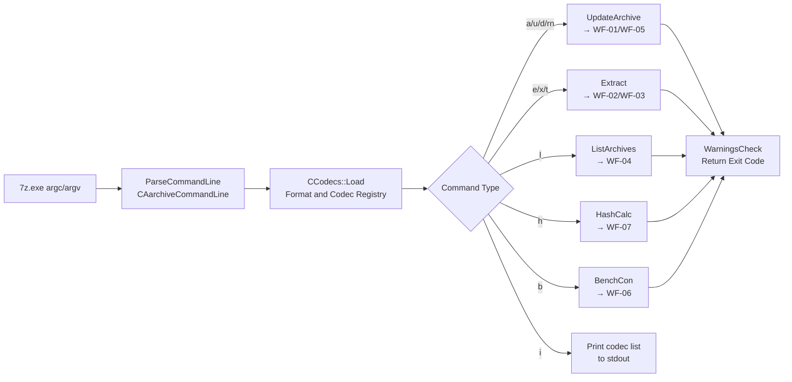

# Workflow: Console (7z.exe) — Full CLI Mode

**Status**: ✅ Complete  
**Priority**: 2  
**Last Updated**: 2026-03-26  

---

## 1. Executive Summary

**Status**: ✅

**What This Workflow Does**: The Console mode is not a separate archive workflow but an alternative user-interface surface for all archive operations. `7z.exe` (and `7za.exe` for the standalone variant) parses a command string from `argv`, constructs the same option structures used by the GUI workflows, and dispatches to identical core functions (`UpdateArchive`, `Extract`, `ListArchives`, `HashCalc`, `BenchCon`). The only unique aspects of Console mode are: (1) progress is printed as a percent-and-filename sequence on a single line using `\r` (carriage return) to overwrite in place; (2) stdout and stderr are used instead of Win32 message boxes; (3) a stdin/stdout pipe mode allows 7-Zip to be integrated into shell pipelines; and (4) a standardized exit code table allows scripts to detect success, warnings, and errors.

**Key Differentiator**: `Main.cpp` is the entry point. Everything after the `ParseCommandLine()` call is identical to the GUI path. The console-specific code is confined to: `ExtractCallbackConsole`, `UpdateCallbackConsole`, `HashCallbackConsole`, `OpenCallbackConsole` (which read from stdin or print to stdout instead of showing dialogs), and the `\r`-based percent display.

**CLI Commands and Dispatch Targets**:

| Command | NCommandType | Core Function Called |
|---|---|---|
| `a` | `kAdd` (IsFromUpdateGroup) | `UpdateArchive()` with `k_ActionSet_Add` |
| `u` | `kUpdate` (IsFromUpdateGroup) | `UpdateArchive()` with `k_ActionSet_Update` |
| `d` | `kDelete` (IsFromUpdateGroup) | `UpdateArchive()` with `k_ActionSet_Delete` |
| `rn` | `kRename` (IsFromUpdateGroup) | `UpdateArchive()` rename mode |
| `e` | `kExtract` (IsFromExtractGroup) | `Extract()` with flat paths |
| `x` | `kExtractFull` (IsFromExtractGroup) | `Extract()` with full paths |
| `t` | `kTest` (IsFromExtractGroup with TestMode) | `Extract()` with `TestMode=true` |
| `l` | `kList` | `ListArchives()` |
| `h` | `kHash` | `HashCalc()` |
| `b` | `kBenchmark` | `BenchCon()` |
| `i` | `kInfo` | Print format/codec list to stdout |

**Exit Codes** (from `ExitCode.h`):

| Code | Meaning |
|---|---|
| 0 (`kSuccess`) | Successful operation with no warnings |
| 1 (`kWarning`) | Non-fatal errors (e.g., some files could not be read) |
| 2 (`kFatalError`) | Fatal error (archive corrupt, disk full, etc.) |
| 7 (`kUserError`) | Bad command line syntax |
| 8 (`kMemoryError`) | Out of memory |
| 255 (`kUserBreak`) | User pressed Ctrl+C |

---

## 2. Workflow Overview

**Status**: ✅

**Conceptual Dataflow**:

**Stage Descriptions**:

1. **ParseCommandLine**: `CArchiveCommandLine::Parse(argc, argv, options)` fills a large `CArchiveCommandLineOptions` struct. This covers: the command letter (stored as `NCommandType::EEnum`), archive path, file wildcard patterns, format (`-t`), method parameters (`-m`), password (`-p`), output dir (`-o`), overwrite mode (`-ao`), NTFS flags, stdin/stdout mode (`-si`/`-so`), disable-percent flag (`-bd`), log level (`-bb0`–`-bb3`), thread count (`-mmt`), hash methods (`-scrc`), and more. Bad syntax throws `kUserErrorMessage` → exit code 7.

2. **CCodecs::Load**: Loads all registered archive handlers and codecs (built-in; or external DLLs for `Z7_EXTERNAL_CODECS` builds). Errors are printed to stdout as a warning.

3. **Dispatch** by `NCommandType`: A single `if / else if` chain dispatches to the core function.

4. **Console callbacks**: Instead of GUI dialogs, all user interaction uses console callbacks:
   - `COpenCallbackConsole`: password prompt prints `"Enter password (will not be echoed):"`  to stderr; reads from stdin.
   - `CExtractCallbackConsole`: prints per-file name and result; manages `\r`-based percent display.
   - `CUpdateCallbackConsole`: prints per-file name on add/update; warnings for locked files.
   - `CHashCallbackConsole`: prints per-file hash results; prints summary table.

5. **Percent display**: A background timer (or `SetRatioInfo()` callback) writes `\r<percent>% <filename>` to the percent stream (`g_StdErr` or suppressed with `-bd`). The `\r` overwrites the previous line, giving an in-place progress display without flooding the terminal with line breaks.

6. **WarningsCheck + exit code**: After the core function returns, `WarningsCheck()` maps the `HRESULT` and any per-file error counts to a final `NExitCode::EEnum`. The process exits with that integer value.

---

## 3. Entry Point Analysis

**Status**: ✅

| Binary | Purpose | Entry |
|---|---|---|
| `7z.exe` | Full CLI (all formats, external codecs) | `Main.cpp:main()` / `wmain()` |
| `7za.exe` | Standalone CLI (built-in codecs only, no DLL required) | Same `Main.cpp` with `Z7_PROG_VARIANT_A` define |
| `7zr.exe` | Restricted standalone (7z format only) | Same `Main.cpp` with `Z7_PROG_VARIANT_R` define |

**Class / Module Hierarchy**:

| Layer | Class / Module | Responsibility |
|---|---|---|
| Entry / Dispatch | `Main.cpp` | `main()`/`wmain()`; `ParseCommandLine`; dispatch switch |
| Option parser | `CArchiveCommandLine` | Full CLI syntax → `CArchiveCommandLineOptions` |
| Open callback | `COpenCallbackConsole` | Password prompt on stdin; open errors to stderr |
| Extract callback | `CExtractCallbackConsole` | Overwrite decision (`-ao`); per-file result to stdout |
| Update callback | `CUpdateCallbackConsole` | Per-file add/skip notice; locked-file warnings to stdout |
| Hash callback | `CHashCallbackConsole` | Per-file hash output; aggregate digest table |
| Bench console | `BenchCon()` | Calls `Bench.cpp` functions; prints to FILE* stdout |
| Core operations | `UpdateArchive()`, `Extract()`, `ListArchives()`, `HashCalc()` | Shared with GUI; identical code |
| Exit code mapper | `WarningsCheck()` | `HRESULT` + error counts → `NExitCode::EEnum` |

---

## 4. Data Structures

**Status**: ✅

**`CArchiveCommandLineOptions`** — fields relevant to CLI-unique behavior:

| Field | Type | Description |
|---|---|---|
| `StdInMode` | `bool` | `-si[{name}]`: read archive/input from stdin |
| `StdOutMode` | `bool` | `-so`: write extracted data / archive to stdout |
| `DisablePercents` | `bool` | `-bd`: suppress percent progress output |
| `EnableHeaders` | `bool` | `-ba`: suppress header/footer lines in output |
| `YesToAll` | `bool` | `-y`: auto-answer Yes to all prompts (overwrite, etc.) |
| `LogLevel` | `int` | `-bb0`–`-bb3`: verbosity level for file names printed during operation |
| `PercentsNameLevel` | value | Controls whether the filename is shown in progres display |
| `ShowTime` | `bool` | `-bt`: print timing info after operation completes |
| `HashMethods` | `UStringVector` | `-scrc{method}`: enable CRC/hash alongside extraction |
| `NumIterations` | `UInt32` | `-mpass`: benchmark pass count |
| `Password` | `UString` | `-p{password}` |
| `PasswordEnabled` | `bool` | True if `-p` was specified |

**Percent stream**: `percentsStream` is set to `g_StdErr` when `!DisablePercents && isatty(stderr)`. It is `NULL` if `-bd` is set or if stderr is redirected. The percent line is only written when the output is a terminal to avoid polluting redirected output with control characters.

---

## 5. Algorithm Deep Dive

**Status**: ✅

**Algorithm**: Command-line parsing → single dispatch. No iterative computation specific to Console mode.

**ParseCommandLine key rules**:
- First positional arg after the binary name is the command letter (`a`, `e`, `x`, `l`, `t`, `u`, `d`, `rn`, `h`, `b`, `i`).
- Second positional arg is the archive name (for all but `h` and `b`).
- Remaining positional args are file wildcards.
- All switches begin with `-` (Windows: also `/`).
- Switch parsing is case-insensitive for switches; case-sensitive for passwords (`-p`).

**Stdin/Stdout pipe mode**:
- `-si`: The archive is read from stdin (handle 0). `options.StdInMode = true`. The archive path is set to `options.ArcName_for_StdInMode` (default `""`) or the name given after `-si`.
  - For extract: the IInArchive open call receives a `CInFileStream` over the stdin handle.
  - For add: the input file is read from stdin; the archive is written to the output file or `-so`.
- `-so`: For extract commands, the `CArchiveExtractCallbackImp::GetStream()` returns a stream pointing to stdout handle (1) instead of a file.
  - All extracted bytes flow to stdout — useful for `7z x -so archive.7z > output.bin` or piping into another process.
  - Progress percent is suppressed automatically when stdout is the output stream.

**CExtractCallbackConsole overwrite handling**:
- In GUI mode, overwrite decisions show a dialog.
- In console mode, the setting comes from `-ao`:
  - `-aoa` (Overwrite All) → skip the question, overwrite.
  - `-aos` (Skip existing) → skip the question, skip.
  - `-aou` (Auto-rename) → rename `file(1).ext`.
  - `-aot` (Auto-rename existing) → rename the existing file.
  - Default (no `-ao`): ask on stdin: `"? (Y)es / (N)o / (A)lways / (S)kip all / (Q)uit?"`.

**LogLevel output** (`-bb`):

| Level | Files printed |
|---|---|
| 0 (`-bb0`) | Nothing |
| 1 (`-bb1`) | Files being compressed/extracted (default) |
| 2 (`-bb2`) | Level 1 + files from archive that match wildcard filter |
| 3 (`-bb3`) | Level 2 + all files enumerated (including skipped) |

**Hash-alongside-extract** (`-scrc`): When `-scrsSHA256` (or similar) is passed alongside `e`/`x`/`t`, `Main.cpp` creates a `CHashBundle` and passes it as `hashCalc` to `Extract()`. This computes file hashes simultaneously with extraction or test using the same read data — no second pass required.

---

## 6. State Mutations

**Status**: ✅

**Console-mode-specific state** (in addition to the dispatched workflow's mutations):

| What | Change |
|---|---|
| stdout (`g_StdStream`) | Progress lines, headers, file lists, results written |
| stderr (`g_ErrStream`) | Errors, warnings written |
| percent stream (`percentsStream`) | `\r<percent>%` lines written and overwritten live |
| Exit code (`retCode`) | Set to `NExitCode::*` based on operation result |

All archive / disk mutations are determined by the dispatched workflow (WF-01 through WF-07). Console mode itself does not create, modify, or delete files beyond the dispatched workflow's effects.

---

## 7. Error Handling

**Status**: ✅

**Bad Command Line**
- Unknown switch, unknown command, missing archive name, etc.
- `ShowMessageAndThrowException(kUserErrorMessage, NExitCode::kUserError)` → stderr gets `"Incorrect command line"` → exit code 7.

**Format Not Found**
- `-t{format}` names a format not in the codec registry.
- `throw kUnsupportedArcTypeMessage` → stderr gets error → exit code 2.

**No Formats Loaded** (external codec builds only)
- If the codec DLL could not be loaded, `throw kNoFormats` → exit code 2.

**Operation-level errors**
- `HRESULT` from `UpdateArchive()`, `Extract()`, `ListArchives()`, or `HashCalc()` is checked by `WarningsCheck()`.
- `S_OK` + no per-file errors → exit 0.
- `S_OK` + some per-file warnings (e.g., locked file skipped during add) → exit 1.
- Any `HRESULT != S_OK` or fatal callback error → exit 2.

**Ctrl+C handling**
- `ConsoleClose.cpp` installs a `SetConsoleCtrlHandler` callback.
- On `CTRL_C_EVENT` / `CTRL_BREAK_EVENT`: sets a flag read by the progress callback, which returns `E_ABORT`.
- `Main.cpp` catches the abort and exits with code 255.

**Password prompt on stdin**
- `COpenCallbackConsole::CryptoGetTextPassword()` prints prompt to stderr, reads one line from stdin (with echo disabled via `SetConsoleMode(... &~ENABLE_ECHO_INPUT)`).
- If stdin is not a terminal (piped), the read returns an empty string and the operation fails with a `kWrongPassword`-class error.

---

## 8. Integration Points

**Status**: ✅

| Component | Console-specific use |
|---|---|
| `CArchiveCommandLine` | CLI-only option parser; not used by FM |
| `CExtractCallbackConsole` | Replaces `CArchiveExtractCallbackImp`; writes to stdout/stderr |
| `CUpdateCallbackConsole` | Replaces FM update dialog; writes to stdout/stderr |
| `COpenCallbackConsole` | Password prompt on stdin; no Win32 ShowDialog |
| `CHashCallbackConsole` | Hash result table to stdout |
| `ConsoleClose.cpp` | Ctrl+C handler; not present in GUI |
| `CStdOutStream` / `g_StdOut` / `g_StdErr` | Wrappers over Windows `HANDLE`-based stdout/stderr |
| All core workflow functions | Identical to GUI path — no console-specific fork |

---

## 9. Key Insights

**Status**: ✅

**Design Philosophy**: The CLI surface is designed so that every core function is completely callback-agnostic. `UpdateArchive()`, `Extract()`, `ListArchives()`, and `HashCalc()` receive interface pointers and never touch a Win32 window or a console directly. Swapping `CArchiveExtractCallbackImp` for `CExtractCallbackConsole` is the entire difference between GUI and CLI extraction. This makes the console a zero-maintenance surface — GUI fixes automatically apply to CLI.

**Scripting Implications**:
- Exit code 0 is the only reliable "success" signal. Always check the exit code, not the output text.
- Exit code 1 (warning) may be acceptable in some scripts (e.g., locked files during backup). Distinguish 0 (perfect) from 1 (partial) from 2 (fatal).
- Suppress headers with `-ba` and disable percents with `-bd` when parsing stdout output programmatically.
- Use `-bso0 -bse0` to fully silence stdout and stderr if only the exit code matters.

**stdin/stdout pipe mode**: `7z a -si archive.7z < input.bin` creates an archive containing a single file named `""` (empty name) from stdin. `7z x -so archive.7z` extracts to stdout. These can be chained: `7z x -so input.7z | 7z a -si -tgzip output.gz` re-compresses without a temp file.

**`-i` (Info)**: Prints the full list of registered archive handlers (format name, extensions, GUID, capabilities) and all registered codecs (name, ID, method ID). This is the fastest way to verify that a codec DLL is loaded and registered correctly.

---

## 10. Conclusion

**Status**: ✅

**Summary**:
1. The CLI surface (`7z.exe`) parses `argv` into the same option structures used by the GUI and dispatches to the identical core functions — there is no separate CLI code path for archive operations.
2. `CExtractCallbackConsole`, `CUpdateCallbackConsole`, `COpenCallbackConsole` replace the GUI dialog callbacks; all other code is shared.
3. Progress display uses a `\r`-overwrite technique on the percent stream (stderr); suppressed with `-bd` or when stderr is redirected.
4. Stdin/stdout pipe mode (`-si`/`-so`) enables integration into shell pipelines without temp files.
5. Exit codes (0/1/2/7/8/255) are the standard automation interface — check exit code, not output text.
6. `ParseCommandLine` covers 30+ switches; bad syntax exits with code 7.

**Documentation Completeness**:
- ✅ All 11 CLI commands documented with their `NCommandType` and dispatch target
- ✅ All 6 exit codes documented from `ExitCode.h` source
- ✅ Stdin/stdout pipe mode semantics documented
- ✅ `-ao` overwrite modes documented
- ✅ `-bb` log levels documented
- ✅ Ctrl+C → code 255 path documented
- ✅ Hash-alongside-extract (`-scrc`) documented

**Phase 7 — All Workflows Documented**:

| ID | Workflow | File |
|---|---|---|
| WF-01 | Add Files to Archive | `phase-7-workflow-add-to-archive.md` |
| WF-02 | Extract from Archive | `phase-7-workflow-extract-from-archive.md` |
| WF-03 | Test Archive Integrity | `phase-7-workflow-test-archive.md` |
| WF-04 | List Archive Contents | `phase-7-workflow-list-archive.md` |
| WF-05 | Update / Delete in Archive | `phase-7-workflow-update-delete.md` |
| WF-06 | Benchmark | `phase-7-workflow-benchmark.md` |
| WF-07 | Compute File Hash | `phase-7-workflow-compute-hash.md` |
| WF-08 | Shell Extension Context Menu | `phase-7-workflow-shell-extension.md` |
| WF-09 | Console CLI Mode | `phase-7-workflow-console-cli.md` |
