# Workflow: Extract from Archive

**Status**: ✅ Complete  
**Priority**: 1  
**Last Updated**: 2026-03-26  

---

## 1. Executive Summary

**Status**: ✅

**What This Workflow Does**: The Extract from Archive workflow opens one or more archive files, enumerates their contents, and recreates the stored files and directories on the local file system under a user-specified output directory. It reverses the compression performed by the Add workflow: each stored item's packed bytes are run through the appropriate decompression codec chain (typically LZMA2/LZMA for 7z archives), and the resulting stream is written to disk with its original filename, timestamps, and attributes restored.

**Key Differentiator**: Unlike Add to Archive, Extract reads a container and produces individual files — there is no new archive created. Unlike Test, Extract writes its output to disk (Test only checks CRC integrity). Extract is the only workflow that interacts with overwrite policies, path-stripping modes, NTFS security stream restoration, and Zone ID (Mark-of-the-Web) assignment.

**Reference Case**: Interactive use — user selects one or more archives in 7zFM.exe, clicks Extract, fills in CExtractDialog, clicks OK. Trigger source: `CPP/7zip/UI/FileManager/FM.cpp:885`.

**Comparison to Test Workflow**:

| Metric | Extract | Test |
|---|---|---|
| Files written to disk | Yes — at OutputDir | No |
| Output directory required | Yes | No |
| Overwrite policy applies | Yes | No |
| NTFS attributes/timestamps restored | Yes | No |
| CRC verification | Yes — errors reported but file is still written | Yes — only outcome |
| Progress shows file names + sizes | Yes | Yes |
| State changed on disk | Yes | No |
| Use case | Recovering stored files | Verifying archive integrity |

---

## 2. Workflow Overview

**Status**: ✅

**Conceptual Dataflow**:

```mermaid
flowchart LR
    A[User Selects Archives\nin CPanel] --> B[CExtractDialog\nOption Collection]
    B --> C[CCodecs::Load\nHandler Discovery]
    C --> D[CArcLink::Open\nFormat Detection]
    D --> E[Item Enumeration\nand Filtering]
    E --> F[LZMA2 Decoder Chain\nPer Folder Stream]
    F --> G[Overwrite Decision\nCallback]
    G --> H[File Write\nTimestamp/Attr Set]
    H --> I[CDecompressStat\nResult Accumulation]
```

**Stage Descriptions**:

1. **User Selects Archives in CPanel**: The user selects one or more archive files in a 7zFM panel and clicks the Extract toolbar button (or uses the context menu). The panel passes the archive paths to the extract orchestrator.

2. **CExtractDialog Option Collection**: A modal dialog is shown where the user specifies: output directory, path mode (full/current/no paths), overwrite mode (ask/overwrite/skip/rename), password, and whether to keep broken files. On OK, a `CExtractOptions` struct is populated.

3. **CCodecs::Load / Handler Discovery**: The `CCodecs` registry (loaded at startup) provides the list of all registered archive format handlers. The correct handler is selected by matching the archive file's magic-byte signature or file extension against handler declarations.

4. **CArcLink::Open Format Detection**: `CArcLink::Open_Strict()` creates an `IInArchive` instance from the matched handler and calls `IInArchive::Open()` on the file stream. For nested archives (e.g., `.tar.gz`), multiple handlers are chained. If headers are encrypted, a password dialog is presented via the callback.

5. **Item Enumeration and Filtering**: `IInArchive::GetNumberOfItems()` returns the item count. For each item, `IInArchive::GetProperty()` retrieves name, size, timestamp, attributes, and CRC. The wildcard censor (`NWildcard::CCensor`) filters items to those matching the user's selection or wildcard patterns.

6. **LZMA2 Decoder Chain**: The archive handler initiates extraction by calling `IArchiveExtractCallback::GetStream()` for each item to obtain a destination stream, then decoding the corresponding packed data through the codec pipeline. For a 7z solid folder, all items in that folder are decoded in a single streaming pass — the packed stream is decompressed sequentially for all files in the group.

7. **Overwrite Decision Callback**: Before each output file's stream is opened, the callback checks if a file already exists at the destination path. In Ask mode, a dialog is shown. In silent modes, the pre-configured overwrite action (always overwrite / always skip / rename / rename existing) is applied.

8. **File Write, Timestamp/Attr Set**: The callback creates the destination file and writes decompressed bytes to it. After all bytes for that item are received, the callback receives `SetOperationResult()` — if OK, it applies the stored `MTime`, `CTime`, `ATime`, and file attributes. If a CRC error was reported, the file is still closed but flagged as an error.

9. **CDecompressStat Result Accumulation**: `NumFiles`, `NumFolders`, `UnpackSize`, `PackSize`, and `NumArchives` counters are incremented for each processed item. These are returned to the caller and shown in the completion dialog.

**Key Concepts**:

- **Solid folder**: In a 7z solid archive, a group of files is compressed together into one packed stream. The decoder must decompress the entire stream sequentially to reach any one file — random access to a single file in the middle requires decompressing everything before it. The `CFolder` struct in the 7z handler records the codec sequence and packed stream offsets for each folder.
- **Path mode**: Controls how stored paths are applied when writing. `kFullPaths` recreates the directory hierarchy as stored in the archive. `kNoPaths` writes all files to the root of the output directory. `kCurPaths` trims the path to the parts relative to the current directory at archive-creation time.
- **Zone ID (Mark-of-the-Web)**: On Windows Vista+, files extracted from archives that were themselves downloaded from the Internet can inherit a Zone ID Alternate Data Stream (`:Zone.Identifier`). 7-Zip supports three zone modes: None (never add), All (always add), Office (add only for Office-compatible file types).
- **Overwrite ask dialog**: In Ask mode, the overwrite callback presents a dialog showing the existing file's size and timestamp alongside the archive copy. The user can choose for one file, for all files in the current archive, or for all remaining archives in the batch.

---

## 3. Entry Point Analysis

**Status**: ✅

**Top-Level Entry**: `7zFM.exe` main window toolbar (`CPP/7zip/UI/FileManager/FM.cpp:885`)  
CLI alternatives: `7z.exe x` (extract with full paths) and `7z.exe e` (extract without paths) (`CPP/7zip/UI/Console/Main.cpp`)

**Selection Mechanism**: The archive format handler is selected at runtime by `CArcLink::Open_Strict()`, which tries candidate handlers in order of: exact extension match, then magic-byte signature match. The first handler whose `IInArchive::Open()` call returns `S_OK` is used. If no handler accepts the file, the operation fails with "Cannot open file as archive." The decoding codec inside the handler is identified from the CLSID stored in the 7z archive header — the handler looks it up in the `CCodecs::Codecs` registry.

**Class / Module Hierarchy**:

| Layer | Class / Module | Responsibility | Code Reference |
|---|---|---|---|
| Application shell | `CApp` (global `g_App`) | Dispatches Extract toolbar command to ExtractArchives() | `FM.cpp:885`, `App.cpp` |
| Panel | `CPanel::ExtractArchives()` | Collects archive paths from panel selection | `Panel.cpp:1008` |
| GUI orchestrator | `ExtractGUI()` | Shows CExtractDialog; assembles CExtractOptions; calls Extract() | `CPP/.../GUI/ExtractGUI.cpp` |
| UI dialog | `CExtractDialog` | Output dir, path mode, overwrite mode, password | `CPP/.../GUI/ExtractDialog.*` |
| Operation orchestrator | `Extract()` free function | For each archive: opens it, enumerates items, runs extraction loop | `CPP/.../Common/Extract.cpp` |
| Archive opener | `CArcLink::Open_Strict()` | Format detection, handler instantiation, password-protected header handling | `CPP/.../Common/OpenArchive.cpp` |
| Codec registry | `CCodecs` | Supplies handler and decoder factory functions | `CPP/.../Common/LoadCodecs.cpp` |
| Archive handler | `C7zHandler` (for 7z) | Implements `IInArchive` — provides item enumeration and drives the codec pipeline to call back with decompressed data | `CPP/7zip/Archive/7z/` |
| Extraction callback | `CArchiveExtractCallbackImp` | Implements `IArchiveExtractCallback` — receives decompressed stream, handles overwrite, writes file | `CPP/.../FileManager/ExtractCallback.cpp` |
| Codec | `CLzma2Decoder` | Implements `ICompressCoder2` — decodes a packed LZMA2 stream | `CPP/7zip/Compress/Lzma2Decoder.*` |
| Core LZMA decoder | `LzmaDec_*` functions | C-language LZMA1 decoder called for each LZMA2 chunk | `C/LzmaDec.c` |

**Initialization**:

When `IInArchive::Open()` is called, the archive handler reads the archive structure into memory (for 7z: reads the end header from the last few bytes of the file, then reads and decompresses the streams info and files info blocks). The folder structure, codec CLSIDs and properties, and item metadata are all loaded into the handler's internal state before the extract call begins. The extractor then calls `IInArchive::Extract()` with the list of item indices and the callback pointer. The handler iterates over solid folders in sequence, decompressing each and routing decompressed bytes to the appropriate callback item stream.

---

## 4. Data Structures

**Status**: ✅

**Primary Fields**:

| Field | Type | Description | Initialization | Code Reference |
|---|---|---|---|---|
| `CExtractOptions::OutputDir` | `FString` | Root directory for extracted files | CExtractDialog on OK | `Extract.h` |
| `CExtractOptions::PathMode` | `NPathMode::EEnum` | `kFullPaths`, `kCurPaths`, `kNoPaths`, `kAbsPaths`, `kNoPathsAlt` | CExtractDialog on OK | `Extract.h` |
| `CExtractOptions::OverwriteMode` | `NOverwriteMode::EEnum` | `kAsk`, `kOverwrite`, `kSkip`, `kRename`, `kRenameExisting` | CExtractDialog on OK | `Extract.h` |
| `CExtractOptions::TestMode` | `bool` | If true, no files are created (used by Test workflow) | Always false for Extract | `Extract.h` |
| `CExtractOptions::NtOptions` | `CExtractNtOptions` | NTFS security, symlinks, hard links, alt streams, pre-allocation flags | Defaulted; configurable in registry | `Extract.h` |
| `CExtractOptions::ZoneMode` | `NZoneIdMode::EEnum` | When to tag extracted files with Zone.Identifier ADS | Registry or user setting | `Extract.h` |
| `CDecompressStat::NumFiles` | `UInt64` | Files extracted | Accumulated per-item during extraction | `Extract.h` |
| `CDecompressStat::UnpackSize` | `UInt64` | Total bytes written to output files | Accumulated per-item during extraction | `Extract.h` |
| `CDecompressStat::PackSize` | `UInt64` | Total compressed bytes read | Accumulated per-archive during extraction | `Extract.h` |

**Field Dependencies**:

- `CExtractOptions::PathMode` determines how `CArcItem::Name` is transformed into a filesystem output path. In `kNoPaths`, the path separator is stripped and only the base filename is used. In `kFullPaths`, the full stored path (including any leading directory components stored in the archive) is appended to `OutputDir`.
- The overwrite behavior (`OverwriteMode`) is applied independently for each item — a batch session can have mixed outcomes (some skipped, some overwritten) if the user responds item-by-item.
- `CDecompressStat::UnpackSize` is accumulated inside `IArchiveExtractCallback::SetOperationResult()` only for items where the stream was actually opened (not skipped by overwrite policy).

**Boundary Conditions**:

| Field | Constraint | Enforced By |
|---|---|---|
| `OutputDir` | Must be a valid path; created if not existing | `Extract.cpp` calls `CreateDir()` before opening item streams |
| Password | Requested via callback if archive headers or items are encrypted | `IArchiveOpenCallback::CryptoGetTextPassword()` — dialog or CLI stdin |
| Items extracted from solid folder | Must be decoded in sequential order — out-of-order random access requires full folder re-decode | 7z handler enforces this by driving items in packed-stream order |

---

## 5. Algorithm Deep Dive

**Status**: ✅

**Algorithm Overview**: The decompression algorithm is the inverse of LZMA encoding. The LZMA decoder reads a 5-byte properties blob, initializes the same probability model that the encoder used, and processes the range-coded bit stream to reconstruct the original byte sequence symbol by symbol. Each symbol is either a literal byte or a reference to a previously-decoded byte run (distance, length), which is copied from the dictionary. The process is deterministic and produces identical output on each run for the same input.

**LZMA Decoding Algorithm Steps**:

1. **Properties initialization**: Read the 5-byte properties blob from the archive header. Byte 0 is decoded as `byte0 = pb × 45 + lp × 9 + lc` — inverted to recover `pb`, `lp`, and `lc`. Bytes 1–4 are read as a 32-bit little-endian `dictSize`. Allocate the circular dictionary buffer of `dictSize` bytes and zero all probability tables (identical initial state as the encoder).

2. **Range decoder initialization**: Read the first 5 bytes of the compressed stream to initialize the range coder state (current range and current code value).

3. **Main decode loop**: Repeat for each output symbol until the uncompressed size stored in the archive header has been reached (or, if `writeEndMark` was set, until the end-of-payload marker token is decoded:

   a. **State machine check**: Maintain a state value (0–11) tracking the sequence of recent literals and matches. This state, combined with the `pb` low bits of the current output position, selects the probability table for the match/literal decision.

   b. **Match/literal decode**: Range-decode one bit from the match/literal probability table. If literal, proceed to step (c). If match, proceed to step (d).

   c. **Literal decode**: Use the `lc` high bits of the last decoded byte and the `lp` low bits of the current output position to select the literal probability sub-table. Range-decode 8 bits (using a tree of conditional probabilities, one per bit position) to reconstruct the byte value. Write the byte to the dictionary and to the output stream.

   d. **Match decode (new or repeat distance)**: Determine if this is a "short rep" (copies one byte from the most-recent previous distance), a "rep match" (uses one of four saved recent distances), or a new-distance match. For a new match, decode the distance slot (6 bits), then decode the trailing low-order bits (either aligned-coded or raw bits, depending on slot value). For all matches, decode the match length (a 2–273 value).

   e. **Dictionary copy**: With distance and length resolved, copy `length` bytes from the circular dictionary at position `(currentPos - distance) mod dictSize` to the current output position. Both the dictionary buffer and the output stream receive identical bytes.

4. **Output delivery**: Decoded bytes are buffered in the dictionary and delivered to the `ISeqOutStream` callback in blocks. For solid 7z folders, the output stream callback is wired to the `CArchiveExtractCallbackImp` which multiplexes the single sequential stream into per-item file writes.

5. **Termination**: The decoder stops when the exact number of bytes declared in the archive header has been output. A CRC-32 of the decompressed bytes is computed simultaneously and compared to the stored CRC in the archive header. The result (`kOK`, `kCRCError`, `kDataError`) is delivered via `SetOperationResult()`.

**Key decoder parameters** (read from archive header, not user-configurable):

| Parameter | Source | Role in Decoding |
|---|---|---|
| `lc`, `lp`, `pb` | Properties blob byte 0 | Selects probability table sub-arrays |
| `dictSize` | Properties blob bytes 1–4 | Circular buffer size; must match encoder value |
| Uncompressed size | 7z archive header `FilesInfo` | Loop termination condition |
| Method CLSID | 7z folder codecs record | Selects which decoder to instantiate via CCodecs registry |

**Non-iterative algorithm**: LZMA decoding is a single-pass operation. Each symbol is decoded exactly once, in order. There is no convergence loop and no failure mode within the algorithm itself (bit-level errors in the compressed stream produce incorrect output, detected by the CRC check after decoding completes).

**Code Reference**: `C/LzmaDec.c`, `CPP/7zip/Compress/Lzma2Decoder.cpp`, `CPP/7zip/Archive/7z/7zDec.cpp`

---

## 6. State Mutations

**Status**: ✅

**Field Evolution Timeline** (single extract operation):

| Step | Operation | Fields / Files Modified | Key Change |
|---|---|---|---|
| 1 | Archive open | Handler internal state populated | Item metadata loaded into memory from archive header |
| 2 | Output dir creation | Disk: `OutputDir` directory tree | Created if not existing, including intermediate subdirectories |
| 3 | Overwrite check (per item) | Decision made for this item | Skip / Overwrite / Rename path selected |
| 4 | Output file creation | Disk: `OutputDir/item.path` (empty file) | New file created (or existing file opened for overwrite) |
| 5 | Decoded bytes written | Disk: file contents | File grows from 0 to uncompressed size as decoding progresses |
| 6 | File close | Disk: file | File contents finalized; handle closed |
| 7 | Timestamps applied | Disk: file MTime/CTime/ATime | Set to values stored in archive header |
| 8 | Attributes applied | Disk: file Attrib | Read-only, hidden, system flags restored |
| 9 | Zone ID applied (optional) | Disk: `file:Zone.Identifier` ADS | Zone identifier ADS written if ZoneMode is set |
| 10 | Stat accumulation | `CDecompressStat fields` | NumFiles/NumFolders/UnpackSize/PackSize incremented |

**Per-Operation Detail**:

**Archive Open**:
- Before: Archive file is a byte sequence on disk; handler has no state.
- Process: Handler reads archive signature, navigates to end header, reads and decodes the streams info and files info blocks into memory. For password-protected headers, the `IInArchive::Open()` call requests the password via callback.
- After: Handler has a complete in-memory item list with names, sizes, timestamps, CRCs, and codec information. No disk files modified.

**File Extraction (per item)**:
- Before: Output path does not exist (or holds older data in overwrite mode).
- Process: Callback creates the file; decoder fills it sequentially; CRC check; `SetOperationResult()` called.
- After: File exists at `OutputDir + derivedPath`; file times and attributes are set to archive-stored values. If CRC error: file exists on disk but is marked as corrupted in the result stat; no automatic deletion.

**Output Files Written**:

| File | Format | Location | Contents | Condition |
|---|---|---|---|---|
| `<item path>` | Original format (binary or text as stored in archive) | `OutputDir + path derived from PathMode` | Decompressed bytes identical to original source file | For each extracted item where GetStream() is not skipped |
| `<item path>:Zone.Identifier` | NTFS ADS text (INI format) | Same as extracted file | `[ZoneTransfer]\r\nZoneId=3\r\n` (or appropriate zone) | Only if ZoneMode is not kNone and file is eligible |

**Consistency requirement**: After extraction completes, the files at the output paths must have byte-for-byte content identical to the originals (verified by CRC-32). Files are considered correctly extracted if and only if `SetOperationResult()` delivered `kOK` for that item. Failed items remain on disk but are distinguishable via the error list in the progress dialog.

**Code Reference**: `CPP/7zip/UI/Common/Extract.cpp:540-580`, `CPP/7zip/UI/Common/ArchiveExtractCallback.cpp`

---

## 7. Error Handling

**Status**: ✅

**Pre-operation errors**:

**Error: Cannot Open Archive**
- **Scenario**: None of the registered format handlers can `Open()` the selected file (wrong extension, corrupt header, not an archive).
- **Symptom**: Error dialog "Cannot open file as [archive type]."
- **Detection**: `CArcLink::Open_Strict()` returns `S_FALSE` for all handlers.
- **Handling**: Archive is skipped; remaining archives in a batch continue.
- **Mitigation**: Verify file is a recognized archive format. Try the correct extension.

**Error: Wrong Password / Headers Encrypted**
- **Scenario**: Archive has encrypted headers; user cancels the password dialog or provides the wrong password.
- **Symptom**: If cancelled, operation aborted. If wrong password, handler returns `E_ABORT` or a CRC error on the first decoded item.
- **Detection**: `IArchiveOpenCallback::CryptoGetTextPassword()` returns `E_ABORT` (user cancel) or handler signals decryption failure.
- **Handling**: On cancel, operation ends. On wrong password, the archive appears to open but extraction yields CRC errors.
- **Mitigation**: Provide the correct password at the dialog prompt.

**Runtime errors**:

**Error: CRC Mismatch (Data Error)**
- **Scenario**: The CRC-32 of the decompressed item does not match the value stored in the archive header.
- **Symptom**: Error reported in the progress dialog per affected item. The file is already written to disk at this point.
- **Detection**: 7z handler computes CRC during decompression and reports it via `SetOperationResult(kCRCError)` or `kDataError`.
- **Handling**: File is written to disk (closed) with its incorrect contents. The extract callback records an error. Operation continues with the next item (unless "stop on first error" mode).
- **Mitigation**: Archive may be corrupted. Run Test workflow to identify which items are affected. Consider using "keep broken files" option to inspect partial content.

**Error: Output Path Inaccessible**
- **Scenario**: The output directory is read-only, or a file in the path cannot be created due to permissions or a locked file.
- **Symptom**: Error reported per affected item in the progress dialog. Unaffected items continue to extract.
- **Detection**: `CreateFileW()` failure in the extraction callback returned via `IArchiveExtractCallback::GetStream()`.
- **Handling**: The item is skipped (or the user is prompted, depending on extract options). Extraction of other items continues.
- **Mitigation**: Check output directory permissions. Close applications locking the target files.

**Error: Unsupported Compression Method**
- **Scenario**: A codec CLSID in the archive header is not registered in the current `CCodecs` instance (e.g., a plugin is missing).
- **Symptom**: `SetOperationResult(kUnsupportedMethod)` for affected items.
- **Detection**: `CCodecs::CreateCoder()` returns failure for unknown CLSID.
- **Handling**: Items using that codec are skipped. Items using other codecs extract normally.
- **Mitigation**: Install or locate the required codec plugin DLL.

**Note on partial extraction without rollback**: If a multi-file extract operation encounters a disk-full error midway, already-extracted files remain on disk. There is no rollback mechanism. The user must manually clean up and retry with more disk space.

---

## 8. Integration Points

**Status**: ✅

**Libraries / Subsystems Used**:

| Component | What It Provides | Selection Mechanism | Configuration |
|---|---|---|---|
| `CCodecs` registry | Format handler and decoder factory lookup | Pre-loaded at startup; handler selected by `CArcLink` signature matching | Same registry as Add workflow |
| `IInArchive` (7z handler) | Archive parsing, item enumeration, solid folder decode coordination | Runtime selection by signature/extension | No external config for 7z; reads properties from archive header |
| `CLzma2Decoder` / `C/LzmaDec.c` | LZMA2 stream decoding | CLSID from archive header → `CCodecs::CreateDecoder()` | Properties (lc, lp, pb, dictSize) read from archive header |
| `CArchiveExtractCallbackImp` | File creation, overwrite decision, attribute/timestamp set, Zone.Identifier write | Instantiated once per extract call; handed to IInArchive::Extract() | OutputDir, PathMode, OverwriteMode from CExtractOptions |
| `IArchiveOpenCallback` (`COpenCallbackImp`) | Password request for encrypted headers | Instantiated once per archive open; shows dialog in GUI mode | No persistent config |
| Windows File System | Output file creation, directory creation, `SetFileTime`, `SetFileAttributes`, ADS write | `CreateFileW` / `WriteFile` / `SetFileTime` / `SetFileAttributes` / `CreateFile` (ADS) | `CExtractNtOptions::AltStreams`, `PreserveATime` |
| `NWildcard::CCensor` | Item include/exclude filtering | Constructed from panel selection or CLI wildcard arguments | No external config |
| Windows Registry | Loading extract preferences (PathMode, OverwriteMode, OutputDir history) | `HKCU\Software\7-Zip\Extraction\` | `ExtractMode`, `OverwriteMode`, `PathHistory` |

**Configuration** (from Windows Registry):

| Registry Key | Settings Read | Effect |
|---|---|---|
| `HKCU\Software\7-Zip\Extraction\ExtractMode` | `NPathMode::EEnum` value | Pre-selects path mode in dialog |
| `HKCU\Software\7-Zip\Extraction\OverwriteMode` | `NOverwriteMode::EEnum` value | Pre-selects overwrite mode in dialog |
| `HKCU\Software\7-Zip\Extraction\PathHistory` | MRU output directory paths | Populates output directory combo history |
| `HKCU\Software\7-Zip\Extraction\Security` | bool | Whether to restore NTFS security descriptors |

**Post-Processing**: Extracted files are the workflow's output. No process is automatically launched after extraction. Files are immediately available at the OutputDir for use by other applications.

**Code References**:
- `Extract()` free function: `CPP/7zip/UI/Common/Extract.cpp`
- `CArcLink::Open_Strict()`: `CPP/7zip/UI/Common/OpenArchive.cpp`
- `CArchiveExtractCallbackImp`: `CPP/7zip/UI/FileManager/ExtractCallback.cpp`
- `C7zHandler` decompression driver: `CPP/7zip/Archive/7z/7zDec.cpp`
- `CLzma2Decoder`: `CPP/7zip/Compress/Lzma2Decoder.cpp`
- `LzmaDec_*`: `C/LzmaDec.c`

---

## 9. Key Insights

**Status**: ✅

#### Design Philosophy

The Extract workflow is built on the same `IArchiveExtractCallback` interface used by both the GUI and the console, which means the overwrite dialog, progress reporting, and error handling are implemented once in `CArchiveExtractCallbackImp` and shared across all UIs. The archive handler (`IInArchive::Extract()`) drives the extraction order — it decides which items to decode in which order based on the archive's internal structure (solid folder boundaries). The callback cannot reorder this — it only decides what to do with each item as it arrives.

This design means the extraction order of items from a solid archive is always determined by the archive structure, not by the user's item selection order. Selecting items 5, 10, and 15 from a single solid folder still decodes items 1–15 sequentially — 1–4 and 6–9 and 11–14 are decoded and discarded. For large solid archives, extracting a single file from the middle can take as long as extracting the entire folder.

#### Algorithmic Insights

The LZMA decoder is a strict state machine: at each step, it reads the minimum number of bits needed to determine the next symbol, updates the probability model, and emits output. The probability tables are the same size in encoder and decoder and follow the same update rule — this is what allows the decoder to reconstruct the exact encoder decisions without a separate header.

The circular dictionary buffer is the central data structure. The decoder writes output bytes into it positionally (modulo the buffer size) and reads match references from it. Memory access during dictionary lookups is sequential for short distances (good cache behavior) but may span the entire buffer for long-distance matches (potential cache misses for `dictSize > L2$ size`, typically > 4 MB).

#### Comparison Insights

| Metric | Extract from 7z (solid LZMA2) | Extract from ZIP (deflate) |
|---|---|---|
| Per-item random access | Must decode from folder start | Immediate — each item is independent |
| Decoding speed | ~100–200 MB/s | ~150–300 MB/s |
| Memory for dict | `dictSize` (default 16 MB) | 32 KB (Deflate window) |
| Partial extraction cost | Full solid folder decode | Only target file |
| Header encryption support | Yes (7z with EncryptHeaders) | No — ZIP headers always readable |

#### Practical Insights

- **Solid archive random-access tax**: If a user frequently extracts single files from large solid 7z archives, consider using "non-solid" compression when creating the archive (`-ms=off`). This increases archive size but makes individual file extraction instantaneous.
- **Overwrite mode in scripts**: For automated use (`7z.exe x`), use `-y` to force overwrite, or `-aos` to skip existing files without prompting. Missing this flag in a batch script may cause interactive prompts.
- **CRC errors vs. data errors**: `kCRCError` means the archive stored a CRC and the decoded data did not match it. `kDataError` means the range decoder encountered an invalid state (the compressed byte stream is damaged). Both result in incorrect output — the distinction is diagnostic only.
- **Timestamps are applied after all bytes**: If the process is interrupted between the write and the `SetFileTime()` call, the file exists with content but a wrong timestamp. This is typically not a problem but is worth noting for forensic use.
- **Zone ID and security**: The Zone.Identifier ADS is written at the last item-processing step. If this fails (NTFS volume not available, or file is on a network share), the extract proceeds without it. The absence of Zone.Identifier flags never causes an extract error.

---

## 10. Conclusion

**Status**: ✅

**Summary**:
1. Extract from Archive reads archives via a format-agnostic `IInArchive` interface, decodes packed streams using the LZMA2/LZMA decoder chain, and writes reconstructed files with original timestamps and attributes.
2. The LZMA decoder is a single-pass state machine that mirrors the encoder's probability model, using the same circular dictionary to reconstruct match references from the compressed bit stream.
3. Solid archive structure forces sequential decoding order — the handler, not the callback, controls item ordering, which means extracting any item from a solid folder requires decoding all prior items in that folder.
4. There is no rollback on error — failed items leave partial files on disk, and the operation continues for remaining items.
5. The workflow shares the codec registry (CCodecs), the archive open path (CArcLink), and the streaming interfaces (ISequentialInStream/OutStream) with the Add and Test workflows.
6. NTFS-specific features — security descriptors, alternate data streams, hard links, symlinks, reparse points, and Zone IDs — are managed by `CExtractNtOptions` flags, each independently controllable.
7. The extraction callback implements all UI separation: overwrite dialogs, progress reporting, and error accumulation are in the callback, never in the archive handler.

**Key Takeaways**:
- Solid archives prioritize compression ratio at the cost of random-access speed; choosing between solid and non-solid at creation time determines the extraction cost model for the archive's lifetime.
- CRC errors leave files on disk — they are not automatically cleaned up. Users should always verify extracted content from archives of uncertain provenance.
- The `IArchiveExtractCallback` interface is the primary extension point for custom extraction behavior — all 7-Zip UIs (GUI, CLI, shell extension, Far plugin) implement their own version of this interface.

**Documentation Completeness**:
- ✅ Full Extract workflow traced from FM.cpp toolbar through to file write + attribute set
- ✅ LZMA decoder algorithm documented as numbered steps
- ✅ CExtractDialog controls and CExtractOptions fields documented
- ✅ State change table with per-step before/after detail
- ✅ All known error conditions documented with detection points and handling
- ⚠️ Exact handling of NTFS security descriptor restoration — [NEEDS CLARIFICATION]; `NtSecurity` flag noted but restoration `RestoreNtSecurity()` internals not traced
- ⚠️ Password handling for item-level encryption (as opposed to header encryption) — not fully traced through `IInArchive::GetPassword()` path

**Limitations**:
- Focused on the 7z format path; ZIP, RAR, TAR, and nested archive (tar.gz) extraction involve additional handler-specific logic not covered here.
- The overwrite ask dialog implementation is referenced but not fully documented; the decision tree for Rename vs. RenameExisting was not traced in detail.

**Recommended Next Steps**:
1. Document the Test Archive Integrity workflow (WF-03) — shares the entire Extract path with `TestMode=true`; the delta is minimal
2. Read `CPP/7zip/Archive/7z/7zDec.cpp` to trace the solid-folder decoding I/O loop in detail
3. Verify NTFS security descriptor restoration path in `CArchiveExtractCallbackImp`

---

## Automation Test Log

| Date | Script | Framework | Result | Findings |
|------|--------|-----------|--------|----------|
| 2026-03-27 | Test_WF02_ExtractFromArchive.cs | FlaUI (C#/UIA3) | PASS | Extract dialog appeared with title containing archive path; output directory Edit pre-populated; OK/Cancel confirmed; trace 'WF-EXTRACT triggered' confirmed; Cancel dismissed without extracting. |
| 2026-03-27 | test_wf02_extract_from_archive.py | pywinauto (Python/win32) | PASS | Same assertions all passed; dialog title format: 'Extract : <archive-path>'; output dir pre-populated with archive's directory; 3 Edit controls, OK/Cancel present; trace confirmed; first-run pass with no iteration needed. |
