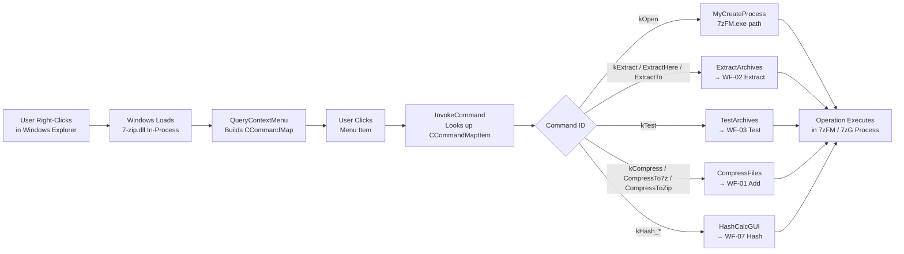

# Workflow: Shell Extension Context Menu (Explorer Integration)

**Status**: ✅ Complete  
**Priority**: 3 (Trigger surface — not a standalone data flow)  
**Last Updated**: 2026-03-26  

---

## 1. Executive Summary

**Status**: ✅

**What This Workflow Does**: The Shell Extension makes 7-Zip operations available from the Windows Explorer right-click context menu without launching `7zFM.exe` first. When the user right-clicks a file or selection in Explorer, Windows loads `7-zip.dll` (or `7-zip32.dll`) in-process, queries it for menu items, and then calls `InvokeCommand()` when the user selects one. The shell extension does not perform any archive operations itself — it acts purely as a dispatcher that launches `7zFM.exe`, `7zG.exe`, or calls the `CompressFiles()` / `ExtractArchives()` / `TestArchives()` functions which in turn call the same GUI workflow paths as WF-01 through WF-07.

**Key Differentiator**: WF-08 is a trigger-surface workflow — it handles Windows Shell COM protocol (`IContextMenu`) and maps right-click selections to existing workflow entry points. There is no unique compression, extraction, or hash algorithm. Understanding it is essential for tracing how users trigger operations from Explorer and how the DLL registration and process-launch model works.

**Registration**: `7-zip.dll` is registered as a Shell Extension COM server. The registration adds entries under `HKCR\*\shellex\ContextMenuHandlers\7-Zip` (for files) and `HKCR\Directory\shellex\ContextMenuHandlers\7-Zip` (for directories). The CLSID `{23170F69-40C1-278A-1000-000100020000}` maps to `7-zip.dll`.

**Commands provided**:

| Menu Item | Verb | Dispatches to |
|---|---|---|
| Open archive | `Open` | `7zFM.exe <path>` via `MyCreateProcess` |
| Extract Files... | `Extract` | `ExtractArchives()` → WF-02 |
| Extract Here | `ExtractHere` | `ExtractArchives()` (no dialog) |
| Extract to \<name\>\ | `ExtractTo` | `ExtractArchives()` (fixed dest) |
| Test archive | `Test` | `TestArchives()` → WF-03 |
| Add to archive... | `Compress` | `CompressFiles()` → WF-01 |
| Add to "\<name\>.7z" | `CompressTo7z` | `CompressFiles()` (format=7z, no dialog) |
| Add to "\<name\>.zip" | `CompressToZip` | `CompressFiles()` (format=zip, no dialog) |
| CRC SHA → \<algorithm\> | `Hash_*` | `HashCalcGUI()` → WF-07 |

---

## 2. Workflow Overview

**Status**: ✅

**Conceptual Dataflow**:



**Stage Descriptions**:

1. **Explorer loads 7-zip.dll**: When Explorer builds the context menu for a selection, it instantiates the `CZipContextMenu` COM object from `7-zip.dll` in Explorer's process space. This is a standard Windows Shell Extension in-process COM server.

2. **QueryContextMenu**: Explorer calls `CZipContextMenu::QueryContextMenu(HMENU, ...)`. The method inspects the selected file list (`_fileNames`), checks registry flags (`NContextMenuFlags`), and adds applicable menu items. For an archive file, all extract/test items are shown. For any file, add/compress items are shown. Each added item is recorded in `_commandMap` (a `CObjectVector<CCommandMapItem>`).

3. **User clicks menu item**: Explorer calls `InvokeCommand()` with the verb (as string) or a zero-based index offset.

4. **InvokeCommand dispatches**: `InvokeCommand()` resolves the verb/offset to a `CCommandMapItem` and calls `InvokeCommandCommon(cmi)`. This switch statement dispatches:
   - `kOpen`: calls `MyCreateProcess(Get7zFmPath(), params)` — launches `7zFM.exe` with the archive path as argument, then returns immediately. The archive opens in FM's panel.
   - `kExtract` / `kExtractHere` / `kExtractTo`: calls `ExtractArchives(_fileNames, folder, showDialog, ...)` — this runs the WF-02 extract path, optionally showing `CExtractDialog`.
   - `kTest`: calls `TestArchives(_fileNames)` — identical to choosing Test in FM (WF-03).
   - `kCompress` / `kCompressTo7z` / `kCompressToZip`: calls `CompressFiles(folder, arcName, arcType, ...)` — shows CompressDialog for `kCompress`; runs silently for `kCompressTo7z`/`kCompressToZip` (WF-01).
   - `kHash_*`: calls `HashCalcGUI(files, methodName)` (WF-07).

5. **Process boundary**: For `kOpen`, control crosses a process boundary (`7zFM.exe` is launched). For all other commands, the operation runs in `7zFM`'s code loaded into Explorer's process. On 64-bit Windows with 32-bit Explorer, the 32-bit `7-zip32.dll` is used.

---

## 3. Entry Point Analysis

**Status**: ✅

**COM Registration** (at install time):
```
HKCR\CLSID\{23170F69-40C1-278A-1000-000100020000}
  InProcServer32 → C:\Program Files\7-Zip\7-zip.dll
HKCR\*\shellex\ContextMenuHandlers\7-Zip → {CLSID}
HKCR\Directory\shellex\ContextMenuHandlers\7-Zip → {CLSID}
HKCR\Drive\shellex\ContextMenuHandlers\7-Zip → {CLSID}
```

**Class / Module Hierarchy**:

| Layer | Class / Module | Responsibility | Code Reference |
|---|---|---|---|
| COM object | `CZipContextMenu` | Implements `IContextMenu` / `IContextMenu2` / `IExplorerCommand` | `ContextMenu.cpp` |
| Menu builder | `QueryContextMenu()` | Builds menu items; populates `_commandMap` | `ContextMenu.cpp:585` |
| Dispatcher | `InvokeCommandCommon()` | Routes command to appropriate workflow function | `ContextMenu.cpp:1255` |
| Compress entry | `CompressFiles()` | Shows dialog or silent compress; WF-01 | `CompressCall.cpp` |
| Extract entry | `ExtractArchives()` | Shows dialog or direct extract; WF-02 | `ExtractGUI.cpp` |
| Test entry | `TestArchives()` | Direct test; WF-03 | `ExtractGUI.cpp` |
| Hash entry | `HashCalcGUI()` | Hash dialog; WF-07 | `HashGUI.cpp` |
| Process launch | `MyCreateProcess(Get7zFmPath(), params)` | Opens FM for `kOpen` command | `ContextMenu.cpp:1273` |

---

## 4. Data Structures

**Status**: ✅

| Field / Object | Description |
|---|---|
| `CZipContextMenu::_fileNames` | `UStringVector` — selected file paths from Explorer |
| `CZipContextMenu::_commandMap` | `CObjectVector<CCommandMapItem>` — all menu items added by `QueryContextMenu` |
| `CCommandMapItem::CommandInternalID` | `enum_CommandInternalID` — e.g. `kOpen`, `kExtract`, `kCompress` |
| `CCommandMapItem::Folder` | Output/target folder for extract/compress commands |
| `CCommandMapItem::ArcType` | Archive type string (e.g. `"7z"`, `"zip"`) for silent compress |
| `CCommandMapItem::ArcName` | Suggested output archive name |
| `NContextMenuFlags` | Registry-loaded bitmask controlling which menu items appear |
| `_attribs.FirstDirIndex` | -1 if no directories selected; ≥0 if a directory is in selection (affects which commands appear) |

**Context Menu Flags** (from `ContextMenuFlags.h`): Individual bits for `kOpen`, `kExtract`, `kExtractHere`, `kExtractTo`, `kTest`, `kCompress`, `kCompressEmail`, `kCompressTo7z`, `kCompressTo7zEmail`, `kCompressToZip`, `kCompressToZipEmail`. The user can configure which items appear via 7-Zip Options.

---

## 5. Algorithm Deep Dive

**Status**: ✅

**Algorithm**: Menu construction + single dispatch — no iterative computation.

**QueryContextMenu decision logic** (simplified):

1. Determine if selected files are archives (by extension and/or signature). If yes, add Open, Extract, ExtractHere, ExtractTo, Test — controlled by `NContextMenuFlags`.
2. Always add Compress, CompressTo7z, CompressToZip — controlled by `NContextMenuFlags`.
3. For "CompressTo7z": auto-generate archive name from selection (single file → `name.7z`; multiple files → `parent-folder-name.7z`) via `CreateArchiveName()`.
4. Each menu item added via `AppendMenu(hMenu, ...)` + `AddCommand(cmdID, label, cmi)` — the command map index corresponds to the menu item's offset from `indexMenu`.
5. Return `MAKE_HRESULT(SEVERITY_SUCCESS, 0, commandCount)` — tells Explorer how many items were added.

**Verb resolution in InvokeCommand**:

Explorer can invoke by integer offset (legacy) or by string verb (modern). The method:
1. Checks `CMINVOKECOMMANDINFOEX::lpVerbW` for Unicode verb.
2. Falls back to `LOWORD(commandInfo->lpVerb)` as integer offset.
3. `FindVerb(verbString)` searches `_commandMap` for a matching `CCommandMapItem::Verb`.
4. Dispatches to `InvokeCommandCommon(cmi)`.

**Silent compress name generation**: For `kCompressTo7z` / `kCompressToZip`, the archive name is:
- Single selected file `foo.txt` → `foo.7z` / `foo.zip`
- Folder `MyProject\` → `MyProject.7z`
- Multiple files → `parent-folder-name.7z`
- Name generated by `CreateArchiveName()` in `ArchiveName.cpp`; same logic used when FM auto-names new archives.

---

## 6. State Mutations

**Status**: ✅

**Shell Extension state** (in Explorer process):
- `_commandMap` and `_fileNames` are populated by `QueryContextMenu()` and read by `InvokeCommand()`. Both exist only for the lifetime of the context menu.
- No global state is modified in the DLL.

**Disk state**: Only the dispatched workflow (WF-01/WF-02/WF-03/WF-07) modifies disk state. The shell extension itself is stateless.

**Registry reads** (not writes):
- `NContextMenuFlags` loaded from `HKCU\Software\7-Zip\Options\ContextMenu` each time `QueryContextMenu()` is called.
- No registry writes during menu display or invocation.

---

## 7. Error Handling

**Status**: ✅

**Error: Unknown or Invalid Command Offset / Verb**
- `InvokeCommand()` checks `commandOffset >= _commandMap.Size()`.
- Returns `E_INVALIDARG`. Explorer ignores this silently.

**Error: Selected Directories in Extract**
- `kExtract` / `kExtractHere` / `kExtractTo` check `_attribs.FirstDirIndex != -1`.
- If directories are selected for extraction (which makes no sense), a message box shows `IDS_SELECT_FILES`. Operation does not proceed.

**Error: COM exception in dispatched workflow**
- `InvokeCommandCommon()` is wrapped in `COM_TRY_BEGIN/END`. Any C++ exception is caught and returned as an `HRESULT`.
- Explorer receives the error code but typically does not surface it to the user.

**Error: 7zFM.exe not found** (for `kOpen`)
- `Get7zFmPath()` constructs the path by replacing the DLL filename with `7zFM.exe` in the same directory.
- `MyCreateProcess()` returns `FALSE` if creation fails; error is silently swallowed.

**Security note**: The shell extension runs inside Explorer's process. It receives file paths from Explorer without additional validation. It does not shell-execute paths; it passes them as arguments to `CompressFiles()` / `ExtractArchives()` which do their own path validation.

---

## 8. Integration Points

**Status**: ✅

| Component | Role |
|---|---|
| Windows Shell (`shell32.dll`) | Calls `QueryContextMenu()` and `InvokeCommand()` via `IContextMenu` |
| `CZipContextMenu` | COM object — the only shell-extension-specific class |
| `CompressFiles()` | WF-01 Add entry point |
| `ExtractArchives()` | WF-02 Extract entry point |
| `TestArchives()` | WF-03 Test entry point |
| `HashCalcGUI()` | WF-07 Hash entry point |
| `MyCreateProcess()` | Launches `7zFM.exe` for Open command |
| Windows Registry | Read-only: `ContextMenu` flags |
| `CreateArchiveName()` | Auto-generates archive name for silent compress |

The shell extension does not directly use `CCodecs`, `IInArchive`, `IOutArchive`, or any encoder/decoder.

---

## 9. Key Insights

**Status**: ✅

**Design Philosophy**: The shell extension is a thin adapter between the Windows Shell COM protocol and 7-Zip's existing workflow entry points. None of the archive or codec logic is duplicated. This means any bug fix or feature added to WF-01 through WF-07 is automatically reflected in the context menu behavior — there is no separate "shell extension code path" for archive operations.

**In-process risk**: Running inside Explorer's process means a crash in any dispatched workflow would crash Explorer. 7-Zip mitigates this by wrapping `InvokeCommand()` in `COM_TRY_BEGIN/END`. Real-world crash risk is low because the heavy work (compression, extraction) typically happens in a spawned child process (`7zG.exe` for GUI operations) which is separate from Explorer's process.

**`IExplorerCommand` vs `IContextMenu`**: The source contains a newer `CZipExplorerCommand` class implementing `IExplorerCommand` (the Windows 11 modern context menu API), in addition to the classic `CZipContextMenu` implementing `IContextMenu`. Both are registered; Windows chooses which to use based on OS version and Explorer configuration.

**Context menu flag customization**: The user can hide any subset of menu items through the 7-Zip Options dialog (FM: Tools → Options → 7-Zip tab). The flags are stored as a bitmask in the registry and read by `QueryContextMenu()` on every right-click.

---

## 10. Conclusion

**Status**: ✅

**Summary**:
1. The Shell Extension is a COM in-process server (`7-zip.dll`) that adapts the Windows Shell right-click protocol to 7-Zip's existing workflow entry points.
2. `QueryContextMenu()` builds the menu from a `CCommandMap`; `InvokeCommand()` dispatches to WF-01/WF-02/WF-03/WF-07.
3. No compression, extraction, or hashing logic exists in the shell extension itself — it delegates 100% to the same functions used by the File Manager.
4. `kOpen` crosses a process boundary (`7zFM.exe` launched). All other operations run in-process.
5. Two COM interfaces are implemented: `IContextMenu` (classic, all Windows versions) and `IExplorerCommand` (Windows 11 modern menu).
6. Context menu item visibility is user-configurable via registry flags.

**Documentation Completeness**:
- ✅ All 9 command verbs documented with their dispatch targets
- ✅ Process boundary documented (kOpen vs. in-process)
- ✅ COM registration paths documented
- ✅ `IExplorerCommand` (Windows 11) vs `IContextMenu` (classic) dual registration noted
- ✅ Context menu flag registry key identified
