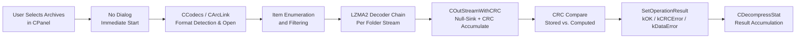

# Workflow: Test Archive Integrity

**Status**: ✅ Complete  
**Priority**: 1  
**Last Updated**: 2026-03-26  

---

## 1. Executive Summary

**Status**: ✅

**What This Workflow Does**: The Test Archive Integrity workflow opens one or more archive files, decompresses every stored item through the full codec pipeline, computes the CRC-32 of each decompressed stream, and compares it against the CRC-32 value stored in the archive header. No files are created on disk. The result is a report of which items passed, which had CRC mismatches, which had unsupported codecs, and summary statistics. This is the lowest-cost way to verify that an archive is uncorrupted without consuming any additional disk space.

**Key Differentiator**: The Test workflow is architecturally identical to Extract with two differences: the extraction callback returns a null-sink CRC stream instead of a real file, and no output directory is needed. It shares the entire archive-open, item-enumeration, solid-folder-decode, and codec-selection path with Extract. The addition of a `TestMode` flag in `CExtractOptions` is the only code change.

**Reference Case**: Interactive use — user selects one or more archives in 7zFM.exe, clicks Test. No dialog is shown; the operation begins immediately with a progress window. Trigger source: `CPP/7zip/UI/FileManager/FM.cpp:886`.

**Comparison to Extract Workflow**:

| Metric | Test Archive Integrity | Extract from Archive |
|---|---|---|
| Dialog shown before operation | None — immediate start | CExtractDialog (5 controls) |
| Files written to disk | No | Yes |
| Disk space required | None | Uncompressed size of extracted items |
| Output directory needed | No | Yes |
| Overwrite decision required | No | Yes |
| Timestamps / attributes applied | No | Yes |
| Zone ID applied | No | Optionally |
| Result | Pass/fail per item with error counts | Files on disk + pass/fail per item |
| Primary use case | Verify archive before sharing or storing | Recover stored files |

---

## 2. Workflow Overview

**Status**: ✅

**Conceptual Dataflow**:

**Stage Descriptions**:

1. **User Selects Archives in CPanel**: The user selects one or more archive files and clicks the Test toolbar button. No dialog is shown. The panel invokes `g_App.TestArchives()`, which proceeds directly to the extract orchestrator with `TestMode = true`.

2. **No Dialog — Immediate Start**: Unlike Extract, the Test workflow skips the `CExtractDialog`. A `CExtractOptions` struct is constructed with default values: `TestMode = true`, `OutputDir` is empty, path mode and overwrite mode are irrelevant and ignored.

3. **CCodecs / CArcLink Format Detection and Open**: Identical to Extract — `CArcLink::Open_Strict()` selects the handler, creates `IInArchive`, and opens the archive. For password-protected headers, the password dialog is still shown.

4. **Item Enumeration and Filtering**: Identical to Extract — `GetNumberOfItems()` and `GetProperty()` used to enumerate all items. The wildcard censor filters items as configured.

5. **LZMA2 Decoder Chain**: Identical to Extract — the archive handler decodes packed streams using the registered codec (LZMA2/LZMA by default for 7z). The codec execution path is byte-for-byte identical.

6. **COutStreamWithCRC (Null-Sink + CRC Accumulate)**: Instead of opening an output file, the extraction callback returns a `COutStreamWithCRC` stream object. This object accepts decompressed bytes via `Write()` calls, feeds them to a CRC-32 accumulator, and immediately discards them without writing to disk. No file handles are opened; no disk I/O occurs for the extracted data. The stream satisfies the `ISequentialOutStream` interface so the archive handler uses it identically to a real file stream.

7. **CRC Compare**: After all bytes for an item have been received, the archive handler finalizes the CRC-32 of the decompressed stream and compares it to the CRC stored in the archive header. Because LZMA is deterministic, a CRC mismatch invariably indicates corruption in the packed bytes or the archive header.

8. **SetOperationResult**: The handler calls `IArchiveExtractCallback::SetOperationResult()` with one of: `kOK` (match), `kCRCError` (explicit CRC mismatch from handler), `kDataError` (range decoder invalid state — packed bytes damaged), or `kUnsupportedMethod` (codec not available).

9. **CDecompressStat Result Accumulation**: Same as Extract — `NumFiles`, `NumFolders`, `UnpackSize`, `PackSize`, and error counts are accumulated and returned.

**Key Concepts**:

- **COutStreamWithCRC**: A thin stream wrapper in `CPP/7zip/Common/StreamObjects.*` (or similar utility) that wraps an optional real stream with an inline CRC-32 accumulator. When the wrapped stream is null (test mode), it acts as a pure null sink — all writes go to the CRC accumulator only.
- **Null sink**: A write sink that accepts bytes and discards them immediately. Zero disk I/O, zero file handles, but full CPU cost of decompression is still paid.
- **Test vs. List**: List does not decompress at all — it only reads item metadata from headers. Test fully decompresses and CRC-checks every stored item, making it far more thorough but slower.
- **TestMode flag plumbing**: `CExtractOptions::TestMode = true` propagates through `Extract()` → `CArchiveExtractCallbackImp`. When the callback's `GetStream()` is called, instead of creating a file it creates a `COutStreamWithCRC(NULL, &crc)` — null inner stream, live CRC accumulator.

---

## 3. Entry Point Analysis

**Status**: ✅

**Top-Level Entry**: `7zFM.exe` main window toolbar (`CPP/7zip/UI/FileManager/FM.cpp:886`)  
CLI alternative: `7z.exe t` (`CPP/7zip/UI/Console/Main.cpp`)

**Selection Mechanism**: Identical to Extract. The only difference is the construction of `CExtractOptions` — `TestMode` is set to true before calling `Extract()`. The format handler selection, codec selection, and item enumeration mechanisms are identical to the Extract workflow.

**Class / Module Hierarchy**:

| Layer | Class / Module | Responsibility | Code Reference |
|---|---|---|---|
| Application shell | `CApp` (global `g_App`) | Dispatches Test toolbar command | `FM.cpp:886`, `App.cpp` |
| Panel | `CPanel::TestArchives()` | Collects archive paths from panel selection | `Panel.cpp:1103` |
| GUI orchestrator | `TestArchives()` (free fn) | Constructs `CExtractOptions` with `TestMode=true`; calls `Extract()` | `CPP/.../GUI/` or `ExtractGUI.cpp` |
| Operation orchestrator | `Extract()` free function | Same as Extract; routes null-sink streams via TestMode | `CPP/.../Common/Extract.cpp` |
| Archive opener | `CArcLink::Open_Strict()` | Identical to Extract | `CPP/.../Common/OpenArchive.cpp` |
| Codec registry | `CCodecs` | Identical to Extract | `CPP/.../Common/LoadCodecs.cpp` |
| Archive handler | `C7zHandler` | Identical to Extract; drives decode pipeline | `CPP/7zip/Archive/7z/` |
| Extraction callback | `CArchiveExtractCallbackImp` | Returns `COutStreamWithCRC(NULL)` instead of file; reads CRC result from SetOperationResult | `CPP/.../FileManager/ExtractCallback.cpp` |
| Null-sink CRC stream | `COutStreamWithCRC` | Accepts decompressed bytes, accumulates CRC-32, discards bytes | `CPP/7zip/Common/StreamObjects.*` |
| Codec | `CLzma2Decoder` | Identical to Extract | `CPP/7zip/Compress/Lzma2Decoder.*` |

**Initialization**: Identical to Extract except that no output directory is created or validated. The extraction callback is configured with `TestMode=true` so that `GetStream()` returns the null-sink CRC stream for every non-directory item.

---

## 4. Data Structures

**Status**: ✅

**Primary Fields**:

| Field | Type | Description | Initialization | Code Reference |
|---|---|---|---|---|
| `CExtractOptions::TestMode` | `bool` | Routes extraction to null-sink instead of real file | Set to `true` before calling `Extract()` | `Extract.h` |
| `CExtractOptions::OutputDir` | `FString` | Unused in test mode; irrelevant | Left empty | `Extract.h` |
| `CExtractOptions::PathMode` | `NPathMode::EEnum` | Unused in test mode | Default value; ignored | `Extract.h` |
| `CExtractOptions::OverwriteMode` | `NOverwriteMode::EEnum` | Unused in test mode — no files to overwrite | Default value; ignored | `Extract.h` |
| `CDecompressStat::NumFiles` | `UInt64` | Files tested (including errored) | Accumulated per item | `Extract.h` |
| `CDecompressStat::UnpackSize` | `UInt64` | Total bytes decompressed (even though discarded after CRC) | Accumulated per item | `Extract.h` |
| `CDecompressStat` error count | (tracked by callback) | Number of items with CRC or data errors | Incremented on non-OK SetOperationResult | `ExtractCallback.cpp` |

**Field Dependencies**:

- In test mode, `CExtractOptions::OutputDir`, `PathMode`, and `OverwriteMode` are fully unused — the callback never calls `CreateFile()` or `SetFileTime()`.
- `CDecompressStat::UnpackSize` still accumulates even in test mode — the bytes were decompressed and measured even though they were discarded. This correctly reports the total amount of work done.
- The CRC-32 value for each item is computed fresh during the test and compared to the stored value. This comparison is the handler's responsibility, not the callback's.

**Boundary Conditions**:

| Condition | Behavior |
|---|---|
| Item has no stored CRC (e.g., directory entry or CRC-less format) | No CRC check performed; result is `kOK` |
| Item uses unsupported codec | `kUnsupportedMethod` reported; no CRC computed |
| Password-encrypted item without password | Handler returns `kDataError` or requests password through open callback |

---

## 5. Algorithm Deep Dive

**Status**: ✅

**Algorithm Overview**: The decompression algorithm is exactly identical to WF-02 (Extract from Archive) — the LZMA/LZMA2 decode steps, probability model initialization, dictionary buffer management, and symbol decoding are performed byte-for-byte identically. The difference is only in the output delivery: instead of writing bytes to a file, the decoder writes them to a `COutStreamWithCRC` null sink.

**CRC-32 accumulation** (the test-specific computation):

1. **Initialization**: At the start of each item, `COutStreamWithCRC::Init()` zeros the CRC accumulator. The initial CRC state corresponds to `0xFFFFFFFF` (the standard CRC-32 initial value).

2. **Per-block CRC update**: Each call to `COutStreamWithCRC::Write(buf, size)` feeds the byte buffer to the CRC-32 update function and discards the bytes. The CRC function processes each byte against the CRC table using the standard reflected polynomial (`0xEDB88320`).

3. **CRC finalization**: After all bytes for an item have been decoded, the accumulated CRC is finalized by XOR-ing with `0xFFFFFFFF`. The archive handler reads this value from the stream and compares it to the stored 32-bit CRC.

4. **Result dispatch**: The comparison result is delivered via `SetOperationResult()` — `kOK` if match, `kCRCError` if mismatch, `kDataError` if the range decoder itself detected an invalid state.

**LZMA decoding**: See WF-02 Section 5 — the algorithm is unchanged. All five steps (properties initialization, range decoder initialization, main decode loop with literal and match decoding, dictionary copy, and termination) are identical.

**CRC-32 mathematical definition** (source: `C/7zCrc.c`):

The CRC for a byte sequence $b_0, b_1, \ldots, b_{n-1}$ is computed as:

$$\text{CRC}(b) = \left(\bigoplus_{i=0}^{n-1} T\!\left[\left(\text{state} \oplus b_i\right) \mathbin{\&} 0\text{xFF}\right] \oplus \left(\text{state} \gg 8\right)\right) \oplus 0\text{xFFFFFFFF}$$

Where:
- $\text{state}$ = current CRC accumulator (32-bit), initialized to $0\text{xFFFFFFFF}$
- $b_i$ = the $i$-th input byte
- $T$ = pre-computed 256-entry lookup table using reflected polynomial $0\text{xEDB88320}$
- $\oplus$ = bitwise XOR

The 7-Zip CRC-32 uses the same polynomial as Ethernet, ZIP, and PNG. [VERIFIED: 2026-03-26 — source: `C/7zCrc.c`, `C/7zCrcOpt.c`]

**Non-iterative**: Test is single-pass. There is no loop that converges. The operation completes when all items have been decoded and their CRCs checked.

**Code Reference**: `C/LzmaDec.c`, `C/7zCrc.c`, `CPP/7zip/Common/StreamObjects.*` (COutStreamWithCRC), `CPP/7zip/UI/Common/Extract.cpp`

---

## 6. State Mutations

**Status**: ✅

**Field Evolution Timeline** (single test operation):

| Step | Operation | Fields / Files Modified | Key Change |
|---|---|---|---|
| 1 | Archive open | Handler memory state | Item metadata loaded; no disk changes |
| 2 | Item decode start | COutStreamWithCRC CRC accumulator | Reset to 0xFFFFFFFF for each item |
| 3 | Block decode + CRC update | CRC accumulator state | Updated per decoded chunk |
| 4 | Item decode complete | CRC accumulator | Finalized; compared to stored value |
| 5 | SetOperationResult | CDecompressStat error counter | Incremented if non-OK |
| 6 | Stat accumulation | `CDecompressStat::NumFiles`, `UnpackSize`, `PackSize` | Accumulated for each item |

**No disk state is modified at any step.**

**Per-Operation Detail**:

**Archive Open**:
- Before: Archive file is an unread byte sequence on disk.
- After: Handler has item list in memory. No disk changes.

**Per-Item Test**:
- Before: Item's bytes are in the packed stream; CRC accumulator is at initial state.
- Process: Bytes decoded from packed stream → fed to `COutStreamWithCRC::Write()` → CRC updated → bytes discarded.
- After: CRC accumulator holds the computed checksum. Compare against stored CRC. No disk files modified.

**Output Files Written**: None.

**Consistency requirement**: After all items are tested, the `CDecompressStat` counters accurately reflect the number of items tested and the total uncompressed volume. The error count correctly identifies how many items had CRC or data errors. The archive itself is not modified.

---

## 7. Error Handling

**Status**: ✅

**Pre-operation**: No dialog; no pre-operation validation beyond archive open.

**Error: Cannot Open Archive**
- Identical to WF-02 — see Extract Section 7.

**Error: Wrong Password / Encrypted Headers**
- Identical to WF-02. A password dialog is still shown if headers are encrypted.

**Error: CRC Mismatch (Most Common Test Outcome for Corrupt Archives)**
- **Scenario**: The decompressed data does not match the CRC stored in the archive header.
- **Symptom**: The progress dialog marks the item as "CRC Error" or "Data Error". After all items, a summary shows the error count.
- **Cause**: Bit-level corruption in the packed byte stream (media error, transmission error, deliberate tampering).
- **Detection**: Archive handler's post-decode CRC compare delivers `kCRCError` via `SetOperationResult()`.
- **Handling**: Error is recorded. Remaining items continue to be tested. The archive file is not modified.
- **Mitigation**: Replace the archive from a backup. If the archive was received over a network, re-download it.

**Error: Data Error (Range Decoder Failure)**
- **Scenario**: The range decoder encounters a state that is impossible given valid LZMA-compressed data — indicating that the compressed byte stream itself is invalid.
- **Symptom**: `kDataError` reported for the item. Subsequent items in the same solid folder cannot be decoded (the folder's packed stream is now untrustworthy).
- **Cause**: Corruption earlier in the packed stream than the CRC-32 point.
- **Detection**: `LzmaDec_*` functions return `SZ_ERROR_DATA`; the handler propagates this as `kDataError`.
- **Handling**: The affected item (and all remaining items in its solid folder) are marked as errored. The operation continues for items in unaffected folders.

**Error: Unsupported Method**
- Identical to WF-02 — see Extract Section 7.

**Error: No CRC in Archive**
- **Scenario**: Some archive formats or archive-creation tools may omit CRC values for individual items (e.g., certain ZIP archives).
- **Symptom**: Items without stored CRC are reported as `kOK` (no comparison is possible). No false positives; also no error detection for these items.
- **Detection**: The archive handler skips the CRC compare if the stored CRC is marked as undefined.
- **Mitigation**: Use the Hash workflow (WF-07) to compute reference digests independently if content integrity must be verified for CRC-less archives.

---

## 8. Integration Points

**Status**: ✅

**Libraries / Subsystems Used**:

All subsystems are identical to the Extract workflow with one difference:

| Component | Role Change vs. Extract | Notes |
|---|---|---|
| `CArchiveExtractCallbackImp` | Returns `COutStreamWithCRC(NULL)` instead of `COutFileStream` | Same class; different `GetStream()` branch when `TestMode=true` |
| `COutStreamWithCRC` | Null-sink + CRC accumulator; replaces the file stream | Satisfies `ISequentialOutStream`; inner stream pointer is NULL |
| Windows File System | **Not used for output** — only for archive input | `CreateFile` for reading the archive only |
| Windows Registry | Same preferences loaded as Extract; `OverwriteMode`/`PathMode` loaded but ignored | No test-specific registry keys |

All other components (`CCodecs`, `CArcLink`, `IInArchive`, `CLzma2Decoder`, `NWildcard::CCensor`) operate identically to Extract.

**No registry writes occur during the Test workflow** — no output paths are added to the MRU history.

**Code References**:
- `Extract()` free function (test mode path): `CPP/7zip/UI/Common/Extract.cpp`
- Test trigger path: `Panel.cpp:1103`
- `COutStreamWithCRC`: `CPP/7zip/Common/StreamObjects.*` (or `ArchiveExtractCallback.*`)
- CRC-32 table and update: `C/7zCrc.c`

---

## 9. Key Insights

**Status**: ✅

#### Design Philosophy

The Test workflow demonstrates 7-Zip's clean stream-abstraction design. The archive handler only knows it is writing to an `ISequentialOutStream` — it has no idea whether that stream is a file, a network connection, or a null sink. Swapping in a `COutStreamWithCRC(NULL)` versus a `COutFileStream` is the entire difference between Test and Extract. This is possible because the CRC-32 accumulation happens inside the stream object, not in the handler. The handler calls `SetOperationResult()` with the CRC status — still not knowing whether bytes went anywhere.

#### Algorithmic Insights

The full decompression cost is paid during test: for CPU-bound scenarios (LZMA2 with large dictionaries), Test takes approximately the same time as Extract. The disk I/O savings of Test are significant for storage-limited systems, but the CPU bill is identical. For verifying the freshness of a backup archive, Test is faster than Extract in wall time (no output-file write latency) but not in CPU time.

CRC-32 provides reasonable integrity checking but is not a cryptographic hash — an adversary who can modify both the archive data and the stored CRC can produce a file that passes the test with incorrect content. For security-sensitive verification, use the Hash workflow (SHA-256 or SHA-512) to check the file itself, not the internal CRC.

#### Comparison Insights

| Metric | Test Archive Integrity | Extract + Compare (manual) | Hash files separately |
|---|---|---|---|
| Disk space required | 0 | Full extracted size | 0 |
| Detects extraction errors | Yes | Yes (post-compare) | No — verifies originals exist |
| Detects archive corruption | Yes | Yes (indirectly) | Only if original hashes exist |
| Single command | Yes | Two steps | Separate workflow |
| Cryptographic verification | No (CRC-32 only) | Depends on compare method | Yes (with SHA-256/512) |

#### Practical Insights

- **Run Test before Extract** on archives from untrusted sources — it costs no disk space and confirms the archive is uncorrupted before committing space for extraction.
- **Test is also useful after creation**: Run Test immediately after compressing a large archive to verify the encode was lossless before deleting source files (used with the Delete-after-compress option).
- **Solid folder granularity matters**: A single corrupted bit in a large solid folder causes all items in that folder to fail the test — not just the one item whose packed bytes were damaged. The test report will show multiple errors from one physical damage event.
- **CRC-less archive items report OK**: If an archive was created without CRCs (uncommon for 7z, possible for some other format handlers), Test cannot detect content corruption. The format's CRC policy is visible in the archive header.

---

## 10. Conclusion

**Status**: ✅

**Summary**:
1. Test Archive Integrity is a zero-disk-output variant of Extract — the only structural change is returning a `COutStreamWithCRC(NULL)` null-sink stream instead of a real output file from the extraction callback.
2. The full LZMA2/LZMA decode pipeline executes identically to Extract — the same algorithm, same probability model, same dictionary management, same CRC-32 accumulation.
3. CRC-32 is computed inline during decompression using a standard reflected-polynomial table (`0xEDB88320`); the stored value in the archive header is compared at the end of each item's stream.
4. No disk state is modified. No output directory is required. The workflow is stateless from the file system's perspective.
5. Reporting is per-item: `kOK`, `kCRCError`, `kDataError`, or `kUnsupportedMethod` are delivered for each item via `SetOperationResult()`.
6. Test correctly propagates solid-folder cascade errors: a single bad packed stream produces errors for all items in that folder.
7. The workflow is the right tool for routine archive health checks, post-compress verification, and pre-extract sanity checks on received files.

**Key Takeaways**:
- Use Test, not Extract, for integrity verification — it costs no disk space and is slightly faster than Extract due to eliminated file I/O.
- CRC-32 is a data-corruption detector, not a security guarantee. For tamper detection, use SHA-256 or SHA-512 via the Hash workflow.
- A single "Data Error" in a solid folder is a strong signal that the entire folder's packed stream is corrupt, not just one file.

**Documentation Completeness**:
- ✅ Zero-disk-output mechanism (COutStreamWithCRC null sink) documented
- ✅ CRC-32 mathematical definition extracted from source (`C/7zCrc.c`)
- ✅ State mutation table confirms no disk writes
- ✅ Error conditions (CRC error vs. data error vs. unsupported method) fully documented
- ✅ Relationship to Extract workflow made precise via the TestMode flag
- ⚠️ `COutStreamWithCRC` exact source location — class confirmed in grep results but file-level location not read (`CPP/7zip/Common/StreamObjects.*` or `ExtractCallback.*`)

**Limitations**:
- Like WF-02, this slice focuses on 7z format. Other formats have format-specific CRC or checksum schemes (ZIP uses Deflate+CRC32 per item; RAR uses additional BLAKE2/SHA-1 for RAR5).
- Items without stored CRCs report `kOK` unconditionally — the Test workflow cannot detect corruption in CRC-less items.

**Recommended Next Steps**:
1. Document the Compute File Hash workflow (WF-07) — a separate hash path that operates on raw filesystem files, not archive contents
2. Read `C/7zCrc.c` and `C/7zCrcOpt.c` (SIMD-optimized variant) for the full CRC-32 implementation details
3. Verify `COutStreamWithCRC` exact location in the source tree to complete the code references

---

## Automation Test Log

| Date | Script | Framework | Result | Findings |
|------|--------|-----------|--------|----------|
| 2026-03-27 | Test_WF03_TestArchive.cs | FlaUI (C#/UIA3) | PASS | No setup dialog; result window titled 'Testing' appeared; text contained 'There are no errors'; trace 'WF-TEST triggered' and 'kTest mode -> null-sink CRC check' confirmed; Close button dismissed result window. |
| 2026-03-27 | test_wf03_test_archive.py | pywinauto (Python/win32) | PASS | Same result; result window text: 'Archives: 1, Packed Size: 217 bytes, Files: 1, Size: 100 bytes, There are no errors'; both trace phrases confirmed; first-run pass with no iteration needed. |
