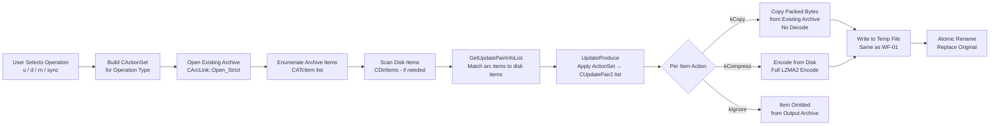

# Workflow: Update / Delete Files in Existing Archive

**Status**: ✅ Complete  
**Priority**: 2  
**Last Updated**: 2026-03-26  

---

## 1. Executive Summary

**Status**: ✅

**What This Workflow Does**: The Update/Delete workflow modifies an existing archive by re-writing it with a new item set. Depending on the operation:
- **Update** (`7z u` / drag-drop into open archive in FM): adds new items and replaces items that are older in the archive than on disk. Items that are the same age or newer in the archive are copied verbatim.
- **Delete** (`7z d` / F8 in FM): removes named items by writing a new archive that excludes them.
- **Rename** (`7z rn`): rewrites item metadata (path name) without changing compressed data.
- **Sync** (`7z u -us`): makes the archive mirror the filesystem — adds new items, updates changed items, deletes items not on disk.

The archive is never modified in-place. The operation always writes to a new temp file, then atomically moves the temp file over the original — the same safe temp-file pattern used by WF-01 (Add to Archive).

**Key Differentiator**: The central mechanism is the `CActionSet` — a 7-element array that maps each of 7 possible `NPairState` values (e.g. "item is only on disk", "item is only in archive", "item is newer on disk") to one of 4 `NPairAction` values (`kIgnore`, `kCopy`, `kCompress`, `kCompressAsAnti`). The `kCopy` action copies compressed bytes from the existing archive directly without decoding — this is the crucial optimization that makes Update fast for large archives where most items are unchanged.

**Reference Cases**:
- FM: Open archive interior → drag-drop new files → Update dialog → writes updated archive
- FM: Select items inside archive → F8 (Delete) → writes archive minus deleted items
- CLI: `7z u archive.7z *.txt` — updates only .txt files; copies everything else
- CLI: `7z d archive.7z old-file.txt` — removes one file

**Comparison to Add (WF-01)**:

| Metric | Update/Delete | Add (WF-01) |
|---|---|---|
| Existing archive required | Yes (if archive exists) | No (creates new) |
| Uses existing packed data | Yes — `kCopy` path copies directly | No — all items re-encoded |
| Action set controls per-item behavior | Yes — 7 states × 4 actions | No — all items always compressed |
| Operations supported | u/d/rn/sync | a |
| Atomic write | Yes — temp-file + rename | Yes — temp-file + rename |

---

## 2. Workflow Overview

**Status**: ✅

**Conceptual Dataflow**:



**Stage Descriptions**:

1. **Build CActionSet**: Each CLI command maps to a pre-defined action set (`k_ActionSet_Update`, `k_ActionSet_Delete`, etc.) from `UpdateAction.cpp`. The action set is a 7-element lookup table.

2. **Open Existing Archive**: `CArcLink::Open_Strict()` opens the existing archive. The `IOutArchive` handle is obtained by `QueryInterface(IID_IOutArchive)` on the existing `IInArchive` — this allows the handler to internally optimize the copy path. If the format does not support `IOutArchive`, the operation is rejected.

3. **Enumerate Archive Items**: `GetNumberOfItems()` + `GetProperty()` populates a `CObjectVector<CArcItem>`. This is a full in-memory snapshot of all items already in the archive.

4. **Scan Disk Items**: For commands that add new items (`kCompress` is possible in the action set), `CDirItems` is constructed by scanning the filesystem wildcard arguments. For pure delete/rename operations where no new files come from disk, this scan is skipped.

5. **GetUpdatePairInfoList**: Matches each `CDirItem` (on-disk) with it s matching `CArcItem` (in-archive) by normalized path, producing a `CRecordVector<CUpdatePair>`. Each pair has a `NPairState` classifying the relationship.

6. **UpdateProduce**: Applies the `CActionSet` to each `CUpdatePair` to produce a `CRecordVector<CUpdatePair2>`. Each `CUpdatePair2` has `NewData` and `NewProps` booleans and `ArcIndex` / `DirIndex` back-references. `kCopy` items get `NewData=false, ArcIndex≥0`; `kCompress` items get `NewData=true, DirIndex≥0`.

7. **Per-Item Output Loop**: `IOutArchive::UpdateItems()` iterates the `CUpdatePair2` list. For each item:
   - `kCopy` (`NewData=false`): the handler internally copies the compressed bytes from its open `IInArchive` — no decode, no re-encode. This is an opaque handler optimization.
   - `kCompress` (`NewData=true`): the callback opens the disk file and feeds it through the codec chain (full LZMA2 encode, same as WF-01).
   - `kIgnore`: item is not included.

8. **Write to Temp File + Atomic Rename**: Identical to WF-01. All output goes to a temp file; on success it is renamed over the original.

---

## 3. Entry Point Analysis

**Status**: ✅

| Interface | Entry | Code Reference |
|---|---|---|
| CLI `7z u` | `Main.cpp` → `UpdateArchive()` | `Update.cpp:~line 1374` |
| CLI `7z d` | Same path, `k_ActionSet_Delete` | `Update.cpp` |
| CLI `7z rn` | Special rename mode in `Compress()` | `Update.cpp:~line 460` |
| FM drag-drop into archive | `PanelOperations.cpp` → `IFolderOperations::CopyTo()` → `UpdateArchive()` | `PanelOperations.cpp` |
| FM F8 Delete inside archive | `PanelOperations.cpp` → `IFolderOperations::Delete()` → `UpdateArchive()` | `PanelOperations.cpp` |

**Class / Module Hierarchy**:

| Layer | Class / Module | Responsibility |
|---|---|---|
| Entry (CLI) | `Main.cpp` | Parses command type; calls `UpdateArchive()` |
| Orchestrator | `UpdateArchive()` free fn | Opens archive; builds item lists; calls `Compress()` per output command |
| Pair producer | `GetUpdatePairInfoList()` | Matches disk↔archive items by path; produces CUpdatePair list |
| Action applicator | `UpdateProduce()` | Applies CActionSet to CUpdatePair list; produces CUpdatePair2 operation chain |
| Archive writer | `IOutArchive::UpdateItems()` | Handler implements per-item compress-or-copy logic |
| New data encoder | `CLzma2Encoder` → `LzmaEnc_*` | Only invoked for `kCompress` items |
| Temp file manager | `CArchivePath`, `CTempFiles` | Same as WF-01 |

---

## 4. Data Structures

**Status**: ✅

**`NPairState::EEnum`** — 7 possible relationships between a disk item and an archive item:

| Value | Meaning |
|---|---|
| `kNotMasked` (0) | Item exists in archive but was not selected by the censor (wildcard did not match) |
| `kOnlyInArchive` (1) | Item is in archive but not on disk |
| `kOnlyOnDisk` (2) | Item is on disk but not in archive |
| `kNewInArchive` (3) | Item exists in both; disk version is newer |
| `kOldInArchive` (4) | Item exists in both; disk version is older |
| `kSameFiles` (5) | Item exists in both; same modification time |
| `kUnknowNewerFiles` (6) | Item exists in both; cannot determine which is newer |

**`NPairAction::EEnum`** — 4 possible actions:

| Value | Meaning |
|---|---|
| `kIgnore` | Omit from output archive |
| `kCopy` | Copy compressed bytes from existing archive without decode |
| `kCompress` | Re-encode from disk source |
| `kCompressAsAnti` | Write an anti-item (marker indicating deletion in solid archives) |

**Built-in Action Sets** (from `UpdateAction.cpp`): states indexed as `[kNotMasked, kOnlyInArc, kOnlyOnDisk, kNewInArc, kOldInArc, kSameFiles, kUnknown]`:

| Operation | Actions |
|---|---|
| `k_ActionSet_Add` | `Copy, Copy, Compress, Compress, Compress, Compress, Compress` — always compress everything from disk, copy unmatched arc items |
| `k_ActionSet_Update` | `Copy, Copy, Compress, Copy, Compress, Copy, Compress` — compress only newer-on-disk items |
| `k_ActionSet_Fresh` | `Copy, Copy, Ignore, Copy, Compress, Copy, Compress` — update existing archive items only (no new items) |
| `k_ActionSet_Sync` | `Copy, Ignore, Compress, Copy, Compress, Copy, Compress` — mirror filesystem (delete arc-only items) |
| `k_ActionSet_Delete` | `Copy, Ignore, Ignore, Ignore, Ignore, Ignore, Ignore` — keep only unselected archive items |

**`CUpdatePair2`**: Result of `UpdateProduce()`:

| Field | Type | Meaning |
|---|---|---|
| `NewData` | `bool` | True = compress from disk; False = copy from archive |
| `NewProps` | `bool` | True = update item properties (e.g. rename) |
| `UseArcProps` | `bool` | If `NewProps && UseArcProps`, only some properties change |
| `ArcIndex` | `int` | Index in `CArcItem` list (-1 if no archive item) |
| `DirIndex` | `int` | Index in `CDirItem` list (-1 if no disk item) |
| `IsAnti` | `bool` | True = write anti-item |

---

## 5. Algorithm Deep Dive

**Status**: ✅

**Algorithm**: The Update/Delete core algorithm is `GetUpdatePairInfoList()` + `UpdateProduce()`:

**Step 1 — Pair matching** (`GetUpdatePairInfoList()`):

For each disk item and each archive item, the algorithm:
1. Normalizes paths to a canonical form.
2. Matches items with the same normalized path (case-insensitive on Windows).
3. If matched, compares modification times using the archive's `fileTimeType` precision.
4. Assigns `NPairState` based on: exists in arc only, exists on disk only, both (with time comparison result).
5. Unmatched disk items → `kOnlyOnDisk`; unmatched arc items → `kOnlyInArchive`.

**Step 2 — Action application** (`UpdateProduce()`):

```
for each UpdatePair:
    state = pair.State
    action = actionSet.StateActions[state]
    if action == kIgnore:
        if ArcIndex >= 0: report ShowDeleteFile(ArcIndex) to callback
        (item not emitted)
    elif action == kCopy:
        emit CUpdatePair2 with NewData=false, ArcIndex=pair.ArcIndex
    elif action == kCompress:
        emit CUpdatePair2 with NewData=true, DirIndex=pair.DirIndex
    elif action == kCompressAsAnti:
        emit CUpdatePair2 with NewData=true, IsAnti=true
```

**Step 3 — Output** (`IOutArchive::UpdateItems()`):

The handler receives an `IArchiveUpdateCallback` and iterates the `CUpdatePair2` list:
- `GetUpdateItemInfo(index, *newData, *newProps, *indexInArchive)` tells the handler what to do for each item.
- For `kCopy` items (`newData=false`): the `IOutArchive` implementation reads packed bytes from its associated `IInArchive` directly. For 7z format, this means copying solid folder data blocks verbatim — O(packSize) byte copy, not O(unpackSize) decode+encode.
- For `kCompress` items (`newData=true`): `GetStream(index, &inStream)` returns the disk file stream; the codec chain (LZMA2) encodes it exactly as in WF-01.

**`kCopy` optimization**: When an existing 7z solid folder has no items changed, the entire folder's packed bytes (which may compress dozens of files!) are written to the new archive without any decompression. This makes incremental updates to large archives very fast. The optimization is format-specific — not all handlers implement it, but 7z and ZIP do.

---

## 6. State Mutations

**Status**: ✅

| Step | Fields / Files Modified | Key Change |
|---|---|---|
| 1 | `CObjectVector<CArcItem>` | Populated from existing archive |
| 2 | `CDirItems` | Populated from disk scan (if needed) |
| 3 | `CRecordVector<CUpdatePair>` | Matched item pairs |
| 4 | `CRecordVector<CUpdatePair2>` | Per-item operation chain produced |
| 5 | Temp file on disk | Output archive written |
| 6 | Original archive on disk (`archivePath`) | Overwritten by atomic rename of temp file |
| 7 | `CTempFiles` | Temp file handle released after rename |

**Input archive is not modified during operation** — only after successful completion, the atomic rename replaces it. If the operation fails before the rename, the original archive is untouched.

**Multi-volume archives**: Update is not supported on multi-volume archives. `kUpdateIsNotSupported_MultiVol` error is thrown immediately.

---

## 7. Error Handling

**Status**: ✅

**Error: Archive Format Does Not Support Update**
- `QueryInterface(IID_IOutArchive)` fails — the archive handler is read-only (e.g., ISO, RAR).
- `kUpdateIsNotSupoorted` exception thrown. Operation aborted; original archive unchanged.

**Error: Multi-Volume Archive**
- Detected by `arc.IsMultiVol` check in `Compress()`.
- `kUpdateIsNotSupported_MultiVol` error. Operation aborted.

**Error: Source File Read Failure (during kCompress)**
- Identical to WF-01 source-file handling. The callback reports the error; the temp file is not renamed; the original archive is preserved.

**Error: Disk Full (during temp file write)**
- Write to temp file fails. Temp file is cleaned up. Original archive is preserved.
- Reported via `CUpdateErrorInfo`.

**Error: Rename Failure (temp → original)**
- Rare (original locked by another process, or cross-device rename attempt).
- The new archive exists in the temp location; the original is unchanged.
- User must manually replace the original.

**Non-destructive guarantee**: The original archive is never modified. The only mutation is the final atomic rename, which is as close to transactional as a local filesystem allows without journaling.

---

## 8. Integration Points

**Status**: ✅

| Component | Role |
|---|---|
| `GetUpdatePairInfoList()` | Disk↔archive item matching; shared with Add path |
| `UpdateProduce()` | Action-set application; the algorithmic heart of Update/Delete |
| `IOutArchive::UpdateItems()` | Handler-level write, including internal kCopy optimization |
| `CLzma2Encoder` | Only invoked for `kCompress` items; identical to WF-01 |
| `CTempFiles` / `CArchivePath` | Temp file management; identical to WF-01 |
| `NWildcard::CCensor` | Which items the operation targets vs. which are left unchanged |
| `PanelOperations.cpp` | FM entry point for drag-drop and F8 delete inside archive |

---

## 9. Key Insights

**Status**: ✅

**Design Philosophy**: The action-set table is the most elegant design in the update subsystem. Five distinct operations (add, update, fresh, sync, delete) share a single code path (`UpdateProduce`) — they differ only in the 7-element `NPairAction` array. The state machine is declarative: the table says what to do for each state, and `UpdateProduce()` applies it mechanically.

**`kCopy` is performance-critical**: For archives where most items are unchanged (e.g., updating one file in a 100-file archive), `kCopy` means the output archive is written almost entirely from a block copy of the input archive's packed stream. On a fast SSD, updating a single file in a large 7z archive takes only slightly longer than copying the archive, not the time it would take to re-encode everything.

**Solid archive trade-off**: In a solid archive, items are packed together into shared solid folders. `kCopy` can only copy an entire solid folder at once — if even one item in a folder changes, the whole folder must be re-encoded. This means solid archives are efficient for read-mostly workloads but expensive to update. Non-solid archives allow finer-grained `kCopy` behavior (one item at a time). The 7z format header contains the solid folder boundaries, so the handler can determine which items share a folder.

**Delete is update with kIgnore**: Deleting items from an archive is not a special operation — it is exactly `k_ActionSet_Delete` applied via `UpdateProduce()`. Items that match the delete selector get `kIgnore`; everything else gets `kCopy`. The result is a new archive that omits the deleted items.

---

## 10. Conclusion

**Status**: ✅

**Summary**:
1. Update/Delete uses an `CActionSet` table (7 states × 4 actions) to declaratively specify per-item behavior for each operation type (add, update, delete, sync).
2. `UpdateProduce()` is a single function that applies any action set — all five operations share one implementation.
3. The `kCopy` action writes existing compressed bytes directly without decode, making incremental archive updates very fast.
4. The temp-file + atomic rename pattern (shared with WF-01) guarantees the original archive is never partially modified.
5. Multi-volume archives and read-only format handlers (ISO, RAR) are rejected early with clear error messages.
6. Solid folder granularity limits the `kCopy` optimization — changing any item in a solid folder forces re-encoding the entire folder.

**Documentation Completeness**:
- ✅ All five action sets fully documented from `UpdateAction.cpp` source
- ✅ All 7 `NPairState` values documented
- ✅ `kCopy` / `kCompress` / `kIgnore` distinction documented with performance implications
- ✅ Solid folder granularity effect on `kCopy` documented
- ✅ `CUpdatePair2` fields documented with exact semantics
