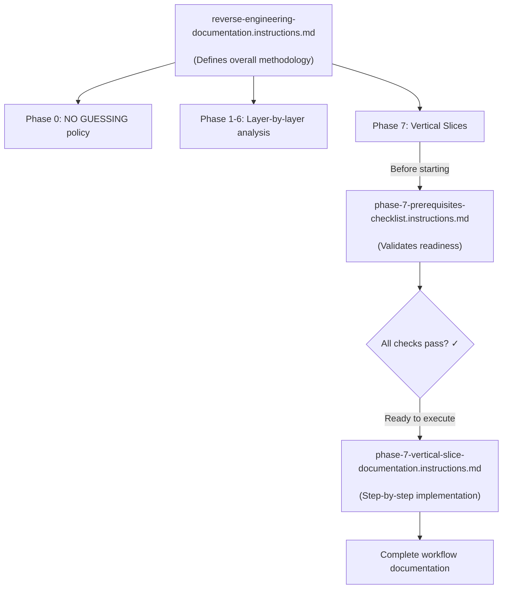

# Reverse Engineering Documentation Guide

## Overview

This directory contains a comprehensive methodology for systematically reverse engineering and documenting legacy software systems. This guide explains how to use the three key documents together to achieve complete, accurate documentation.

---

## Getting Started: Example Kickoff Prompts

### Option A — C# / .NET full process (Phases 0-7)

Use this for any C# / .NET codebase using grep and file reads (no MCP tools required):

```text
I need to reverse engineer and document a legacy C# codebase.

Please follow the guide in:
- docs/reverse-engineering-prompts/vertical-slice-guide-csharp.instructions.md

**Session setup — do this first:**
1. Check whether docs/[SYSTEM NAME]/session-status.md already exists.
   - If it does: read it, identify the current phase, and resume from there — do NOT restart from Phase 0.
   - If it does not: create it now with status "Phase 0 — in progress" and proceed below.

Start with Phase 0:
1. List the solution and project directory structure
2. Review resource access with me (source code, database, external APIs, shared DLLs)
3. Confirm the NO GUESSING policy and documentation standards
4. Record in session-status.md: system type (GUI application / Web API / CLI / daemon / library)

Then guide me through Phases 1-6 in order:
- Before beginning each phase, briefly state your plan: which files you intend to read, what you expect to find, and what would block you. Then proceed.
- Stop and ask when information is unclear — never guess
- Mark unavailable information with [NEEDS CLARIFICATION], [NOT AVAILABLE], or [BLOCKED]
- Update session-status.md at the end of each phase

Do NOT proceed to Phase 7 until ALL of the following are complete:
- Phase 2.5 State Change Patterns are captured
- Phase 3.4 Calculation Engine Analysis is complete (or marked N/A)
- Phase 5.3 Dependency Inventory is complete
- Phase 6.2 Candidate Workflow Inventory table is produced
- Phase 6.3 Readiness Assessment is complete and signed off

The codebase is located at: [YOUR PATH HERE]
The system name is: [SYSTEM NAME]
The system type is: [GUI application / Web API / CLI / daemon / library]

Organize all documentation into:
- docs/[system-name]/system-analysis/ (Phases 0-6)
- docs/[system-name]/vertical-slice-documentation/ (Phase 7)
- docs/[system-name]/vertical-slice-documentation/vertical-slices/ (individual workflows)

Ready to begin?
```

### Option B — C++ full process (Phases 0-7)

Use this for any C++ codebase using grep and file reads (no MCP tools required):

```text
I need to reverse engineer and document a legacy C++ codebase.

Please follow the guide in:
- docs/reverse-engineering-prompts/vertical-slice-guide-cpp.instructions.md

**Session setup — do this first:**
1. Check whether docs/[SYSTEM NAME]/session-status.md already exists.
   - If it does: read it, identify the current phase, and resume from there — do NOT restart from Phase 0.
   - If it does not: create it now with status "Phase 0 — in progress" and proceed below.

Start with Phase 0:
1. List the top-level project structure
2. Review resource access with me (source code, config files, external libraries)
3. Confirm the NO GUESSING policy and documentation standards
4. Record in session-status.md: system type (GUI application / CLI tool / daemon / library / config-file-driven tool)

Then guide me through Phases 1-6 in order:
- Before beginning each phase, briefly state your plan: which files you intend to read, what you expect to find, and what would block you. Then proceed.
- Stop and ask when information is unclear — never guess
- Mark unavailable information with [NEEDS CLARIFICATION], [NOT AVAILABLE], or [BLOCKED]
- Update session-status.md at the end of each phase

Do NOT proceed to Phase 7 until ALL of the following are complete:
- Phase 2.5 State Change Patterns are captured
- Phase 3.4 Calculation Engine Analysis is complete (or marked N/A)
- Phase 5.3 Dependency Inventory is complete
- Phase 6.2 Candidate Workflow Inventory table is produced
- Phase 6.3 Readiness Assessment is complete and signed off

The codebase is located at: [YOUR PATH HERE]
The system name is: [SYSTEM NAME]
The system type is: [GUI application / CLI tool / daemon / library / config-file-driven tool]

Organize all documentation into:
- docs/[system-name]/system-analysis/ (Phases 0-6)
- docs/[system-name]/vertical-slice-documentation/ (Phase 7)
- docs/[system-name]/vertical-slice-documentation/vertical-slices/ (individual workflows)

Ready to begin?
```

### Option D — C++ full process (Phases 0-7) with CognitiveIQ MCP tools

Use this for any C++ codebase when the CognitiveIQ MCP server is running at localhost:8000
(verify: `curl http://localhost:8000/health`). Covers the complete process from Phase 0 through
Phase 7, with a Fast Path to skip directly to Phase 7 if Phases 0-6 are already in memory.

```text
I need to reverse engineer and document a legacy C++ codebase using CognitiveIQ tools.

Please follow the guide in:
- docs/reverse-engineering-prompts/full-process-cpp-cognitiveiq.instructions.md

Start with Section 1 of the guide (Session Setup):
1. Initialize the workspace: workspace_init(agent_name="Claude", root_dirs=["[CODEBASE PATH]"])
   - If reconnecting after a restart, add skip_indexing=True for a 2-second reconnect
2. Check for prior foundation work: memory_search("phases foundation [SYSTEM NAME]")
3. If memory shows Phase 6.3 sign-off is complete → take the Fast Path directly to Phase 7
   Otherwise → begin at Phase 0

Use the progressive narrowing pattern throughout:
  memory_search → cognitive_next → symbol_search → file read → memory_store

Follow the Documentation Contract strictly —
describe behavior in plain English, no code snippets except file references and formulas.

The codebase is located at: [YOUR PATH HERE]
The system name is: [SYSTEM NAME]

Organize all documentation into:
- docs/[system-name]/system-analysis/ (Phases 0-6)
- docs/[system-name]/vertical-slice-documentation/ (Phase 7)
- docs/[system-name]/vertical-slice-documentation/vertical-slices/ (individual workflows)

Ready to begin?
```

---

## Quick Start: Document Reading Order

**For first-time users**, read the documents in this order:

1. **[reverse-engineering-documentation.instructions.md](reverse-engineering-documentation.instructions.md)** - Start here to understand the complete 7-phase methodology
2. **[phase-7-prerequisites-checklist.instructions.md](phase-7-prerequisites-checklist.instructions.md)** - Use this before starting Phase 7 to ensure readiness
3. **[phase-7-vertical-slice-documentation.instructions.md](phase-7-vertical-slice-documentation.instructions.md)** - Follow this detailed guide when executing Phase 7

---

## Documentation Organization

### Required Folder Structure

All reverse engineering documentation **MUST** be organized into the following structure:

```mermaid
graph TD
    root["docs/[system-name]/"]
    sysanalysis["system-analysis/<br/>(Phases 0-6: Foundation)"]
    vertical["vertical-slice-documentation/<br/>(Phase 7: Workflows)"]
    slices["vertical-slices/<br/>(Individual workflows)"]
    
    root --> sysanalysis
    root --> vertical
    vertical --> slices
    
    sysanalysis -.-> p0["phase-0-prerequisites.md"]
    sysanalysis -.-> p1a["phase-1-architecture-patterns.md"]
    sysanalysis -.-> p1b["phase-1-project-structure.md"]
    sysanalysis -.-> p1c["phase-1-technology-stack.md"]
    sysanalysis -.-> p1d["phase-1-data-flow.md"]
    sysanalysis -.-> p25["phase-2-5-state-changes.md"]
    sysanalysis -.-> p3a["phase-3-business-logic.md"]
    sysanalysis -.-> p3b["phase-3-query-services.md"]
    sysanalysis -.-> p3c["phase-3-scan-engines.md"]
    sysanalysis -.-> p3d["phase-3-utility-functions.md"]
    sysanalysis -.-> p4a["phase-4-client-architecture.md"]
    sysanalysis -.-> p4b["phase-4-transport-layer.md"]
    sysanalysis -.-> p53["phase-5-3-dependency-inventory.md"]
    sysanalysis -.-> p5["phase-5-integration-deployment.md"]
    sysanalysis -.-> p63["phase-6-3-readiness-assessment.md"]
    
    vertical -.-> sum["phase-7-summary.md"]
    vertical -.-> pre["phase-7-prerequisites-complete.md"]
    vertical -.-> pri["phase-7-priority-1-index.md"]
    vertical -.-> comp["phase-7-completion-summary.md"]
    
    slices -.-> wf1["phase-7-workflow-checkin.md"]
    slices -.-> wf2["phase-7-workflow-checkout.md"]
    slices -.-> wf3["..."]
```



### Folder Purpose

| Folder | Contains | Phases |
|--------|----------|--------|
| **system-analysis/** | Layer-by-layer technical analysis of the system | 0-6 |
| **vertical-slice-documentation/** | End-to-end workflow documentation and summaries | 7 |
| **vertical-slices/** | Individual workflow documents (7-section format) | 7 |

### Benefits of This Structure

✅ **Clear separation** between foundation (Phases 0-6) and workflows (Phase 7)  
✅ **Easy navigation** - find what you need quickly  
✅ **Scalable** - works for small and large systems  
✅ **Organized** - keeps individual workflows separate from summary documents  
✅ **Standard** - consistent across all projects


**Customization Tips**:
- Replace `[YOUR PATH HERE]` with your actual codebase path
- Replace `[e.g., .NET WinForms application, Web API, etc.]` with your system type
- If you already know specific workflows to document, mention them
- If you have limited time, specify which phases are most critical

**What to Expect**:
The AI will guide you through each phase systematically, stopping to ask questions when it encounters:
- Missing dependencies or external systems
- Unclear business logic or calculations
- Configuration values it cannot find
- Validation rules that need verification

---

## Document Descriptions

### 1. Reverse Engineering Process Template

**File**: [reverse-engineering-documentation.instructions.md](reverse-engineering-documentation.instructions.md)

**Purpose**: The master process document that defines the complete methodology.

**What It Contains**:
- **Phase 0**: Prerequisites & Ground Rules (NO GUESSING policy - applies to ALL phases)
- **Phases 1-6**: Individual layer analysis (Architecture, Data, Business Logic, UI, Integrations, Quality)
- **Phase 7**: User Workflow Vertical Slices (end-to-end synthesis)
- Documentation standards and best practices
- Status indicators and marking conventions

**When to Use**:
- Starting a new reverse engineering project
- Understanding the overall process flow
- Reference during any phase of the work
- Training new team members on the methodology

**Key Sections**:
- Phase 0 establishes the **NO GUESSING** policy that applies throughout
- Each phase (1-7) has specific objectives and deliverables
- Phase 7 synthesizes all previous phases into complete workflow documentation

---

### 2. Phase 7 Prerequisites Checklist

**File**: [phase-7-prerequisites-checklist.instructions.md](phase-7-prerequisites-checklist.instructions.md)

**Purpose**: A **STOP GATE** to ensure you're ready for Phase 7 before starting.

**What It Contains**:
- Quick yes/no readiness questions
- Critical sections that must be complete from Phases 0-6
- Section-by-section dependency mapping (what Phase 7 needs from earlier phases)
- Red flags that indicate you're not ready
- Blocker identification and remediation guidance

**When to Use**:
- **BEFORE** starting Phase 7
- When Phase 7 documentation feels difficult or incomplete
- To identify gaps in earlier phases
- To prioritize which earlier work must be completed first

**Critical Questions to Answer**:
1. Is Phase 6.3 Readiness Assessment complete?
2. Is the Dependency Inventory (Phase 5.3) complete?
3. Are all calculation engines documented (Phase 3.4)?
4. Are state change patterns captured (Phase 2.5)?
5. Do you have the detailed Phase 7 guide open?

**If ANY answer is "No"**, return to the incomplete phases before proceeding.

---

### 3. Phase 7 Vertical Slices Implementation Guide

**File**: [phase-7-vertical-slice-documentation.instructions.md](phase-7-vertical-slice-documentation.instructions.md)

**Purpose**: Detailed, step-by-step execution guide for documenting complete user workflows.

**What It Contains**:
- NO GUESSING policy reinforcement (most critical phase)
- Workflow identification and prioritization process
- 7-section template for each workflow:
  1. Input (Data Entry)
  2. Validation (Input Verification)
  3. Preparation (Data Packaging)
  4. Calculation (Computational Model)
  5. Processing (Result Extraction)
  6. Visualization (Output Display)
  7. Iteration (Repeated Execution)
- Code reference formatting guidelines
- Real-world examples
- Dependency access instructions
- String handling pattern documentation (GetCopyString vs GetCopyOfCTString)

**When to Use**:
- During Phase 7 execution (have it open while documenting workflows)
- When documenting any end-to-end user workflow
- To understand what information is required for each section
- As a reference for documenting calculations and data transformations

**Key Principle**: This is the **MOST IMPORTANT PHASE** - it documents complete workflows that must preserve exact behavior. No guessing or assumptions are allowed.

---

## How These Documents Work Together

### The Relationship



### Workflow for Using These Documents

#### Starting a New Reverse Engineering Project

1. **Read** [reverse-engineering-documentation.instructions.md](reverse-engineering-documentation.instructions.md) completely
2. **Complete** Phase 0 (Prerequisites & Ground Rules)
3. **Execute** Phases 1-6 according to the template
4. **Stop** before Phase 7 and open [phase-7-prerequisites-checklist.instructions.md](phase-7-prerequisites-checklist.instructions.md)
5. **Verify** all prerequisites are met
6. **If ready**, open [phase-7-vertical-slice-documentation.instructions.md](phase-7-vertical-slice-documentation.instructions.md) and begin documenting workflows
7. **If not ready**, return to incomplete phases

#### Already Mid-Project and Need to Document a Workflow

1. **Open** [phase-7-prerequisites-checklist.instructions.md](phase-7-prerequisites-checklist.instructions.md)
2. **Check** which earlier phases are incomplete
3. **Complete** missing sections (refer to main template)
4. **Once ready**, follow [phase-7-vertical-slice-documentation.instructions.md](phase-7-vertical-slice-documentation.instructions.md)

#### Documenting Just One Workflow

Even for a single workflow, you still need:
- Phase 2 information (data structures)
- Phase 3 information (business logic, calculations)
- Phase 4 information (UI screens)
- Phase 5 information (external dependencies)

Use the prerequisite checklist to identify what you need.

---

## Common Scenarios

### Scenario 1: "I'm documenting a calculation-heavy workflow"

**Required Reading**:
1. [reverse-engineering-documentation.instructions.md](reverse-engineering-documentation.instructions.md) - Phase 3.4 (Calculation Engine Analysis)
2. [phase-7-prerequisites-checklist.instructions.md](phase-7-prerequisites-checklist.instructions.md) - Section on Phase 3.4 and Phase 5.3
3. [phase-7-vertical-slice-documentation.instructions.md](phase-7-vertical-slice-documentation.instructions.md) - Sections 3 (Preparation) and 4 (Calculation)

**Critical Dependencies**:
- Access to calculation engines (DLLs, APIs)
- Lookup tables and their data
- Constants and configuration files
- Sample input/output data

---

### Scenario 2: "I don't have access to external dependencies"

**What to Do**:
1. **Document the gap** using `[NOT AVAILABLE]` markers
2. **Request access** if possible (use Phase 5.3 dependency inventory)
3. **Decide**: Can you proceed with partial information?
4. **Follow** Phase 7's guidance on handling unavailable dependencies

**Never guess** what the dependency does. Document what you know and mark the rest as unavailable.

---

### Scenario 3: "Phase 7 feels impossible - too many unknowns"

**Diagnosis**: You likely skipped critical sections in earlier phases.

**Solution**:
1. **Stop** Phase 7 work immediately
2. **Open** [phase-7-prerequisites-checklist.instructions.md](phase-7-prerequisites-checklist.instructions.md)
3. **Go through** each checklist item systematically
4. **Return** to incomplete phases (especially 2.5, 3.4, 5.3, 6.3)
5. **Only restart** Phase 7 when prerequisites are met

---

### Scenario 4: "I need to train someone on this methodology"

**Training Path**:

**Foundation Phase**: Understanding the Process
- Read [reverse-engineering-documentation.instructions.md](reverse-engineering-documentation.instructions.md) completely
- Review Phase 0 (NO GUESSING policy) thoroughly
- Understand the 7-phase flow
- **Time investment**: 2-4 hours of focused reading

**Practice Phase**: Hands-On with Phases 1-6
- Execute one example workflow through Phases 1-6
- Focus on Phase 3.4 (Calculations) and Phase 2.5 (State Changes)
- Complete Phase 5.3 (Dependency Inventory)
- **Time investment**: 5-10 hours with AI assistance, working through a real codebase

**Mastery Phase**: Complete Workflow Documentation
- Review [phase-7-prerequisites-checklist.instructions.md](phase-7-prerequisites-checklist.instructions.md)
- Study [phase-7-vertical-slice-documentation.instructions.md](phase-7-vertical-slice-documentation.instructions.md) examples
- Document one complete workflow end-to-end
- **Time investment**: 2-4 hours per workflow

**Progression Indicators**:
- ✅ Foundation complete when you can explain the NO GUESSING policy and all 7 phases
- ✅ Practice complete when you've successfully documented Phases 1-6 for at least one system component
- ✅ Mastery achieved when you can independently document a complete workflow meeting all Phase 7 quality criteria

---

## Key Principles (Summary)

### The NO GUESSING Policy

Applies to **ALL** phases, especially Phase 7:

❌ **Never**:
- Guess about validation rules, calculations, or business logic
- Assume data flows, integrations, or dependencies
- Infer default values, constants, or configuration sources
- Make up error messages or behavior descriptions

✅ **Always**:
- Verify with actual code, configuration files, or database queries
- Request access to external dependencies before proceeding
- Document unavailable information with proper markers
- Ask domain experts when code is unclear

### Documentation Markers

Use these consistently across all phases:

- `[NEEDS CLARIFICATION]` - Information exists but is unclear
- `[NOT AVAILABLE]` - Dependency/resource is confirmed unavailable
- `[BLOCKED]` - Cannot proceed without missing information
- `[VERIFIED: YYYY-MM-DD]` - Confirmed/tested information

### Status Indicators

- ✅ **Complete** - All information verified with code/data/expert
- ⚠️ **Partial** - Some information verified, gaps documented
- ❌ **Needs Clarification** - Multiple unknowns, requires user input
- 🚫 **Blocked** - Cannot proceed without external dependency

---

## When to Use Each Document

| Situation | Document to Use |
|-----------|----------------|
| Starting a new project | [reverse-engineering-documentation.instructions.md](reverse-engineering-documentation.instructions.md) |
| Need to understand overall process | [reverse-engineering-documentation.instructions.md](reverse-engineering-documentation.instructions.md) |
| About to start Phase 7 | [phase-7-prerequisites-checklist.instructions.md](phase-7-prerequisites-checklist.instructions.md) |
| Phase 7 feels difficult | [phase-7-prerequisites-checklist.instructions.md](phase-7-prerequisites-checklist.instructions.md) |
| Actively documenting a workflow | [phase-7-vertical-slice-documentation.instructions.md](phase-7-vertical-slice-documentation.instructions.md) |
| Don't know what's required for Phase 7 | [phase-7-vertical-slice-documentation.instructions.md](phase-7-vertical-slice-documentation.instructions.md) |
| Need calculation documentation guidance | All three (3.4 in template, prerequisites for 3.4, Phase 7 sections 3-4) |
| Training new team members | All three, in order |

---

## FAQ

### Q: Can I skip Phases 1-6 and go straight to Phase 7?

**A: No.** Phase 7 synthesizes information from all earlier phases. Without that foundation, your workflow documentation will be incomplete and inaccurate.

### Q: How long does each phase take?

**A:** Highly variable depending on system size and complexity. With AI assistance, typical ranges:
- Phases 1-2: 1-3 hours (architecture and data model)
- Phases 3-4: 2-6 hours (business logic and UI)
- Phases 5-6: 1-2 hours (integrations and quality)
- Phase 7: 30 minutes - 2 hours **per workflow** (depends on complexity and dependency access)

**Note**: Times assume AI-assisted documentation with good codebase access. Manual reverse engineering without AI would take significantly longer (days rather than hours per phase).

### Q: What if I find new information in Phase 7 that belongs in earlier phases?

**A:** This is normal! Go back and update the earlier phase documentation. Phase 7 often reveals gaps in earlier work.

### Q: Do I need all three documents open at once?

**A:** For Phase 7 work, yes:
- Main template: Reference for overall context
- Prerequisites checklist: Verify you have what you need
- Implementation guide: Step-by-step instructions

### Q: Can I modify this methodology for my project?

**A:** Yes, but don't skip Phase 0 (NO GUESSING) or the prerequisite checks. These are critical for accuracy.

---

## Support and Questions

For questions about using these documents:

1. Review the specific section in the relevant document
2. Check the prerequisite checklist for dependencies
3. Ensure Phase 0 (NO GUESSING) policy is being followed
4. Document gaps with appropriate markers (`[NEEDS CLARIFICATION]`, etc.)

**Remember**: When in doubt, STOP and ASK. The quality of your documentation depends on accuracy, not speed.

---

## Document Maintenance

**Last Updated**: 2026-03-02

**Change Log**:

- 2026-03-02: Removed Option A (generic Phases 0-7 prompt referencing reverse-engineering-documentation.instructions.md)
- 2026-03-02: Updated Option B — kickoff prompt now matches Option C structure
- 2026-02-24: Updated Option B — vertical-slice-guide.instructions.md now covers Phases 0-7 (was Phase 7 only)
- 2026-02-24: Updated Option C — vertical-slice-guide-cpp.instructions.md now covers Phases 0-7 (was Phase 7 only)
- 2026-02-24: Replaced Options D and E with single Option D pointing to combined full-process-cpp-cognitiveiq.instructions.md
- 2026-02-24: Added full-process-cpp-cognitiveiq.instructions.md — unified Phases 0-7 guide for C++ with CognitiveIQ tools
- 2026-01-27: Updated training path to use phase-based progression instead of week-based timeline
- 2024-12-18: Created README to explain document relationships and usage
- 2024-12-18: Added Phase 0 (NO GUESSING policy) to template
- 2024-12-18: Created Phase 7 prerequisites checklist
- 2024-12-18: Created detailed Phase 7 implementation guide

**Feedback**: If you find these documents unclear or incomplete, please document your questions in the appropriate section with `[NEEDS CLARIFICATION]` for future improvement.