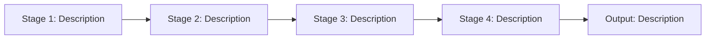

<!--
CONTEXT FOR AI ASSISTANTS:
Document Type: Complete reverse engineering guide — Phases 0-7
               C++ codebases — grep / file read workflow (no MCP tools required)
Scope: Foundation phases (0-6) + Phase 7 vertical slice documentation
Last Updated: 2026-03-03

AI DIRECTIVES:
- Read Section 1 (Session Setup) at the start of every session
- Read Section 2 (Documentation Contract) before writing anything
- Read Section 3 (NO GUESSING Policy) before touching any code
- Complete Phases 0-6 before reaching Section 12 (Phase 7 Entry Gate)
- Run the prose scan at the end of every Phase 7 section
-->

# C++ Reverse Engineering Guide — Phases 0-7

---

## 1. Session Setup

**Do this at the start of every session before any analysis.**

### 1.1 Check for session-status.md

Read `docs/[system-name]/session-status.md` if it exists.

```markdown
## session-status.md

**Current Phase**: [0 / 1 / 2 / 3 / 4 / 5 / 6 / 7]
**Last Completed**: [Plain English — e.g., "Phase 3.4 calculation engine documented"]
**Next Step**: [Plain English — e.g., "Phase 4: read UI directory, produce phase-4-client-architecture.md"]
**Blockers**: [None / plain English description]
**Workflows Documented (Phase 7)**: [list of workflow names, or "none yet"]
**Date**: YYYY-MM-DD
```

- If the file **exists**: read it, confirm the current phase and next step, then jump directly to that step. Do not re-run completed phases.
- If the file **does not exist**: this is a fresh session — start at Phase 0.

### 1.2 Update session-status.md at the end of every session

Before ending the session, write or overwrite `session-status.md` with the current state. This is the cross-session memory for the entire engagement. Without it, the next session restarts from scratch.

---

## 2. Documentation Contract

Read this before writing a single word of documentation.

### Allowed in backtick blocks

- File paths and line references: `src/solvers/StressEngine.cpp:45-78`
- Function signatures: `calculateStress(double load, double area, const Material& mat)`
- Enum and enum class values: `MaterialType::STEEL`, `SolverStatus::CONVERGED`
- Mathematical formulas: `σ = F / A`
- Constants with values: `MAX_ITERATIONS = 1000` (source: `config.h`)
- Struct field names when part of a public API: `Result.stress`, `Result.strain`

### Forbidden — rewrite as prose

- C++ function or method bodies of any length
- Pointer operations (`*ptr`, `ptr->field`, `new`, `delete`)
- Template instantiations or template specialization code
- Class or struct definitions and constructor bodies
- Preprocessor macros and `#include` chains
- `std::` algorithm calls written out as code
- Pseudocode that mirrors code structure

### The conversion test

Before writing any ``` block, ask: "Is this a formula, file path, function signature, or enum value?" If no → write a sentence describing **what happens** and **why** instead.

**If a reader could understand the system's behavior from your documentation without looking at the code, you've succeeded. If they still need to read the code to understand what happens, you've transcribed instead of documented.**

---

## 3. NO GUESSING Policy

Applies to every section of every phase, no exceptions.

| Forbidden                    | Required instead                                               |
| ---------------------------- | -------------------------------------------------------------- |
| Guess a validation rule      | Verify in code or mark `[NEEDS CLARIFICATION]`                 |
| Assume a calculation formula | Extract the exact formula or mark `[NEEDS CLARIFICATION]`      |
| Infer a default value        | Find its source in config/code or mark `[NOT AVAILABLE]`       |
| Make up an error message     | Quote it exactly from code or mark `[NEEDS CLARIFICATION]`     |
| Assume a state change        | Trace the exact field mutation or mark `[NEEDS CLARIFICATION]` |

**When in doubt: STOP and ask the user. Never proceed by guessing.**

### Status markers (use consistently)

- `[NEEDS CLARIFICATION]` — information exists but is unclear
- `[NOT AVAILABLE]` — dependency confirmed unavailable
- `[BLOCKED]` — cannot proceed without missing information
- `[VERIFIED: YYYY-MM-DD]` — confirmed with code, data, or domain expert

### Status indicators

✅ Complete | ⚠️ Partial | ❌ Needs Clarification | 🚫 Blocked

---

## 4. Exploration Strategy

Use this table to decide how to approach codebase investigation at each step. The goal is progressive narrowing: start wide (directory structure), then narrow (targeted file reads), then verify (grep for specific patterns).

| Situation                                 | Preferred action                                                               |
| ----------------------------------------- | ------------------------------------------------------------------------------ |
| Need to understand module layout          | List directories one level at a time — do not grep across everything           |
| Need to find which file owns a concept    | Grep for the class name or function name across `src/` and `include/`          |
| Need to understand a class or function    | Read its header file first; read the `.cpp` only if the header is insufficient |
| Need to confirm a formula or constant     | Read the specific file:line range — do not grep for approximate values         |
| Need to trace data flow between layers    | Read the caller, identify the callee, read the callee — one hop at a time      |
| Need to find all validation rules         | Grep for `*Validator`, `validate`, `check`, `verify` across the codebase       |
| Unsure whether something exists           | Grep for it; if no results, mark `[NOT AVAILABLE]` and move on                 |
| Have a result from grep that is too broad | Narrow with a second grep using a more specific pattern or a path filter       |

### Progressive narrowing pattern

1. List the relevant directory (`src/solvers/`)
2. Identify which 2–3 files are most likely to contain what you need
3. Read the header files of those 2–3 files
4. Read only the specific `.cpp` sections needed to confirm or extract information
5. Stop when you have the answer — do not read the entire file if a section is sufficient

**Do not read files speculatively.** If a file is not on the direct path from the entry point to the answer, skip it. If you are uncertain, grep first to confirm the file is relevant before reading.

---

## 5. Phase 0: Prerequisites & Ground Rules

**Purpose**: Confirm resource access and establish documentation standards before any analysis.

**Deliverable**: `docs/[system-name]/system-analysis/phase-0-prerequisites.md`

**Steps**:

1. List the top-level project directory structure
2. Read `CMakeLists.txt` (or `Makefile`, `vcpkg.json`, `conanfile.txt`) to identify external library dependencies
3. Confirm access to each required resource: source code, config files, external libraries, build environment, domain expert, test/sample data
4. Identify the system's interface type: GUI application / CLI tool / daemon / library / config-file-driven tool. Record in `session-status.md` and in the Phase 0 document. This drives Phase 4.
5. Document blockers immediately — do not proceed past Phase 0 with unresolved resource access questions

> **Scope note**: Phases 1-6 are system-wide — they document the full architecture, all shared
> components, and all patterns. No vertical slice is chosen at Phase 0. Where analysis depth
> must be prioritised, prefer the code paths most commonly used. The first Phase 7 workflow
> is chosen during Phase 6.3 sign-off, after the full candidate inventory (Phase 6.2) is complete.

**Document to produce**:

```markdown
## Phase 0: Prerequisites

**Status**: ✅ | ⚠️ | 🚫

| Resource           | Status | Location / Notes        |
| ------------------ | ------ | ----------------------- |
| Source code        | ✅     | [path]                  |
| Config files       | ✅/🚫  | [path or NOT AVAILABLE] |
| External libraries | ✅/🚫  | [path or NOT AVAILABLE] |
| Build environment  | ✅/🚫  | [can compile: yes/no]   |
| Domain expert      | ✅/🚫  | [name or NOT AVAILABLE] |
| Test/sample data   | ✅/🚫  | [path or NOT AVAILABLE] |

**System type**: [GUI application / CLI tool / daemon / library / config-file-driven tool]
**NO GUESSING policy**: Confirmed
**Documentation standards**: Confirmed
**Analysis scope**: Phases 1-6 are system-wide. Phase 7 workflows are chosen in Phase 6.2-6.3.
```

---

## 6. Phase 1: Architecture Analysis

**Purpose**: Understand project structure, technology stack, design patterns, and high-level data flow.

**Deliverables**: `phase-1-project-structure.md`, `phase-1-technology-stack.md`, `phase-1-architecture-patterns.md`, `phase-1-data-flow.md`

### 1.1 Project Structure + Technology Stack

1. List the top-level `src/` and `include/` directories recursively (one level at a time)
2. Read the build definition file (`CMakeLists.txt`, `Makefile`, `Make/options`, `BUILD.bazel`, or equivalent) — the declared external dependency lookups, library link directives, and subdirectory or module inclusions reveal the module breakdown and external dependencies without needing to read code
3. Note the C++ standard in use (compiler flag `-std=c++17`, build system variable, or in-source `#pragma`) and the target compiler and platform

### 1.2 Architectural Patterns

1. Search the codebase for design pattern indicators — class name suffixes such as `*Factory`, `*Repository`, `*Service`, `*Manager`, `*Adapter`, `*Visitor`
2. Read the main entry-point file (`main.cpp` or the top-level application class) to understand the startup sequence and how major components are initialized
3. Read the key header files for the largest modules to understand their public interfaces and layer boundaries
4. Document patterns in plain English: "The system uses the Factory pattern to construct solver instances based on a type enum. Service classes are stateless and injected via constructor."

### 1.3 Data Flow

1. Trace the path from the user-facing entry point (UI trigger, CLI argument, or file read) through to the output (file write, display update, database commit)
2. Identify the major transformation points: where raw input becomes validated data, where validated data becomes prepared parameters, where parameters enter the calculation engine, and where results are written out
3. Document this as a numbered plain English sequence, not as code

**Phase 1 complete?**

- [ ] Module structure documented with purpose for each directory
- [ ] Technology stack listed (C++ version, key libraries)
- [ ] Architectural patterns identified and described in plain English
- [ ] Main data flow traced as a numbered sequence

---

## 7. Phase 2: Data Layer Dissection

**Purpose**: Document all data structures, relationships, persistence patterns, and state changes. Phase 2.5 is a direct dependency of Phase 7 Section 5.

**Deliverables**: `phase-2-entity-model.md`, `phase-2-data-access.md`, `phase-2-5-state-changes.md`

### 2.1 Entity Discovery + Relationships

1. Search for `struct ` and `class ` declarations in the `src/` and `include/` trees — focus on the `data/`, `models/`, or `domain/` directories first
2. For each major domain entity found, read its header file to extract field names and types
3. Trace relationships by reading the `#include` chains and member variable types in each entity header
4. Document: entity name, key fields (name, type, units if applicable), and how it relates to other entities — in prose, not struct definitions

### 2.2 Data Access Patterns

1. Search for file I/O patterns: `std::fstream`, `ifstream`, `ofstream`, `fopen`, `HDF5`, `VTK`, serialization library calls
2. Identify whether the system is file-based, in-memory, or database-backed
3. Read the primary persistence classes to understand the read/write lifecycle

### 2.5 State Change Patterns ⚠️ CRITICAL — Phase 7 Section 5 depends on this

For each major operation identified in Phase 1.3:

1. Identify the function or method that executes the operation (use the data flow trace from Phase 1.3 as the starting point)
2. Read that function and its callees to find every field assignment, file write, and status flag update
3. Document each mutation as a before/after pair — not as code, but as a row in the state change table
4. Find the transaction boundary: search for RAII scope guards, try/catch blocks, rollback logic, or atomic operations that define what must all succeed or all fail together

**Template for 2.5**:

```markdown
### State Changes: [Operation Name]

| Structure / File  | Field / Path | Before      | After       | Condition       |
| ----------------- | ------------ | ----------- | ----------- | --------------- |
| [StructName]      | [field]      | [old value] | [new value] | [always / if X] |
| [output/file.dat] | [exists?]    | No          | Yes         | [always / if X] |

**Transaction boundary**: [Plain English — what must all succeed or all fail together]
**Code Reference**: `path/to/file.cpp:line-range`
```

**Phase 2 complete?**

- [ ] Major domain entities documented with fields, types, and relationships
- [ ] Data access pattern identified (file-based / in-memory / DB)
- [ ] State changes for each major operation documented (2.5) with before/after pairs
- [ ] Transaction boundaries identified

---

## 8. Phase 3: Business Logic Analysis

**Purpose**: Document service orchestration, validation rules, and calculation engines. Phase 3.4 is the deepest Phase 7 dependency.

**Deliverables**: `phase-3-service-orchestration.md`, `phase-3-validation-logic.md`, `phase-3-4-calculation-engines.md`

### 3.1 Service Orchestration

1. Search for classes named `*Service`, `*Manager`, `*Handler`, `*Orchestrator`, `*Controller`
2. Read the header files for these classes to understand their public API and dependencies
3. Document each service: what it is responsible for, what it receives as input, what it produces, and what other services or components it depends on — in plain English

### 3.2 Validation Logic

1. Search for classes or functions named `*Validator`, `*Checker`, `*Guard`, `validate`, `check`, `verify`
2. Read the implementation of each validator to identify every rule enforced
3. For each rule, read the exact error message string or exception type thrown — these must be quoted verbatim, not paraphrased
4. Document where each rule is enforced: UI layer, input parser, solver pre-check, or library boundary

### 3.4 Calculation Engine Analysis ⚠️ MOST CRITICAL — Phase 7 Section 4 depends on this

Never document a calculation engine from a summary or inference. Read the source.

1. Identify the calculation entry point from the Phase 1.3 data flow trace — it is the function that receives prepared input and returns a result
2. Read the engine's header and implementation files
3. Extract the algorithm as a numbered plain English sequence: what each step receives, what it computes, what it produces
4. Extract every mathematical formula and define each variable (name, description, units, source)
5. For iterative algorithms: find the stopping criterion, maximum iteration count, and the behavior when convergence fails — read the exact config key or constant, not guessing the value
6. Identify all dependencies: lookup tables, constant files, external libraries — read their paths from include directives or config keys

**Template for 3.4**:

```markdown
### Calculation Engine: [Name]

**Type**: [Custom C++ / Third-party static lib / Shared library / External API]
**Location**: `path/to/Engine.cpp` or `libEngine.so`
**Documentation**: ✅ Available at [path] | 🚫 [NOT AVAILABLE]

**Purpose**: [Plain English — what this engine computes]

**Algorithm** (plain English):

1. [Step one — what data is used and what is determined]
2. [Step two — what is computed and from what]

**Mathematical Formulas** [VERIFIED: YYYY-MM-DD]:
`Formula = expression`
Where:

- Variable = [description] ([units], source: [config/lookup/input])
  Result units: [units]

**Convergence** (if iterative):

- Stops when: [plain English stopping condition]
- Maximum iterations: [value] (source: [config key / `file.cpp:line`])
- If no convergence: [what the system does]

**Dependencies**:
| Dependency | Type | Access |
|-----------|------|--------|
| [name] | [lookup table / constant / external lib] | ✅ Available / 🚫 Blocked |

**Code Reference**: `path/to/Engine.cpp:line-range`
```

**Phase 3 complete?**

- [ ] Services identified with purpose described
- [ ] Validation rules documented with exact error messages or exception types
- [ ] All calculation engines identified and documented (3.4)
- [ ] Formulas extracted with variable definitions and units (or marked `[NEEDS CLARIFICATION]`)
- [ ] All engine dependencies identified with access status

---

## 9. Phase 4: UI / Client Layer Study

**Purpose**: Document user interaction entry points. Phase 7 Sections 1 and 6 depend on this.

**Deliverable**: `phase-4-client-architecture.md`

First, determine what kind of interface the system exposes — not all systems have a GUI.

**If the system has a graphical UI** (`gui/`, `ui/`, `views/`, Qt/GTK/wxWidgets includes, or similar):

1. List the UI directory structure to identify the main window, dialogs, and panels
2. Read the main window or application shell header to understand the primary screen layout
3. For each major workflow, find the UI trigger point — the button click handler, menu action, or command class that initiates the operation. Note the exact file and line.
4. Read each workflow's primary form or dialog to inventory its input controls (widgets, fields, labels)
5. Document: the UI framework in use, the main screens and their purposes, and for each workflow — the triggering element (file:line)

**If the system has no GUI** (CLI-only, daemon, library, or file-driven tool):

1. Read the main entry-point file (the file containing `main()` or the top-level command dispatcher) to identify every supported command, subcommand, or mode flag
2. For each workflow, identify the CLI invocation or input file that triggers it — record the exact flag name, file name, or config key and its source location
3. List every configuration or input file the workflow reads: its path, format, and the parameters it controls
4. Document: the invocation mechanism (CLI / config file / API call), each workflow's trigger (exact flag or file), and the role of every input file

**Phase 4 complete?**

- [ ] Interface type identified (GUI / CLI / config-file-driven / library API)
- [ ] Main screens, commands, or entry points documented with purpose
- [ ] Each major workflow has its trigger point identified (file:line)

---

## 10. Phase 5: Integration Points

**Purpose**: Identify all external systems. Phase 5.3 (Dependency Inventory) is read directly by the Phase 7 entry gate.

**Deliverables**: `phase-5-integration-summary.md`, `phase-5-3-dependency-inventory.md`

### 5.1 External System Discovery

1. Search for network patterns: `socket`, `http`, `curl`, `boost::asio`, REST client library includes
2. Search for database patterns: SQL strings, ORM includes, database driver headers
3. Search for file protocol patterns: `HDF5`, `VTK`, `netCDF`, `MPI`, `MKL`, `LAPACK`, `BLAS`
4. Read each integration class header to understand what the external system provides and how it is invoked
5. Document: integration name, type (file I/O / network API / shared library / database), purpose, and which workflows use it

### 5.3 Dependency Inventory ⚠️ CRITICAL — Phase 7 entry gate reads this

For each dependency found in 5.1:

1. Confirm whether it is physically present: check library directories, config files, credential files
2. For lookup tables or data files: read a sample row to confirm structure and access
3. Record the access status — ✅ Available or 🚫 Blocked — for every item

**Template for 5.3**:

```markdown
## Dependency Inventory

### Calculation Engines

| Engine | Type             | Location | Documentation | Access                    |
| ------ | ---------------- | -------- | ------------- | ------------------------- |
| [name] | [custom/lib/API] | `path/`  | ✅/🚫         | ✅ Available / 🚫 Blocked |

### Lookup Tables

| Table / Source | Format            | Location | Sample Data | Access                    |
| -------------- | ----------------- | -------- | ----------- | ------------------------- |
| [name]         | [CSV/binary/HDF5] | [path]   | ✅/🚫       | ✅ Available / 🚫 Blocked |

### Configuration Files

| File       | Contains             | Access                    |
| ---------- | -------------------- | ------------------------- |
| [filename] | [what it configures] | ✅ Available / 🚫 Blocked |

### Blockers

| Dependency | Workflows Affected | Action Taken              | Status                  |
| ---------- | ------------------ | ------------------------- | ----------------------- |
| [name]     | [list]             | [access requested from X] | 🚫 Blocked since [date] |
```

**Phase 5 complete?**

- [ ] All external systems identified with integration type and purpose
- [ ] Dependency inventory complete (5.3) with access status for every dependency
- [ ] Blockers listed with workflow impact and remediation action

---

## 11. Phase 6: Implementation Details & Readiness Assessment

**Purpose**: Document the real state of the implementation, then produce the sign-off that unlocks Phase 7.

**Deliverables**: `phase-6-implementation-details.md`, `phase-6-3-readiness-assessment.md`

### 6.1 Implementation Details

1. Search the codebase for: `TODO`, `FIXME`, `stub`, `not implemented`, `placeholder`, `HACK`
2. For each hit, read the surrounding context to understand what is missing and how significant the gap is
3. Document each stub: what component it is in, what it was supposed to do, and what the gap means for workflow documentation

### 6.2 Workflow Enumeration ⚠️ REQUIRED — Populates the Phase 7 Queue

Before the sign-off gate, enumerate every candidate workflow that could be documented in Phase 7. This produces the prioritized queue that drives all of Phase 7.

Work through the discovery sources **in order**, stopping when you have enough candidates to fill the queue. Do not guess — if a workflow is not evidenced by at least one of these sources, do not invent it.

#### Discovery Source 1: Existing documentation in the repository

Search for workflow descriptions in the project's own docs before looking at any code.

1. Check for `README.md`, `README.org`, `docs/`, `doc/`, `Guides/`, or any `*.md` / `*.org` / `*.rst` file at the project root or in a `docs/` tree
2. Grep for terms that signal user-facing operations: `workflow`, `use case`, `scenario`, `example`, `tutorial`, `getting started`, `how to`
3. Read any "Usage" or "Examples" sections found — these often name the canonical workflows the authors intended to support
4. Note each named workflow, the entry point it uses, and any distinguishing parameters or modes mentioned

#### Discovery Source 2: Example, sample, or tutorial directories

If the project ships runnable examples (any of: `examples/`, `samples/`, `tutorials/`, `test/`, `demo/`, `cases/`):

1. List the directory one level deep — each subdirectory is a candidate workflow
2. For each candidate, read only the top-level run-control or configuration file (e.g., `config.yaml`, `settings.json`, `main.cfg`, `Makefile`, `run.sh`, or whatever the project uses) to identify:
   - Which entry point, solver, or mode is invoked
   - What variant is active (e.g., algorithm choice, feature flag, data source, output format)
   - Any non-default options or plugins enabled
3. Do not read every file in every example — one config file per candidate is sufficient to classify it

#### Discovery Source 3: Entry-point and public API scan

If no docs or examples exist, infer candidate workflows from the codebase:

1. Re-read the Phase 1 data flow doc and the Phase 4 client architecture doc — the documented entry points and CLI flags already imply distinct workflows (e.g., different `-solver` values, different mode flags)
2. Search the main entry-point file and any top-level `*Factory`, `*Registry`, or `*Selector` class for the full set of registered type names — each registered type is a candidate workflow variant
3. Search for `--help`, usage strings, or argument parser declarations (e.g., `argparse`, `boost::program_options`, `CLI11`, `getopt`, or any custom argument-parsing class) — the documented options and subcommands reveal the full set of intended modes

#### Classification

For each candidate identified from any source above:

1. Check the Dependency Inventory (Phase 5.3) to confirm whether all required dependencies are ✅ Available
2. Compare it against already-documented workflows — if it exercises no new code path, it is not a distinct workflow
3. Assign a priority:
   - **Priority 1**: All dependencies available AND the workflow exercises a distinct, not-yet-documented code path
   - **Priority 2**: Minor dependency gap with a documented workaround, OR the workflow variant is a configuration difference only (no new code path)
   - **Priority 3**: A required dependency is 🚫 Blocked and cannot be worked around

**Template for 6.2 Workflow Table**:

```markdown
## Candidate Workflow Inventory

| Workflow Name | Source                     | Entry Point / Config                  | Key Distinguishing Feature                                  | Priority  | Blocker (if any)  |
| ------------- | -------------------------- | ------------------------------------- | ----------------------------------------------------------- | --------- | ----------------- |
| [name]        | [Doc / Example / API scan] | `path/to/config` or `CLI -flag value` | [what makes it architecturally different from the baseline] | 1 / 2 / 3 | None / [dep name] |
```

**Minimum required columns**:

- **Workflow Name**: Short identifier used for the Phase 7 filename (e.g., `batch-export`, `async-processing`, `read-only-mode`, `admin-override`)
- **Source**: Which discovery source surfaced it — `Doc`, `Example`, or `API scan`
- **Entry Point / Config**: The file, directory, CLI flag, or config key that exercises this workflow
- **Key Distinguishing Feature**: The one thing that makes this workflow architecturally different from the already-documented baseline — must reference a specific code path, config key, algorithm branch, or data source, not just a name
- **Priority**: 1 / 2 / 3 per the classification rules above
- **Blocker**: The specific dependency that is 🚫 Blocked, or "None"

---

### 6.3 Phase 7 Readiness Assessment — Sign-Off Gate

This is primarily a synthesis of what was found in Phases 1-6 — minimal new codebase exploration needed.

1. Review the phase deliverables produced in Phases 0-5 and confirm each is complete
2. Copy the Workflow Table from Phase 6.2 into the sign-off document — this becomes the authoritative Phase 7 queue
3. Classify each workflow: Priority 1 (all dependencies accessible), Priority 2 (partial gaps with workarounds), Priority 3 (blocked until dependency resolved)
4. Record the sign-off decision

**Template for 6.3**:

```markdown
## Phase 7 Readiness Assessment

**Date**: YYYY-MM-DD
**Overall Status**: ✅ Ready | ⚠️ Partial | 🚫 Blocked

### Readiness Checklist

| Phase | What Was Checked               | Status   | Notes |
| ----- | ------------------------------ | -------- | ----- |
| 1     | Architecture and data flow     | ✅/⚠️/🚫 |       |
| 2     | Entities documented            | ✅/⚠️/🚫 |       |
| 2.5   | State changes captured         | ✅/⚠️/🚫 |       |
| 3.4   | Calculation engines documented | ✅/⚠️/🚫 |       |
| 4     | UI entry points identified     | ✅/⚠️/🚫 |       |
| 5.3   | Dependency inventory complete  | ✅/⚠️/🚫 |       |

### Workflow Priority List

_(Copied from Phase 6.2 Workflow Table — do not re-derive; extend only if new candidates are discovered)_

| Workflow Name | Source                     | Entry Point / Config | Key Distinguishing Feature | Priority    | Blocker                              |
| ------------- | -------------------------- | -------------------- | -------------------------- | ----------- | ------------------------------------ |
| [name]        | [Doc / Example / API scan] | `path/`              | [feature]                  | 1 — Ready   | None                                 |
| [name]        | [Doc / Example / API scan] | `path/`              | [feature]                  | 2 — Partial | [specific gap with workaround]       |
| [name]        | [Doc / Example / API scan] | `path/`              | [feature]                  | 3 — Blocked | [specific blocker, access requested] |

### Sign-Off

**Decision**: Proceed to Phase 7 | Resolve blockers first | Proceed with partial coverage
```

**Phase 6 complete?**

- [ ] Stubs and partial implementations identified (6.1)
- [ ] Candidate workflow inventory produced from tutorials / examples (6.2) — every discoverable workflow listed with priority and blocker
- [ ] Readiness checklist completed (6.3)
- [ ] Workflow priority list confirmed as copy of 6.2 table (6.3)
- [ ] Sign-off decision recorded

---

## 12. Phase 7 Entry Gate

Answer honestly before starting any workflow.

1. Are key data structure state changes documented (before → after field values)? **Yes / No**
2. Are all calculation engines identified with formulas extracted? **Yes / No / N/A**
3. Is the dependency inventory complete (lookup tables, external libraries, config files)? **Yes / No**
4. Are critical dependencies ✅ Available or explicitly marked 🚫 Blocked? **Yes / No**
5. Is Phase 6.3 Readiness Assessment complete with sign-off? **Yes / No**

**If ANY answer is No: STOP. Return to the incomplete phase. Phase 7 documentation will be inaccurate without this foundation.**

### Workflow priority classification

| Priority    | Status | Condition                                    |
| ----------- | ------ | -------------------------------------------- |
| 1 — Ready   | ✅     | All dependencies accessible                  |
| 2 — Partial | ⚠️     | Some gaps; document with explicit caveats    |
| 3 — Blocked | 🚫     | Cannot document until dependency is resolved |

Start with Priority 1 workflows only.

### What a good vertical slice is

Choose workflows that:

- Represent core, user-visible functionality
- Cross multiple system layers (UI → logic → data / file I/O)
- Have a complete path from user input to persisted output
- Include meaningful business logic, validation, or calculation

---

## 13. Phase 7: The 10-Section Vertical Slice Template

**File location**: `docs/[system-name]/vertical-slice-documentation/vertical-slices/phase-7-workflow-[name].md`

Begin each document with:

```
# Workflow: [Name]

**Status**: ✅ Complete | ⚠️ Partial | 🚫 Blocked
**Priority**: 1 / 2 / 3
**Last Updated**: YYYY-MM-DD
```

---

### Section 1: Executive Summary

**Purpose**: Orient the reader — state what the workflow does, what distinguishes it from related workflows, and provide a high-level comparison to alternatives.

> ⛔ No code blocks in this section. Describe purpose and differentiation.

**What to document**:

- A concise description of what the workflow accomplishes (2–4 sentences)
- What makes this workflow distinct from other workflows in the system
- A comparison table contrasting this workflow against the nearest alternative or simpler baseline (metrics such as complexity, cost, applicability, accuracy)
- The reference case, tutorial, or example used as the basis for this vertical slice (with directory path)

**Template**:

```
### 1. Executive Summary

**Status**: ✅ | ⚠️ | ❌

**What This Workflow Does**: [2–4 sentences describing the workflow's purpose and scope]

**Key Differentiator**: [What sets this apart from related workflows]

**Reference Case**: [Tutorial / example name] (`path/to/case/`)

**Comparison to Alternative**:
| Metric | [This Workflow] | [Alternative] | Notes |
|--------|-----------------|---------------|-------|
| [metric] | [value] | [value] | [explanation] |
```

**Section 1 complete?**

- [ ] Purpose and scope described clearly
- [ ] Comparison table included with at least one alternative
- [ ] Reference case identified with path
- [ ] ⛔ Scan: no ``` blocks containing code logic

---

### Section 2: Workflow Overview

**Purpose**: Provide a conceptual map of how data moves through the workflow from start to finish.

> ⛔ No code blocks in this section except for the Mermaid diagram.
> Use Mermaid syntax for all dataflow and process diagrams.

**What to document**:

- A Mermaid flowchart or sequence diagram showing the major stages and data flow
- A brief explanation of each stage in the diagram
- Key domain concepts the reader must understand to follow the rest of the document
- A physical or domain problem description: what real-world scenario this workflow addresses

**Template**:

````
### 2. Workflow Overview

**Status**: ✅ | ⚠️ | ❌

**Conceptual Dataflow**:



**Stage Descriptions**:
1. **[Stage name]**: [What happens and why]
2. **[Stage name]**: [What happens and why]
3. [Continue for each stage]

**Key Concepts**:
- **[Concept]**: [Plain English definition — what it is and why it matters for this workflow]
````

**Section 2 complete?**

- [ ] Mermaid diagram present showing end-to-end data flow
- [ ] Each stage in the diagram has a prose explanation
- [ ] Key domain concepts defined for a reader unfamiliar with the domain
- [ ] ⛔ Scan: no ``` blocks containing code logic (Mermaid diagrams are allowed)

---

### Section 3: Entry Point Analysis

**Before writing this section, read**: `phase-1-architecture-patterns.md` and `phase-4-client-architecture.md`
These files identify the top-level entry points, runtime selection mechanisms, and class hierarchy. Section 3 should trace from those entry points into this specific workflow.

**Purpose**: Document how execution reaches this workflow — from the top-level entry point through any runtime selection or dispatch mechanisms down to the specific classes or functions that implement this workflow.

> ⛔ No code blocks in this section. Describe the execution path and class hierarchy.
> If you are about to paste a class definition or constructor → instead describe the inheritance chain and what each layer adds.

**What to document**:

- The top-level entry point (main function, CLI command, or launcher) and how it selects this workflow
- The class hierarchy or module chain from entry point to the workflow-specific implementation, with each layer's responsibility described in plain English
- Runtime selection mechanisms: how the system decides which concrete implementation to use (configuration, registry lookup, factory pattern, etc.)
- Constructor initialization: what each layer sets up, and where defaults come from

**Template**:

```
### 3. Entry Point

**Status**: ✅ | ⚠️ | ❌

**Top-Level Entry**: [executable / command] (`path/to/main.cpp`)

**Selection Mechanism**: [How the system determines which workflow/solver/handler to use — e.g., "runtime dictionary lookup", "factory registration", "command-line flag"]

**Class / Module Hierarchy**:
| Layer | Class / Module | Responsibility | Code Reference |
|-------|---------------|----------------|----------------|
| Base | [name] | [what it provides] | `file:line-range` |
| ↓ | [name] | [what this layer adds] | `file:line-range` |
| ↓ | [name] | [what this layer adds] | `file:line-range` |
| Concrete | [name] | [workflow-specific behavior] | `file:line-range` |

**Initialization**: [Plain English — what is set up at construction time, where defaults are loaded from, and what configuration files or dictionaries are read]
```

**Section 3 complete?**

- [ ] Entry point identified with file reference
- [ ] Full hierarchy from entry point to concrete implementation documented
- [ ] Runtime selection mechanism described
- [ ] Initialization described in plain English (no constructor code)
- [ ] ⛔ Scan: no ``` blocks containing code logic

---

### Section 4: Data Structure Trace

**Before writing this section, read**: `phase-2-entity-model.md` and `phase-2-data-access.md`
These files document the entity model and data access patterns. Section 4 should expand on those with workflow-specific detail — the fields, their relationships, and their physical or domain meaning.

**Purpose**: Document every major data field or structure that participates in this workflow — its type, meaning, initialization, and interdependencies.

> ⛔ No code blocks in this section. Describe fields and their relationships.
> If you are about to paste a struct definition → instead describe each field's purpose, type, units, and where its initial value comes from.

**What to document**:

- Each major data field: name, type, dimensions/units, physical or domain meaning
- Initialization: where the initial value comes from (file, computed, constant, user input)
- Interdependencies: which fields depend on which others and how they are coupled
- Boundary conditions or constraints on each field (valid ranges, required relationships)
- Typical values for the reference case

**Template**:

```
### 4. Data Structures

**Status**: ✅ | ⚠️ | ❌

**Primary Fields**:
| Field | Type | Dimensions / Units | Physical Meaning | Initialization | Code Reference |
|-------|------|-------------------|-----------------|----------------|----------------|
| [name] | [scalar/vector/tensor/etc] | [units] | [what it represents] | [source] | `file:line` |

**Field Dependencies**:
- [Field A] depends on [Field B] and [Field C] via [relationship described in plain English]
- [Field D] is derived from [Field E] using [formula or process]

**Boundary Conditions**:
| Field | Boundary | Condition Type | Value / Behavior |
|-------|----------|---------------|------------------|
| [name] | [boundary name] | [fixed / gradient / derived] | [value or description] |

**Typical Values** (reference case):
| Field | Region / Location | Typical Range | Notes |
|-------|-------------------|--------------|-------|
| [name] | [where] | [range] | [context] |
```

**Section 4 complete?**

- [ ] All major data fields listed with types and meaning
- [ ] Initialization sources documented (not assumed)
- [ ] Field interdependencies described
- [ ] Boundary conditions or constraints documented
- [ ] ⛔ Scan: no ``` blocks containing code logic

---

### Section 5: Algorithm Deep Dive

**Before writing this section, read**: `phase-3-4-calculation-engines.md`
This file contains the algorithm steps, mathematical formulas, convergence behavior, and engine location. Section 5 should be assembled from this — do not re-read the engine source unless a specific detail is missing.

**Purpose**: Document the core algorithms — what the system computes, in what order, with what mathematical relationships, and how convergence is achieved.

> ⛔ No C++ code blocks in this section. Mathematical formulas are the one exception.
> If you are about to paste a solver function body → instead number the algorithm steps in plain English and express the math as a formula.
> **If you have written a ``` block containing pointer operations, template code, loops, or conditionals: delete it and rewrite as prose.**
> Use standard mathematical notation for block and inline equations.

**What to document**:

- The overall algorithm structure: outer loop, inner steps, convergence strategy
- A plain English numbered description of the algorithm steps
- Mathematical formulas with every variable defined (name, description, units, source)
- For iterative algorithms: the stopping criterion, maximum iterations, and what the system does if convergence fails
- Discretization or numerical scheme choices and why they matter
- How parallelism or threading is used, if any — described behaviorally, not as code

**Template**:

```
### 5. Algorithm Deep Dive

**Status**: ✅ | ⚠️ | 🚫 BLOCKED

**Algorithm Overview**: [Plain English — describe the overall strategy in 2–3 sentences]

**Algorithm Steps**:
1. **[Step name]**: [What happens — what data is consumed, what is produced, what method is used]
2. **[Step name]**: [Continue for each meaningful step]
3. [Continue...]

**Governing Equations**:

[Mathematical formula]

Where:
- [variable] = [description] ([units], source: [config/lookup/input])

**Convergence** (if iterative):
- Stops when: [plain English stopping condition]
- Maximum iterations: [value] (source: [config key / hardcoded at file:line])
- If no convergence: [what the system does — exception / best estimate / fallback]

**Numerical Scheme Choices**:
| Choice | Selected Scheme | Why | Alternatives |
|--------|----------------|-----|-------------|
| [aspect] | [scheme name] | [reason] | [other options] |

**Code Reference**: `path/to/Solver.cpp:line-range`
```

**Section 5 complete?**

- [ ] Algorithm described as numbered plain English steps
- [ ] All formulas expressed with every variable defined (units and source)
- [ ] Convergence behavior documented
- [ ] Numerical scheme choices explained with rationale
- [ ] ⛔ Scan: no ``` blocks containing C++ code — only mathematical formulas and Mermaid diagrams allowed

---

### Section 6: State Mutations

**Before writing this section, read**: `phase-2-5-state-changes.md`
This file lists every field mutation (before → after) for each major operation. Section 6 should be assembled from this — select the mutations relevant to this workflow.

**Purpose**: Document how the system's state evolves through the workflow — what fields change, when, and from what to what.

> ⛔ No code blocks in this section. Describe what mutates and how.
> If you are about to paste a state-update function → instead list each state change as a row in the table.

**What to document**:

- A timeline or sequence showing the order in which fields are updated during one execution cycle
- Per-operation state changes: which fields had what values before, what values after, and under what conditions
- Output files written: file name, format, location, what data it contains
- Consistency requirements: which fields must be mutually consistent after the cycle completes

**Template**:

```
### 6. State Mutations

**Status**: ✅ | ⚠️ | ❌

**Field Evolution Timeline** (one execution cycle):
| Step | Operation | Fields Modified | Key Change |
|------|-----------|----------------|------------|
| 1 | [operation] | [field list] | [what changes and why] |
| 2 | [operation] | [field list] | [what changes and why] |

**Per-Operation Detail**:

**[Operation Name]**:
- **Before**: [field values / state description]
- **Process**: [plain English — what happens]
- **After**: [field values / state description]

**Output Files Written**:
| File | Format | Location | Contents | Condition |
|------|--------|----------|----------|-----------|
| [filename] | [format] | [path] | [what data it holds] | [always / if X] |

**Consistency**: [Plain English — what must be true about the relationships between fields after the cycle completes]
```

**Section 6 complete?**

- [ ] Timeline of state changes documented in execution order
- [ ] Per-operation before/after values captured
- [ ] Output files documented (name, format, contents)
- [ ] Consistency requirements stated
- [ ] ⛔ Scan: no ``` blocks containing code logic

---

### Section 7: Error Handling

**Before writing this section, read**: `phase-3-validation-logic.md`
This file lists validator rules, error messages, and exception types. Section 7 should cover both input validation errors (from phase-3) and runtime errors discovered while tracing this workflow.

**Purpose**: Document every error condition the workflow can encounter — both input validation failures and runtime errors — with their causes, detection, and handling.

> ⛔ No code blocks in this section. Describe error conditions and responses.

**What to document**:

- Input validation errors: rules that reject input before processing begins
- Runtime errors: conditions that arise during execution (divergence, constraint violations, resource failures)
- For each error: scenario, symptom, root cause, how the system detects it, what the system does, and how the user can mitigate it
- Domain-specific error conditions unique to this workflow

**Template**:

```
### 7. Error Handling

**Status**: ✅ | ⚠️ | ❌

**Workflow-Specific Errors**:

**Error: [Name]**
- **Scenario**: [When this occurs]
- **Symptom**: [What the user or system observes]
- **Cause**: [Root cause]
- **Detection**: [How the system detects it — check, assertion, solver report]
- **Handling**: [What the system does — abort, warn, retry, clamp]
- **Mitigation**: [What the user should do to prevent or recover]

**General Errors**: [Reference to shared error handling — e.g., "See Phase 7 [other workflow] Section 7 for errors common to all workflows using the same framework"]
```

**Section 7 complete?**

- [ ] All workflow-specific error conditions documented
- [ ] Each error has scenario, symptom, cause, detection, handling, and mitigation
- [ ] General/shared errors referenced rather than duplicated
- [ ] ⛔ Scan: no ``` blocks containing error-handling code

---

### Section 8: Integration Points

**Before writing this section, read**: `phase-5-integration-summary.md` and `phase-5-3-dependency-inventory.md`
These files document system-wide integration points and dependencies. Section 8 should identify which of those are relevant to this specific workflow and add any workflow-specific integration detail.

**Purpose**: Document the libraries, frameworks, external systems, and subsystem boundaries that this workflow depends on or interacts with.

> ⛔ No code blocks in this section. Describe integrations and their roles.

**What to document**:

- Libraries or subsystems this workflow calls into: what each provides, how it is selected, and where it is configured
- Class hierarchy details specific to this workflow (if not fully covered in Section 3)
- Configuration files or dictionaries that control workflow behavior
- Post-processing tools or output consumers
- Infrastructure dependencies (parallelism, I/O, scheduling)

**Template**:

```
### 8. Integration Points

**Status**: ✅ | ⚠️ | ❌

**Libraries / Subsystems**:
| Component | What It Provides | Selection Mechanism | Configuration |
|-----------|-----------------|---------------------|---------------|
| [name] | [capability] | [how chosen at runtime] | [config file / dictionary / hardcoded] |

**Configuration**:
| File / Dictionary | Key Settings | Effect on Workflow |
|-------------------|-------------|-------------------|
| [name] | [setting list] | [what each controls] |

**Post-Processing**: [Tools or consumers that read this workflow's output — what they do with it]

**Code References**:
- [component]: `path/to/file:line-range`
```

**Section 8 complete?**

- [ ] All libraries and subsystems this workflow uses are listed
- [ ] Selection and configuration mechanisms documented
- [ ] Post-processing or output consumers identified
- [ ] ⛔ Scan: no ``` blocks containing code logic

---

### Section 9: Key Insights

**Purpose**: Synthesize understanding — capture the non-obvious lessons, design trade-offs, and practical knowledge that would otherwise be lost when the analysis session ends.

> ⛔ No code blocks in this section. Write reflective analysis.

**What to document**:

- **Design philosophy**: Why the system is built this way — the trade-offs the designers chose and their consequences
- **Algorithmic insights**: Non-obvious properties of the algorithm — what makes it work well, where it struggles, and what parameters are most sensitive
- **Implementation insights**: Practical findings about the codebase — surprising design choices, performance characteristics, debugging strategies
- **Comparison insights**: Quantitative or qualitative comparison to alternative approaches, with metrics where available
- **Practical insights**: Lessons for someone who will use, extend, or maintain this workflow — requirements, parameter sensitivity, common pitfalls

**Template**:

```
### 9. Key Insights

**Status**: ✅ | ⚠️ | ❌

#### Design Philosophy
[Why the system works this way — trade-offs and consequences]

#### Algorithmic Insights
[Non-obvious properties, sensitivities, failure modes]

#### Comparison Insights
| Metric | [This Workflow] | [Alternative] | Ratio / Notes |
|--------|-----------------|---------------|---------------|
| [metric] | [value] | [value] | [interpretation] |

#### Practical Insights
[Lessons for users, maintainers, or extenders — common pitfalls, parameter guidance, debugging strategies]
```

**Section 9 complete?**

- [ ] Design trade-offs explained (not just described)
- [ ] At least one comparison table with metrics
- [ ] Practical advice included for future users or maintainers
- [ ] ⛔ Scan: no ``` blocks containing code logic

---

### Section 10: Conclusion

**Purpose**: Summarize findings, state limitations, and provide direction for follow-up work.

**What to document**:

- Summary of the workflow's key characteristics (5–7 bullet points)
- Key takeaways — the most important things a reader should remember
- Documentation completeness checklist — which aspects of the workflow are fully documented
- Stated limitations of this vertical slice (what was not covered and why)
- Recommended next steps for further analysis or validation

**Template**:

```
### 10. Conclusion

**Status**: ✅ | ⚠️ | ❌

**Summary**:
1. [Key characteristic]
2. [Key characteristic]
3. [Continue for 5–7 items]

**Key Takeaways**:
- [Most important finding]
- [Second most important finding]

**Documentation Completeness**:
- ✅ [aspect fully documented]
- ⚠️ [aspect partially documented — reason]
- ❌ [aspect not documented — reason]

**Limitations**:
- [What was not covered and why]

**Recommended Next Steps**:
1. [Specific follow-up action]
2. [Specific follow-up action]
```

**Section 10 complete?**

- [ ] Summary captures the workflow's key characteristics
- [ ] Limitations honestly stated
- [ ] Next steps are specific and actionable
- [ ] ⛔ Scan: no ``` blocks containing code logic

---

## 14. Workflow Document Complete?

Run this final check before considering the workflow done.

- [ ] Section 1 (Executive Summary): Purpose, differentiation, and comparison table present
- [ ] Section 2 (Workflow Overview): Mermaid diagram with stage descriptions and key concepts
- [ ] Section 3 (Entry Point): Full hierarchy from entry point to concrete implementation
- [ ] Section 4 (Data Structures): All fields with types, units, meaning, and initialization
- [ ] Section 5 (Algorithm): Steps in plain English; formulas with units; convergence documented
- [ ] Section 6 (State Mutations): Timeline of changes; per-operation before/after; output files
- [ ] Section 7 (Error Handling): All workflow-specific errors with scenario through mitigation
- [ ] Section 8 (Integration Points): Libraries, configuration, post-processing consumers
- [ ] Section 9 (Key Insights): Design philosophy, comparisons, practical advice
- [ ] Section 10 (Conclusion): Summary, limitations, and next steps
- [ ] **PROSE SCAN**: Search the entire document for ``` blocks. Every one must be ONLY a formula, Mermaid diagram, file path, function signature, enum value, or constant. If any contain C++ code logic — rewrite them as prose before marking this workflow complete.
- [ ] **Update `session-status.md`**: Record the workflow just completed under "Workflows Documented (Phase 7)" and set "Next Step" to the next workflow or "Phase 7 complete".

---

## 15. Prose Conversion Reference

When you feel the urge to paste code, use these patterns instead.

| Instead of pasting...                               | Write this instead                                                                                                                                                     |
| --------------------------------------------------- | ---------------------------------------------------------------------------------------------------------------------------------------------------------------------- |
| A `for` / range-based `for` loop                    | "The system processes each [item] in [collection], applying [rule] to each one"                                                                                        |
| A `while` loop                                      | "The system continues [action] until [stopping condition]"                                                                                                             |
| An `if/else` block                                  | "If [condition], the system [does A]; otherwise it [does B]"                                                                                                           |
| A `try/catch` block                                 | "The operation catches [exception type] and [logs it / reports to the user / retries]. If [other exception], the workflow [aborts / continues with degraded behavior]" |
| Raw pointer operations (`*`, `->`, `new`, `delete`) | "The system [creates / accesses / releases] a [object type]. Ownership belongs to [component]"                                                                         |
| `std::shared_ptr` / `std::unique_ptr`               | "The [object] has shared ownership across [A and B]" or "The [object] is owned exclusively by [component] and released when [condition]"                               |
| A template instantiation                            | "The [algorithm / container] is specialized for [type], which means [behavioral consequence]"                                                                          |
| A `std::` algorithm call                            | "The system [sorts / finds / transforms / filters] the [collection] by [criterion]"                                                                                    |
| A function or method body                           | "The function performs three steps: [step 1 in plain English], [step 2], [step 3]. See `file.cpp:45-78`"                                                               |
| Struct field assignments                            | "The [struct] is populated with: [field] set to [value], [field] set to [value]"                                                                                       |
| A constructor body                                  | "The component is initialized with [what it needs]; defaults are loaded from [source]"                                                                                 |
| A `switch` statement                                | "The system selects behavior based on [condition]: when [value A] it [does X], when [value B] it [does Y]"                                                             |
| Virtual method override                             | "The [derived class] overrides [behavior] so that [what it does differently from the base]"                                                                            |
| A preprocessor macro                                | "The macro [NAME] [expands to / controls] [plain English description of what it does]"                                                                                 |
| Callback / function pointer setup                   | "When [event occurs], the system invokes [callback purpose] to [what happens as a result]"                                                                             |
| RAII / scope guard                                  | "The [resource] is automatically released when [scope / object] exits, regardless of whether the operation succeeded or failed"                                        |

---

## 16. Folder Structure

```
docs/[system-name]/
├── session-status.md                        ← Cross-session memory — read at session start, update at session end
├── system-analysis/                         ← Phases 0-6
│   ├── phase-0-prerequisites.md
│   ├── phase-1-project-structure.md
│   ├── phase-1-technology-stack.md
│   ├── phase-1-architecture-patterns.md
│   ├── phase-1-data-flow.md
│   ├── phase-2-entity-model.md
│   ├── phase-2-data-access.md
│   ├── phase-2-5-state-changes.md          ← Phase 7 Section 6 dependency
│   ├── phase-3-service-orchestration.md
│   ├── phase-3-validation-logic.md
│   ├── phase-3-4-calculation-engines.md    ← Phase 7 Section 5 dependency
│   ├── phase-4-client-architecture.md      ← Phase 7 Sections 3 dependency
│   ├── phase-5-integration-summary.md
│   ├── phase-5-3-dependency-inventory.md   ← Phase 7 entry gate + Section 8 dependency
│   ├── phase-6-implementation-details.md
│   └── phase-6-3-readiness-assessment.md  ← Phase 7 sign-off gate
└── vertical-slice-documentation/           ← Phase 7
    ├── phase-7-summary.md
    ├── phase-7-prerequisites-complete.md
    ├── phase-7-priority-1-index.md
    └── vertical-slices/
        ├── phase-7-workflow-[name1].md
        ├── phase-7-workflow-[name2].md
        └── ...
```

---

_Last Updated: 2026-03-03_
