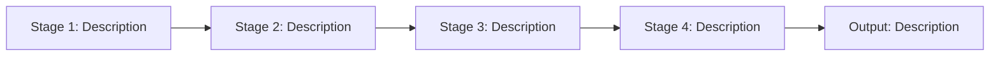

<!--
CONTEXT FOR AI ASSISTANTS:
Document Type: Complete reverse engineering guide — Phases 0-7
               C# / .NET codebases — grep / file read workflow (no MCP tools required)
Scope: Foundation phases (0-6) + Phase 7 vertical slice documentation
Last Updated: 2026-03-03

AI DIRECTIVES:
- Read Section 1 (Session Setup) at the start of every session
- Read Section 2 (Documentation Contract) before writing anything
- Read Section 3 (NO GUESSING Policy) before touching any code
- Complete Phases 0-6 before reaching Section 11 (Phase 7 Entry Gate)
- Run the prose scan at the end of every Phase 7 section
-->

# C# / .NET Reverse Engineering Guide — Phases 0-7

---

## 1. Session Setup

**Do this at the start of every session before any analysis.**

### 1.1 Check for session-status.md

Read `docs/[system-name]/session-status.md` if it exists.

```markdown
## session-status.md

**Current Phase**: [0 / 1 / 2 / 3 / 4 / 5 / 6 / 7]
**Last Completed**: [Plain English — e.g., "Phase 3.4 calculation engine documented"]
**Next Step**: [Plain English — e.g., "Phase 4: read UI directory, produce phase-4-client-architecture.md"]
**Blockers**: [None / plain English description]
**Workflows Documented (Phase 7)**: [list of workflow names, or "none yet"]
**Date**: YYYY-MM-DD
```

- If the file **exists**: read it, confirm the current phase and next step, then jump directly to that step. Do not re-run completed phases.
- If the file **does not exist**: this is a fresh session — start at Phase 0.

### 1.2 Update session-status.md at the end of every session

Before ending the session, write or overwrite `session-status.md` with the current state. This is the cross-session memory for the entire engagement. Without it, the next session restarts from scratch.

---

## 2. Documentation Contract

Read this before writing a single word of documentation.

### Allowed in backtick blocks

- File paths and line references: `src/Services/CheckoutService.cs:45-78`
- Method signatures: `CheckOut(string name, bool silent, ref DataTable data)`
- Enum values: `CO_GET_COPY`, `CO_CHECKED_OUT_TO_USER`
- Mathematical formulas: `Result = (Input × Factor) / (Base + Offset)`
- Constants with values: `DefaultTimeout = 30` (source: `appsettings.json`)
- Property names when part of a public API: `CheckoutRequest.ItemId`, `CheckoutResult.Status`

### Forbidden — rewrite as prose

- C# code bodies (if/else blocks, loops, try/catch, property assignments)
- Method implementations of any length
- Class or interface definitions and constructor bodies
- LINQ queries written out as code
- Pseudocode that mirrors code structure

### The conversion test

Before writing any ``` block, ask: "Is this a formula, file path, method signature, enum, or constant?" If no → write a sentence describing **what happens** and **why** instead.

**If a reader could understand the system's behavior from your documentation without looking at the code, you've succeeded. If they still need to read the code to understand what happens, you've transcribed instead of documented.**

---

## 3. NO GUESSING Policy

Applies to every section of every phase, no exceptions.

| Forbidden                    | Required instead                                                         |
| ---------------------------- | ------------------------------------------------------------------------ |
| Guess a validation rule      | Verify in code or mark `[NEEDS CLARIFICATION]`                           |
| Assume a calculation formula | Extract the exact formula or mark `[NEEDS CLARIFICATION]`                |
| Infer a default value        | Find its source in config/code or mark `[NOT AVAILABLE]`                 |
| Make up an error message     | Quote it exactly from code or mark `[NEEDS CLARIFICATION]`               |
| Assume a state change        | Trace the exact field or column mutation or mark `[NEEDS CLARIFICATION]` |

**When in doubt: STOP and ask the user. Never proceed by guessing.**

### Status markers (use consistently)

- `[NEEDS CLARIFICATION]` — information exists but is unclear
- `[NOT AVAILABLE]` — dependency confirmed unavailable
- `[BLOCKED]` — cannot proceed without missing information
- `[VERIFIED: YYYY-MM-DD]` — confirmed with code, data, or domain expert

### Status indicators

✅ Complete | ⚠️ Partial | ❌ Needs Clarification | 🚫 Blocked

---

## 4. Exploration Strategy

Use this table to decide how to approach codebase investigation at each step. The goal is progressive narrowing: start wide (directory structure), then narrow (targeted file reads), then verify (grep for specific patterns).

| Situation                                 | Preferred action                                                                        |
| ----------------------------------------- | --------------------------------------------------------------------------------------- |
| Need to understand project layout         | List the solution directory one level at a time — do not grep across everything         |
| Need to find which file owns a concept    | Grep for the class name, interface name, or method name across `src/`                   |
| Need to understand a class or service     | Read its interface first; read the implementation only if the interface is insufficient |
| Need to confirm a formula or constant     | Read the specific file:line range — do not grep for approximate values                  |
| Need to trace data flow between layers    | Read the caller, identify the callee, read the callee — one hop at a time               |
| Need to find all validation rules         | Grep for `AbstractValidator`, `[Required]`, `[Range]`, `Validate`, `IValidationService` |
| Unsure whether something exists           | Grep for it; if no results, mark `[NOT AVAILABLE]` and move on                          |
| Have a result from grep that is too broad | Narrow with a second grep using a more specific pattern or a path filter                |

### Progressive narrowing pattern

1. List the relevant directory (`src/Services/`)
2. Identify which 2–3 files are most likely to contain what you need
3. Read the interface or header files for those 2–3 files
4. Read only the specific `.cs` sections needed to confirm or extract information
5. Stop when you have the answer — do not read the entire file if a section is sufficient

**Do not read files speculatively.** If a file is not on the direct path from the entry point to the answer, skip it. If you are uncertain, grep first to confirm the file is relevant before reading.

---

## 5. Phase 0: Prerequisites & Ground Rules

**Purpose**: Confirm resource access and establish documentation standards before any analysis.

**Deliverable**: `docs/[system-name]/system-analysis/phase-0-prerequisites.md`

**Steps**:

1. List the solution directory structure (`.sln` file and project folders)
2. Read each `.csproj` file to identify NuGet package dependencies and project references
3. Read `appsettings.json` (or `web.config`) to identify connection strings, external API endpoints, and environment-specific configuration
4. Confirm access to each required resource: source code, database, external APIs, shared DLLs, domain expert, test/sample data
5. Identify the system's interface type: GUI application / Web API / CLI / daemon / library. Record in `session-status.md` and in the Phase 0 document. This drives Phase 4.
6. Document blockers immediately — do not proceed past Phase 0 with unresolved resource access questions

> **Scope note**: Phases 1-6 are system-wide — they document the full architecture, all shared
> components, and all patterns. No vertical slice is chosen at Phase 0. Where analysis depth
> must be prioritised, prefer the code paths most commonly used. The first Phase 7 workflow
> is chosen during Phase 6.3 sign-off, after the full candidate inventory (Phase 6.2) is complete.

**Document to produce**:

```markdown
## Phase 0: Prerequisites

**Status**: ✅ | ⚠️ | 🚫

| Resource         | Status | Location / Notes                         |
| ---------------- | ------ | ---------------------------------------- |
| Source code      | ✅     | [path]                                   |
| Database         | ✅/🚫  | [connection string key or NOT AVAILABLE] |
| External APIs    | ✅/🚫  | [endpoint or NOT AVAILABLE]              |
| Shared DLLs      | ✅/🚫  | [path or NOT AVAILABLE]                  |
| Domain expert    | ✅/🚫  | [name or NOT AVAILABLE]                  |
| Test/sample data | ✅/🚫  | [path or NOT AVAILABLE]                  |

**System type**: [GUI application / Web API / CLI / daemon / library]
**NO GUESSING policy**: Confirmed
**Documentation standards**: Confirmed
**Analysis scope**: Phases 1-6 are system-wide. Phase 7 workflows are chosen in Phase 6.2-6.3.
```

---

## 6. Phase 1: Architecture Analysis

**Purpose**: Understand project structure, technology stack, design patterns, and high-level data flow.

**Deliverables**: `phase-1-project-structure.md`, `phase-1-technology-stack.md`, `phase-1-architecture-patterns.md`, `phase-1-data-flow.md`

### 1.1 Project Structure + Technology Stack

1. List the solution and project directory layout
2. Read each `.csproj` for `<TargetFramework>`, `<PackageReference>` entries — these reveal the .NET version, UI framework, ORM, and key third-party libraries without reading code
3. Identify the application type from project structure: WinForms, WPF, ASP.NET MVC/Web API, Blazor, console application

### 1.2 Architectural Patterns

1. Search for dependency injection registrations in `Program.cs` or `Startup.cs` — these reveal the complete service/repository inventory and their lifetimes
2. Search for class name suffixes: `*Service`, `*Repository`, `*Manager`, `*Handler`, `*Factory`, `*Adapter` — map them to their interface definitions
3. Read the primary `DbContext` class (if Entity Framework) to understand the entity model and table relationships
4. Document patterns in plain English: "The system uses a layered architecture with a service layer over a repository layer. Services are registered as scoped instances in the DI container."

### 1.3 Data Flow

1. Trace the path from the user-facing entry point (button click, HTTP controller action, or message handler) through to the output (database commit, file write, API response)
2. Identify the major transformation points: where raw input becomes a validated command/DTO, where it enters the service layer, where it reaches the database or external system
3. Document this as a numbered plain English sequence, not as code

**Phase 1 complete?**

- [ ] Solution structure documented with project purposes
- [ ] Technology stack listed (.NET version, UI framework, ORM, key NuGet packages)
- [ ] Architectural patterns identified and described in plain English
- [ ] Main data flow traced as a numbered sequence

---

## 7. Phase 2: Data Layer Dissection

**Purpose**: Document all entities, database schema, data access patterns, and state changes. Phase 2.5 is a direct dependency of Phase 7 Section 5.

**Deliverables**: `phase-2-entity-model.md`, `phase-2-data-access.md`, `phase-2-5-state-changes.md`

### 2.1 Entity Discovery + Relationships

1. If using Entity Framework: read the `DbContext` to identify all `DbSet<T>` entities and their relationships; read `OnModelCreating` or `IEntityTypeConfiguration` classes for table mappings, foreign keys, and constraints
2. If using ADO.NET or Dapper: search for SQL `CREATE TABLE` statements or migration scripts to understand the schema
3. For each major entity, read its class to extract property names, types, and any Data Annotation attributes (`[Key]`, `[Required]`, `[MaxLength]`, `[Column]`)
4. Document: entity name, database table name, key properties (name, type, nullable), and how it relates to other entities — in prose, not class code

### 2.2 Data Access Patterns

1. Search for repository implementations (classes implementing `IRepository<T>` or similar)
2. Read each repository to understand how records are queried, created, updated, and deleted
3. Identify the unit-of-work pattern, transaction scope management, or `SaveChanges` call points

### 2.5 State Change Patterns ⚠️ CRITICAL — Phase 7 Section 5 depends on this

For each major operation identified in Phase 1.3:

1. Find the service method that executes the operation
2. Read that method and trace every property assignment, `SaveChanges` call, and `DbSet.Add`/`Remove`/`Update` call
3. Document each database mutation as a before/after pair in the table below — not as code, but as column-level changes
4. Find the transaction boundary: search for `TransactionScope`, `BeginTransaction`, `SaveChanges` placement, and any rollback or compensating actions

**Template for 2.5**:

```markdown
### State Changes: [Operation Name]

| Table       | Column       | Before             | After       | Condition       |
| ----------- | ------------ | ------------------ | ----------- | --------------- |
| [TableName] | [ColumnName] | [old value / NULL] | [new value] | [always / if X] |

**File System Changes** (if any):
| Operation | From | To | Condition |
|-----------|------|----|-----------|
| [copy/move/create] | [path] | [path] | [always / if X] |

**Transaction boundary**: [Plain English — what must all succeed or all fail together]
**Code Reference**: `path/to/Service.cs:line-range`
```

**Phase 2 complete?**

- [ ] Major entities documented with properties, types, and DB table mapping
- [ ] Entity relationships described in plain English
- [ ] Data access pattern identified (EF / ADO.NET / Dapper / other)
- [ ] State changes for each major operation documented (2.5) with column-level before/after pairs
- [ ] Transaction boundaries identified

---

## 8. Phase 3: Business Logic Analysis

**Purpose**: Document service orchestration, validation rules, and calculation engines. Phase 3.4 is the deepest Phase 7 dependency.

**Deliverables**: `phase-3-service-orchestration.md`, `phase-3-validation-logic.md`, `phase-3-4-calculation-engines.md`

### 3.1 Service Orchestration

1. Enumerate every service class registered in `Program.cs` / `Startup.cs` or discovered in Phase 1.2
2. Read each service's public interface methods to understand its contract
3. For each workflow-relevant service, read its implementation to identify what it calls (other services, repositories, external clients) and in what sequence
4. Document each service: purpose, public operations, dependencies, and the orchestration sequence — in plain English

### 3.2 Validation Logic

1. Search for FluentValidation `AbstractValidator<T>` classes, Data Annotation attributes on models/DTOs (`[Required]`, `[Range]`, `[RegularExpression]`), and custom `IValidationService` or `Validate()` methods
2. Read each validator implementation to extract every rule
3. For each rule, find the exact error message string — these must be quoted verbatim, not paraphrased
4. Document where each rule is enforced: UI layer (client-side), controller/API layer, service layer, or database constraint

### 3.4 Calculation Engine Analysis ⚠️ MOST CRITICAL — Phase 7 Section 4 depends on this

Never document a calculation engine from a summary or inference. Read the source.

1. Identify the calculation entry point from the Phase 1.3 data flow trace — it is the method that receives prepared input and returns a result
2. If the engine is a custom class: read its full implementation, extract the algorithm steps and formulas
3. If the engine is an external DLL or API: read the calling code to understand what parameters are passed and what is returned; document what the external engine does based on its documentation (not by guessing)
4. Extract every mathematical formula and define each variable (name, description, units, source)
5. For iterative algorithms: find the stopping criterion, maximum iteration count, and convergence failure behavior — read the exact config key or constant
6. Identify all dependencies: lookup tables, database queries, configuration values, external services

**Template for 3.4**:

```markdown
### Calculation Engine: [Name]

**Type**: [Custom .NET code / Third-party DLL / External API]
**Location**: `path/to/Calculator.cs` or `ExternalEngine.dll`
**Documentation**: ✅ Available at [path] | 🚫 [NOT AVAILABLE]

**Purpose**: [Plain English — what this engine computes]

**Algorithm** (plain English):

1. [Step one — what data is used and what is determined]
2. [Step two — what is computed and from what]

**Mathematical Formulas** [VERIFIED: YYYY-MM-DD]:
`Formula = expression`
Where:

- Variable = [description] ([units], source: [config key / lookup table / input field])
  Result units: [units]

**Convergence** (if iterative):

- Stops when: [plain English stopping condition]
- Maximum iterations: [value] (source: [config key / hardcoded at `file.cs:line`])
- If no convergence: [what the system does]

**Dependencies**:
| Dependency | Type | Access |
|-----------|------|--------|
| [name] | [lookup table / DB query / config value / external API] | ✅ Available / 🚫 Blocked |

**Code Reference**: `path/to/Calculator.cs:line-range`
```

**Phase 3 complete?**

- [ ] Services identified with purpose and orchestration sequence described
- [ ] Validation rules documented with exact error messages
- [ ] All calculation engines identified and documented (3.4)
- [ ] Formulas extracted with variable definitions and units (or marked `[NEEDS CLARIFICATION]`)
- [ ] All engine dependencies identified with access status

---

## 9. Phase 4: UI / Client Layer Study

**Purpose**: Document user interaction entry points. Phase 7 Sections 1 and 6 depend on this.

**Deliverable**: `phase-4-client-architecture.md`

1. List the UI project directory structure to identify forms, views, pages, or controllers
2. Identify the UI technology: WinForms (`.cs` + `.Designer.cs` pairs), WPF (`.xaml` + `.xaml.cs`), ASP.NET MVC (Controllers + Views), Blazor (`.razor` components)
3. Read the main form/window/page to understand the primary screen layout and available actions
4. For each major workflow, find the UI trigger point:
   - WinForms/WPF: the button click or menu item event handler (find it in the Designer file or by searching `Click +=`)
   - ASP.NET: the controller action and its `[HttpPost]` or `[HttpGet]` route
   - Blazor: the `@onclick` handler or form submit
5. Note the exact file and line for each trigger point — this is what Phase 7 Section 1 needs as "UI Location"

**If the application has no graphical UI** (console application, ASP.NET Web API with no frontend, background service, or class library):

1. Read the `Program.cs` entry point or the top-level command dispatcher to identify every supported command, endpoint, or mode
2. For each workflow, identify the HTTP route, CLI argument, or hosted service trigger that initiates it — record the exact route template, flag name, or config key and its source location
3. List every configuration file the workflow reads: its `appsettings.json` key path, its type, and what parameter it controls
4. Document: the invocation mechanism (HTTP request / CLI argument / scheduled trigger / message), each workflow's trigger (exact route or flag), and the role of every input model or config value

**Phase 4 complete?**

- [ ] Interface type identified (GUI application / Web API / CLI / daemon / library)
- [ ] Main screens, controllers, commands, or entry points documented with purpose
- [ ] Each major workflow has its trigger point identified (file:line)

---

## 10. Phase 5: Integration Points

**Purpose**: Identify all external systems. Phase 5.3 (Dependency Inventory) is read directly by the Phase 7 entry gate.

**Deliverables**: `phase-5-integration-summary.md`, `phase-5-3-dependency-inventory.md`

### 5.1 External System Discovery

1. Search `appsettings.json` / `web.config` for connection strings, API base URLs, and service endpoints — these are the declared integration points
2. Search for `HttpClient` usage, `IHttpClientFactory` registrations, REST client NuGet packages (Refit, RestSharp)
3. Search for `SqlConnection`, `OracleConnection`, or ORM context constructors to identify all databases
4. Search for message queue client classes (RabbitMQ, Azure Service Bus, MassTransit)
5. Read each external client class to understand what the integration provides and how it is invoked

### 5.3 Dependency Inventory ⚠️ CRITICAL — Phase 7 entry gate reads this

For each dependency found in 5.1:

1. Confirm physical access: can the connection string resolve? Is the API endpoint reachable? Is the shared DLL present?
2. For lookup tables or reference data: verify the table exists in the database and query a sample row to confirm the schema
3. Record the access status — ✅ Available or 🚫 Blocked — for every item

**Template for 5.3**:

```markdown
## Dependency Inventory

### Calculation Engines

| Engine | Type                       | Location           | Documentation | Access                    |
| ------ | -------------------------- | ------------------ | ------------- | ------------------------- |
| [name] | [custom class / DLL / API] | `path/` or `[URL]` | ✅/🚫         | ✅ Available / 🚫 Blocked |

### Lookup Tables / Reference Data

| Table / Source | Location          | Columns Used  | Sample Data | Access                    |
| -------------- | ----------------- | ------------- | ----------- | ------------------------- |
| [name]         | [DB / file / API] | [column list] | ✅/🚫       | ✅ Available / 🚫 Blocked |

### Configuration Files

| File / Key                    | Contains             | Access                    |
| ----------------------------- | -------------------- | ------------------------- |
| [appsettings key or filename] | [what it configures] | ✅ Available / 🚫 Blocked |

### External APIs

| API    | Purpose            | Auth Method              | Access                    |
| ------ | ------------------ | ------------------------ | ------------------------- |
| [name] | [what it provides] | [API key / OAuth / none] | ✅ Available / 🚫 Blocked |

### Blockers

| Dependency | Workflows Affected | Action Taken              | Status                  |
| ---------- | ------------------ | ------------------------- | ----------------------- |
| [name]     | [list]             | [access requested from X] | 🚫 Blocked since [date] |
```

**Phase 5 complete?**

- [ ] All external systems identified with integration type and purpose
- [ ] Dependency inventory complete (5.3) with access status for every dependency
- [ ] Blockers listed with workflow impact and remediation action

---

## 11. Phase 6: Implementation Details & Readiness Assessment

**Purpose**: Document the real state of the implementation, then produce the sign-off that unlocks Phase 7.

**Deliverables**: `phase-6-implementation-details.md`, `phase-6-3-readiness-assessment.md`

### 6.1 Implementation Details

1. Search the codebase for: `TODO`, `FIXME`, `HACK`, `NotImplementedException`, `throw new NotImplementedException`, `// stub`, `// placeholder`
2. For each hit, read the surrounding context to understand what is missing and how significant the gap is
3. Document each stub: which class it is in, what feature it was supposed to implement, and what the gap means for workflow documentation

### 6.2 Workflow Enumeration ⚠️ REQUIRED — Populates the Phase 7 Queue

Before the sign-off gate, enumerate every candidate workflow that could be documented in Phase 7. This produces the prioritized queue that drives all of Phase 7.

Work through the discovery sources **in order**, stopping when you have enough candidates to fill the queue. Do not guess — if a workflow is not evidenced by at least one of these sources, do not invent it.

#### Discovery Source 1: Existing documentation in the repository

Search for workflow descriptions in the project's own docs before looking at any code.

1. Check for `README.md`, `docs/`, `doc/`, `Guides/`, or any `*.md` / `*.rst` file at the project root or in a `docs/` tree
2. Grep for terms that signal user-facing operations: `workflow`, `use case`, `scenario`, `example`, `tutorial`, `getting started`, `how to`
3. Read any "Usage" or "Examples" sections found — these often name the canonical workflows the authors intended to support
4. Note each named workflow, the entry point it uses, and any distinguishing parameters or modes mentioned

#### Discovery Source 2: Example, sample, or test directories

If the project ships runnable examples (any of: `examples/`, `samples/`, `tests/`, `demo/`, `integration-tests/`):

1. List the directory one level deep — each subdirectory or test class is a candidate workflow
2. For each candidate, read only the top-level configuration or test setup file to identify:
   - Which entry point, controller route, or service method is exercised
   - What variant is active (e.g., different HTTP verb, request model, feature flag)
   - Any non-default options enabled
3. Do not read every file in every example — one config or test file per candidate is sufficient to classify it

#### Discovery Source 3: Entry-point and public API scan

If no docs or examples exist, infer candidate workflows from the codebase:

1. Re-read the Phase 1 data flow doc and the Phase 4 client architecture doc — the documented entry points and routes already imply distinct workflows (e.g., different controller actions, different service operations)
2. Search `Program.cs` / `Startup.cs` and any top-level `*Factory`, `*Registry`, or `*Router` class for the full set of registered routes, commands, or service operations — each registered type is a candidate workflow variant
3. Search for Swagger/OpenAPI decorators (`[HttpGet]`, `[HttpPost]`, `[Route]`), CLI argument definitions, or hosted service registrations — these reveal the full set of intended modes

#### Classification

For each candidate identified from any source above:

1. Check the Dependency Inventory (Phase 5.3) to confirm whether all required dependencies are ✅ Available
2. Compare it against already-documented workflows — if it exercises no new code path, it is not a distinct workflow
3. Assign a priority:
   - **Priority 1**: All dependencies available AND the workflow exercises a distinct, not-yet-documented code path
   - **Priority 2**: Minor dependency gap with a documented workaround, OR the workflow variant is a configuration difference only (no new code path)
   - **Priority 3**: A required dependency is 🚫 Blocked and cannot be worked around

**Template for 6.2 Workflow Table**:

```markdown
## Candidate Workflow Inventory

| Workflow Name | Source                     | Entry Point / Config                 | Key Distinguishing Feature                                  | Priority  | Blocker (if any)  |
| ------------- | -------------------------- | ------------------------------------ | ----------------------------------------------------------- | --------- | ----------------- |
| [name]        | [Doc / Example / API scan] | `path/to/config` or `[Route] action` | [what makes it architecturally different from the baseline] | 1 / 2 / 3 | None / [dep name] |
```

**Minimum required columns**:

- **Workflow Name**: Short identifier used for the Phase 7 filename (e.g., `batch-export`, `async-processing`, `read-only-mode`, `admin-override`)
- **Source**: Which discovery source surfaced it — `Doc`, `Example`, or `API scan`
- **Entry Point / Config**: The controller route, service method, CLI flag, or config key that exercises this workflow
- **Key Distinguishing Feature**: The one thing that makes this workflow architecturally different from the already-documented baseline — must reference a specific code path, route, algorithm branch, or data source, not just a name
- **Priority**: 1 / 2 / 3 per the classification rules above
- **Blocker**: The specific dependency that is 🚫 Blocked, or "None"

---

### 6.3 Phase 7 Readiness Assessment — Sign-Off Gate

This is primarily a synthesis of what was found in Phases 1-6 — minimal new codebase exploration needed.

1. Review the phase deliverables produced in Phases 0-5 and confirm each is complete
2. Copy the Workflow Table from Phase 6.2 into the sign-off document — this becomes the authoritative Phase 7 queue
3. Classify each workflow: Priority 1 (all dependencies accessible), Priority 2 (partial gaps with workarounds), Priority 3 (blocked until dependency resolved)
4. Record the sign-off decision

**Template for 6.3**:

```markdown
## Phase 7 Readiness Assessment

**Date**: YYYY-MM-DD
**Overall Status**: ✅ Ready | ⚠️ Partial | 🚫 Blocked

### Readiness Checklist

| Phase | What Was Checked                  | Status   | Notes |
| ----- | --------------------------------- | -------- | ----- |
| 1     | Architecture and data flow        | ✅/⚠️/🚫 |       |
| 2     | Entities and DB schema documented | ✅/⚠️/🚫 |       |
| 2.5   | State changes captured            | ✅/⚠️/🚫 |       |
| 3.4   | Calculation engines documented    | ✅/⚠️/🚫 |       |
| 4     | UI entry points identified        | ✅/⚠️/🚫 |       |
| 5.3   | Dependency inventory complete     | ✅/⚠️/🚫 |       |

### Workflow Priority List

_(Copied from Phase 6.2 Workflow Table — do not re-derive; extend only if new candidates are discovered)_

| Workflow Name | Source                     | Entry Point / Config | Key Distinguishing Feature | Priority    | Blocker                              |
| ------------- | -------------------------- | -------------------- | -------------------------- | ----------- | ------------------------------------ |
| [name]        | [Doc / Example / API scan] | `path/`              | [feature]                  | 1 — Ready   | None                                 |
| [name]        | [Doc / Example / API scan] | `path/`              | [feature]                  | 2 — Partial | [specific gap with workaround]       |
| [name]        | [Doc / Example / API scan] | `path/`              | [feature]                  | 3 — Blocked | [specific blocker, access requested] |

### Sign-Off

**Decision**: Proceed to Phase 7 | Resolve blockers first | Proceed with partial coverage
```

**Phase 6 complete?**

- [ ] Stubs and unimplemented methods identified (6.1)
- [ ] Candidate workflow inventory produced from examples / docs (6.2) — every discoverable workflow listed with priority and blocker
- [ ] Readiness checklist completed (6.3)
- [ ] Workflow priority list confirmed as copy of 6.2 table (6.3)
- [ ] Sign-off decision recorded

---

## 12. Phase 7 Entry Gate

Answer honestly before starting any workflow.

1. Are key entity state changes documented (before → after column values)? **Yes / No**
2. Are all calculation engines identified with formulas extracted? **Yes / No / N/A**
3. Is the dependency inventory complete (lookup tables, APIs, config files)? **Yes / No**
4. Are critical dependencies ✅ Available or explicitly marked 🚫 Blocked? **Yes / No**
5. Is Phase 6.3 Readiness Assessment complete with sign-off? **Yes / No**

**If ANY answer is No: STOP. Return to the incomplete phase. Phase 7 documentation will be inaccurate without this foundation.**

### Workflow priority classification

| Priority    | Status | Condition                                    |
| ----------- | ------ | -------------------------------------------- |
| 1 — Ready   | ✅     | All dependencies accessible                  |
| 2 — Partial | ⚠️     | Some gaps; document with explicit caveats    |
| 3 — Blocked | 🚫     | Cannot document until dependency is resolved |

Start with Priority 1 workflows only.

### What a good vertical slice is

Choose workflows that:

- Represent core, user-visible functionality
- Cross multiple system layers (UI → service → data)
- Have a complete path from user input to persisted output
- Include meaningful business logic, validation, or calculation

---

## 13. Phase 7: The 10-Section Vertical Slice Template

**File location**: `docs/[system-name]/vertical-slice-documentation/vertical-slices/phase-7-workflow-[name].md`

Begin each document with:

```
# Workflow: [Name]

**Status**: ✅ Complete | ⚠️ Partial | 🚫 Blocked
**Priority**: 1 / 2 / 3
**Last Updated**: YYYY-MM-DD
```

---

### Section 1: Executive Summary

**Purpose**: Orient the reader — state what the workflow does, what distinguishes it from related workflows, and provide a high-level comparison to alternatives.

> ⛔ No code blocks in this section. Describe purpose and differentiation.

**What to document**:

- A concise description of what the workflow accomplishes (2–4 sentences)
- What makes this workflow distinct from other workflows in the system
- A comparison table contrasting this workflow against the nearest alternative or simpler baseline (metrics such as complexity, cost, applicability, accuracy)
- The reference case, tutorial, or example used as the basis for this vertical slice (with directory path)

**Template**:

```
### 1. Executive Summary

**Status**: ✅ | ⚠️ | ❌

**What This Workflow Does**: [2–4 sentences describing the workflow's purpose and scope]

**Key Differentiator**: [What sets this apart from related workflows]

**Reference Case**: [Tutorial / example name] (`path/to/case/`)

**Comparison to Alternative**:
| Metric | [This Workflow] | [Alternative] | Notes |
|--------|-----------------|---------------|-------|
| [metric] | [value] | [value] | [explanation] |
```

**Section 1 complete?**

- [ ] Purpose and scope described clearly
- [ ] Comparison table included with at least one alternative
- [ ] Reference case identified with path
- [ ] ⛔ Scan: no ``` blocks containing code logic

---

### Section 2: Workflow Overview

**Purpose**: Provide a conceptual map of how data moves through the workflow from start to finish.

> ⛔ No code blocks in this section except for the Mermaid diagram.
> Use Mermaid syntax for all dataflow and process diagrams.

**What to document**:

- A Mermaid flowchart or sequence diagram showing the major stages and data flow
- A brief explanation of each stage in the diagram
- Key domain concepts the reader must understand to follow the rest of the document
- A physical or domain problem description: what real-world scenario this workflow addresses

**Template**:

````
### 2. Workflow Overview

**Status**: ✅ | ⚠️ | ❌

**Conceptual Dataflow**:



**Stage Descriptions**:
1. **[Stage name]**: [What happens and why]
2. **[Stage name]**: [What happens and why]
3. [Continue for each stage]

**Key Concepts**:
- **[Concept]**: [Plain English definition — what it is and why it matters for this workflow]
````

**Section 2 complete?**

- [ ] Mermaid diagram present showing end-to-end data flow
- [ ] Each stage in the diagram has a prose explanation
- [ ] Key domain concepts defined for a reader unfamiliar with the domain
- [ ] ⛔ Scan: no ``` blocks containing code logic (Mermaid diagrams are allowed)

---

### Section 3: Entry Point Analysis

**Before writing this section, read**: `phase-1-architecture-patterns.md` and `phase-4-client-architecture.md`
These files identify the top-level entry points, runtime selection mechanisms, and class hierarchy. Section 3 should trace from those entry points into this specific workflow.

**Purpose**: Document how execution reaches this workflow — from the top-level entry point through any runtime selection or dispatch mechanisms down to the specific classes that implement this workflow.

> ⛔ No code blocks in this section. Describe the execution path and class hierarchy.
> If you are about to paste a class definition or constructor → instead describe the inheritance chain and what each layer adds.

**What to document**:

- The top-level entry point (Main method, controller, or startup entry) and how it selects this workflow
- The class hierarchy from entry point to the workflow-specific implementation, with each layer's responsibility described in plain English
- Runtime selection mechanisms: how the system decides which concrete implementation to use (configuration, dependency injection, factory pattern, etc.)
- Constructor initialization: what each layer sets up, and where defaults come from

**Template**:

```
### 3. Entry Point

**Status**: ✅ | ⚠️ | ❌

**Top-Level Entry**: [executable / command] (`path/to/Program.cs`)

**Selection Mechanism**: [How the system determines which workflow/service/handler to use — e.g., "DI container registration", "factory pattern", "configuration-driven"]

**Class Hierarchy**:
| Layer | Class / Interface | Responsibility | Code Reference |
|-------|------------------|----------------|----------------|
| Interface | [name] | [what it defines] | `file.cs:line-range` |
| ↓ | [name] | [what this layer adds] | `file.cs:line-range` |
| ↓ | [name] | [what this layer adds] | `file.cs:line-range` |
| Concrete | [name] | [workflow-specific behavior] | `file.cs:line-range` |

**Initialization**: [Plain English — what is set up at construction time, where defaults are loaded from, what services are injected, and what configuration files are read]
```

**Section 3 complete?**

- [ ] Entry point identified with file reference
- [ ] Full hierarchy from entry point to concrete implementation documented
- [ ] Runtime selection mechanism described
- [ ] Initialization described in plain English (no constructor code)
- [ ] ⛔ Scan: no ``` blocks containing code logic

---

### Section 4: Data Structure Trace

**Before writing this section, read**: `phase-2-entity-model.md` and `phase-2-data-access.md`
These files document the entity model and data access patterns. Section 4 should expand on those with workflow-specific detail — the fields, their relationships, and their business or domain meaning.

**Purpose**: Document every major data field or entity that participates in this workflow — its type, meaning, initialization, and interdependencies.

> ⛔ No code blocks in this section. Describe fields and their relationships.
> If you are about to paste a class or entity definition → instead describe each field's purpose, type, constraints, and where its initial value comes from.

**What to document**:

- Each major data field: name, type, constraints, business or domain meaning
- Initialization: where the initial value comes from (database, config, computed, user input)
- Interdependencies: which fields depend on which others and how they are coupled
- Entity relationships: how the entities in this workflow relate to each other
- Typical values for the reference case

**Template**:

```
### 4. Data Structures

**Status**: ✅ | ⚠️ | ❌

**Primary Fields**:
| Field | Type | Constraints | Business Meaning | Initialization | Code Reference |
|-------|------|------------|-----------------|----------------|----------------|
| [name] | [string/int/decimal/bool/etc] | [required/range/format] | [what it represents] | [source] | `file.cs:line` |

**Entity Relationships**:
| Entity | Relationship | Related Entity | Cardinality |
|--------|-------------|---------------|-------------|
| [name] | [has-many / belongs-to / references] | [name] | [1:1 / 1:N / M:N] |

**Field Dependencies**:
- [Field A] depends on [Field B] and [Field C] via [relationship described in plain English]
- [Field D] is derived from [Field E] using [formula or process]

**Typical Values** (reference case):
| Field | Context | Typical Range | Notes |
|-------|---------|--------------|-------|
| [name] | [where] | [range] | [context] |
```

**Section 4 complete?**

- [ ] All major data fields listed with types and meaning
- [ ] Initialization sources documented (not assumed)
- [ ] Entity relationships and field interdependencies described
- [ ] Constraints or validation rules documented
- [ ] ⛔ Scan: no ``` blocks containing code logic

---

### Section 5: Algorithm Deep Dive

**Before writing this section, read**: `phase-3-4-calculation-engines.md`
This file contains the algorithm steps, mathematical formulas, convergence behavior, and engine location. Section 5 should be assembled from this — do not re-read the engine source unless a specific detail is missing.

**Purpose**: Document the core algorithms — what the system computes, in what order, with what mathematical relationships, and how convergence is achieved.

> ⛔ No C# code blocks in this section. Mathematical formulas are the one exception.
> If you are about to paste a calculation method body → instead number the algorithm steps in plain English and express the math as a formula.
> **If you have written a ``` block containing variable assignments, if/else, or loops: delete it and rewrite as prose.**
> Use standard mathematical notation for block and inline equations.

**What to document**:

- The calculation engine: whether it is custom code, a third-party DLL, or an external API; its location, version, and documentation status
- The overall algorithm structure: outer loop, inner steps, convergence strategy
- A plain English numbered description of the algorithm steps
- Mathematical formulas with every variable defined (name, description, units, source)
- For iterative algorithms: the stopping criterion, maximum iterations, and what the system does if convergence fails
- How parallelism or async processing is used, if any — described behaviorally, not as code
- What the engine returns

**Template**:

```
### 5. Algorithm Deep Dive

**Status**: ✅ | ⚠️ | 🚫 BLOCKED

**Engine**:
- Type: [Custom .NET code / Third-party DLL / External API]
- Location: `path/to/Calculator.cs` or `ExternalEngine.dll`
- Version: [version if applicable]
- Documentation: ✅ Available at [path] | 🚫 [NOT AVAILABLE — access requested from owner]

**Algorithm Overview**: [Plain English — describe the overall strategy in 2–3 sentences]

**Algorithm Steps**:
1. **[Step name]**: [What happens — what data is consumed, what is produced, what method is used]
2. **[Step name]**: [Continue for each meaningful step]
3. [Continue...]

**Governing Equations**:

[Mathematical formula]

Where:
- [variable] = [description] ([units], source: [config/lookup/input])

**Convergence** (if iterative):
- Stops when: [plain English stopping condition]
- Maximum iterations: [value] (source: [config key / hardcoded at file.cs:line])
- If no convergence: [what the system does — throws exception / returns best estimate / uses fallback]

**Parallelism / Async**: [Plain English — e.g., "The work is divided across N tasks, each operating independently on a separate data partition. Results are aggregated once all tasks complete." If not applicable, write "Not used."]

**Code Reference**: `path/to/Calculator.cs:line-range`
```

**Section 5 complete?**

- [ ] Algorithm described as numbered plain English steps
- [ ] All formulas expressed with every variable defined (units and source)
- [ ] Engine location, type, and access status confirmed
- [ ] Convergence behavior documented
- [ ] Parallelism or async behavior described in plain English if used
- [ ] ⛔ Scan: no ``` blocks containing C# code — only mathematical formulas and Mermaid diagrams allowed

---

### Section 6: State Mutations

**Before writing this section, read**: `phase-2-5-state-changes.md`
This file lists every column-level mutation (before → after) for each major operation, the file system changes, and the transaction boundaries. Section 6 should be assembled from this — select the mutations relevant to this workflow.

**Purpose**: Document how the system's state evolves through the workflow — what fields change, when, and from what to what.

> ⛔ No code blocks in this section. Describe what mutates and how.
> If you are about to paste a state-update method → instead list each state change as a row in the table.

**What to document**:

- A timeline or sequence showing the order in which fields are updated during one execution cycle
- Per-operation state changes: which fields had what values before, what values after, and under what conditions
- Database state changes: table, column, before/after values
- File system changes: created, moved, or deleted files
- Transaction boundary: what operations must all succeed or all fail together
- Output mapping: how calculation results map to the display fields the user sees

**Template**:

```
### 6. State Mutations

**Status**: ✅ | ⚠️ | ❌

**State Change Timeline** (one execution cycle):
| Step | Operation | Fields Modified | Key Change |
|------|-----------|----------------|------------|
| 1 | [operation] | [field list] | [what changes and why] |
| 2 | [operation] | [field list] | [what changes and why] |

**Database State Changes**:
| Table | Column | Before | After | Condition |
|-------|--------|--------|-------|-----------|
| [table] | [column] | [old value / NULL] | [new value] | [always / if X] |

**File System Changes**:
| Operation | From | To | Condition |
|-----------|------|----|-----------|
| [copy / move / create / delete] | [source path] | [destination path] | [always / if X] |

**Transaction Boundary**: [Plain English — e.g., "The database record update, file copy to the repository, and audit log entry are performed as a single transaction; if any step fails, all changes are rolled back and the user sees an error"]

**Code Reference**: `path/to/ResultProcessor.cs:line-range`
```

**Section 6 complete?**

- [ ] Timeline of state changes documented in execution order
- [ ] Every database field change documented (table, column, before, after)
- [ ] Every file system operation documented
- [ ] Transaction boundary described in plain English
- [ ] ⛔ Scan: no ``` blocks containing code logic

---

### Section 7: Error Handling

**Before writing this section, read**: `phase-3-validation-logic.md`
This file lists validator rules, error messages, and exception types. Section 7 should cover both input validation errors (from phase-3) and runtime errors discovered while tracing this workflow.

**Purpose**: Document every error condition the workflow can encounter — both input validation failures and runtime errors — with their causes, detection, and handling.

> ⛔ No code blocks in this section. Describe error conditions and responses.

**What to document**:

- Input validation errors: rules that reject input before processing begins
- Runtime errors: conditions that arise during execution (constraint violations, resource failures, external service failures)
- For each error: scenario, symptom, root cause, how the system detects it, what the system does, and how the user can mitigate it
- Domain-specific error conditions unique to this workflow

**Template**:

```
### 7. Error Handling

**Status**: ✅ | ⚠️ | ❌

**Workflow-Specific Errors**:

**Error: [Name]**
- **Scenario**: [When this occurs]
- **Symptom**: [What the user or system observes]
- **Cause**: [Root cause]
- **Detection**: [How the system detects it — validation check, exception, assertion]
- **Handling**: [What the system does — abort, warn, retry, catch and log]
- **Mitigation**: [What the user should do to prevent or recover]

**General Errors**: [Reference to shared error handling — e.g., "See Phase 7 [other workflow] Section 7 for errors common to all workflows using the same framework"]
```

**Section 7 complete?**

- [ ] All workflow-specific error conditions documented
- [ ] Each error has scenario, symptom, cause, detection, handling, and mitigation
- [ ] General/shared errors referenced rather than duplicated
- [ ] ⛔ Scan: no ``` blocks containing error-handling code

---

### Section 8: Integration Points

**Before writing this section, read**: `phase-5-integration-summary.md` and `phase-5-3-dependency-inventory.md`
These files document system-wide integration points and dependencies. Section 8 should identify which of those are relevant to this specific workflow and add any workflow-specific integration detail.

**Purpose**: Document the libraries, frameworks, external systems, and subsystem boundaries that this workflow depends on or interacts with.

> ⛔ No code blocks in this section. Describe integrations and their roles.

**What to document**:

- Libraries or subsystems this workflow calls into: what each provides, how it is selected, and where it is configured
- Class hierarchy details specific to this workflow (if not fully covered in Section 3)
- Configuration files or settings that control workflow behavior
- Post-processing tools or output consumers
- Infrastructure dependencies (database, external APIs, message queues)

**Template**:

```
### 8. Integration Points

**Status**: ✅ | ⚠️ | ❌

**Libraries / Subsystems**:
| Component | What It Provides | Selection Mechanism | Configuration |
|-----------|-----------------|---------------------|---------------|
| [name] | [capability] | [how chosen at runtime] | [config file / DI registration / hardcoded] |

**Configuration**:
| File / Section | Key Settings | Effect on Workflow |
|----------------|-------------|-------------------|
| [name] | [setting list] | [what each controls] |

**Post-Processing**: [Tools or consumers that read this workflow's output — what they do with it]

**Code References**:
- [component]: `path/to/file.cs:line-range`
```

**Section 8 complete?**

- [ ] All libraries and subsystems this workflow uses are listed
- [ ] Selection and configuration mechanisms documented
- [ ] Post-processing or output consumers identified
- [ ] ⛔ Scan: no ``` blocks containing code logic

---

### Section 9: Key Insights

**Purpose**: Synthesize understanding — capture the non-obvious lessons, design trade-offs, and practical knowledge that would otherwise be lost when the analysis session ends.

> ⛔ No code blocks in this section. Write reflective analysis.

**What to document**:

- **Design philosophy**: Why the system is built this way — the trade-offs the designers chose and their consequences
- **Algorithmic insights**: Non-obvious properties of the algorithm — what makes it work well, where it struggles, and what parameters are most sensitive
- **Implementation insights**: Practical findings about the codebase — surprising design choices, performance characteristics, debugging strategies
- **Comparison insights**: Quantitative or qualitative comparison to alternative approaches, with metrics where available
- **Practical insights**: Lessons for someone who will use, extend, or maintain this workflow — requirements, parameter sensitivity, common pitfalls

**Template**:

```
### 9. Key Insights

**Status**: ✅ | ⚠️ | ❌

#### Design Philosophy
[Why the system works this way — trade-offs and consequences]

#### Algorithmic Insights
[Non-obvious properties, sensitivities, failure modes]

#### Comparison Insights
| Metric | [This Workflow] | [Alternative] | Ratio / Notes |
|--------|-----------------|---------------|---------------|
| [metric] | [value] | [value] | [interpretation] |

#### Practical Insights
[Lessons for users, maintainers, or extenders — common pitfalls, parameter guidance, debugging strategies]
```

**Section 9 complete?**

- [ ] Design trade-offs explained (not just described)
- [ ] At least one comparison table with metrics
- [ ] Practical advice included for future users or maintainers
- [ ] ⛔ Scan: no ``` blocks containing code logic

---

### Section 10: Conclusion

**Purpose**: Summarize findings, state limitations, and provide direction for follow-up work.

**What to document**:

- Summary of the workflow's key characteristics (5–7 bullet points)
- Key takeaways — the most important things a reader should remember
- Documentation completeness checklist — which aspects of the workflow are fully documented
- Stated limitations of this vertical slice (what was not covered and why)
- Recommended next steps for further analysis or validation

**Template**:

```
### 10. Conclusion

**Status**: ✅ | ⚠️ | ❌

**Summary**:
1. [Key characteristic]
2. [Key characteristic]
3. [Continue for 5–7 items]

**Key Takeaways**:
- [Most important finding]
- [Second most important finding]

**Documentation Completeness**:
- ✅ [aspect fully documented]
- ⚠️ [aspect partially documented — reason]
- ❌ [aspect not documented — reason]

**Limitations**:
- [What was not covered and why]

**Recommended Next Steps**:
1. [Specific follow-up action]
2. [Specific follow-up action]
```

**Section 10 complete?**

- [ ] Summary captures the workflow's key characteristics
- [ ] Limitations honestly stated
- [ ] Next steps are specific and actionable
- [ ] ⛔ Scan: no ``` blocks containing code logic

---

## 14. Workflow Document Complete?

Run this final check before considering the workflow done.

- [ ] Section 1 (Executive Summary): Purpose, differentiation, and comparison table present
- [ ] Section 2 (Workflow Overview): Mermaid diagram with stage descriptions and key concepts
- [ ] Section 3 (Entry Point): Full hierarchy from entry point to concrete implementation
- [ ] Section 4 (Data Structures): All fields with types, meaning, and initialization
- [ ] Section 5 (Algorithm): Steps in plain English; formulas with units; convergence documented
- [ ] Section 6 (State Mutations): Timeline of changes; per-operation before/after; output files
- [ ] Section 7 (Error Handling): All workflow-specific errors with scenario through mitigation
- [ ] Section 8 (Integration Points): Libraries, configuration, post-processing consumers
- [ ] Section 9 (Key Insights): Design philosophy, comparisons, practical advice
- [ ] Section 10 (Conclusion): Summary, limitations, and next steps
- [ ] **PROSE SCAN**: Search the entire document for ``` blocks. Every one must be ONLY a formula, Mermaid diagram, file path, method signature, enum value, or constant. If any contain C# code logic — rewrite them as prose before marking this workflow complete.
- [ ] **Update `session-status.md`**: Record the workflow just completed under "Workflows Documented (Phase 7)" and set "Next Step" to the next workflow or "Phase 7 complete".

---

## 15. Prose Conversion Reference

When you feel the urge to paste code, use these patterns instead.

| Instead of pasting...           | Write this instead                                                                                                                                                      |
| ------------------------------- | ----------------------------------------------------------------------------------------------------------------------------------------------------------------------- |
| A `for` / `foreach` loop        | "The system processes each [item] in [collection], applying [rule] to each one"                                                                                         |
| A `while` loop                  | "The system continues [action] until [stopping condition]"                                                                                                              |
| An `if/else` block              | "If [condition], the system [does A]; otherwise it [does B]"                                                                                                            |
| A `try/catch` block             | "The operation handles [exception type] by [logging it / showing a message / retrying]. If [other exception], the workflow [aborts / continues with degraded behavior]" |
| A method body                   | "The method performs three steps: [step 1 in plain English], [step 2], [step 3]. See `file.cs:45-78`"                                                                   |
| Property assignments            | "The [entity] is updated: [field] is set to [new value], [field] is cleared"                                                                                            |
| A constructor call              | "The component is initialized with [what it needs]; defaults come from [source]"                                                                                        |
| A LINQ query                    | "The system retrieves all [items] where [condition], ordered by [field]"                                                                                                |
| A `switch` statement            | "The system selects behavior based on [condition]: when [value A] it [does X], when [value B] it [does Y]"                                                              |
| An `async/await` chain          | "The operation [does X] asynchronously, then [does Y] once the result is available"                                                                                     |
| Event handler wiring            | "When [event occurs], the system [does X]"                                                                                                                              |
| Dependency injection resolution | "The [component] receives a [service type] through its constructor, injected by the DI container"                                                                       |

---

## 16. Folder Structure

```
docs/[system-name]/
├── session-status.md                        ← Cross-session memory — read at session start, update at session end
├── system-analysis/                         ← Phases 0-6
│   ├── phase-0-prerequisites.md
│   ├── phase-1-project-structure.md
│   ├── phase-1-technology-stack.md
│   ├── phase-1-architecture-patterns.md
│   ├── phase-1-data-flow.md
│   ├── phase-2-entity-model.md
│   ├── phase-2-data-access.md
│   ├── phase-2-5-state-changes.md          ← Phase 7 Section 6 dependency
│   ├── phase-3-service-orchestration.md
│   ├── phase-3-validation-logic.md
│   ├── phase-3-4-calculation-engines.md    ← Phase 7 Section 5 dependency
│   ├── phase-4-client-architecture.md      ← Phase 7 Section 3 dependency
│   ├── phase-5-integration-summary.md
│   ├── phase-5-3-dependency-inventory.md   ← Phase 7 entry gate + Section 8 dependency
│   ├── phase-6-implementation-details.md
│   └── phase-6-3-readiness-assessment.md  ← Phase 7 sign-off gate
└── vertical-slice-documentation/           ← Phase 7
    ├── phase-7-summary.md
    ├── phase-7-prerequisites-complete.md
    ├── phase-7-priority-1-index.md
    └── vertical-slices/
        ├── phase-7-workflow-[name1].md
        ├── phase-7-workflow-[name2].md
        └── ...
```

---

_Last Updated: 2026-03-03_
